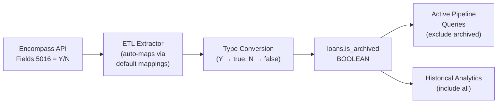

# Add `is_archived` Field and Exclude Archived Loans from Active Pipeline

## Data Flow

## 1. Sync `Fields.5016` as `is_archived`

**Migration** — new file `server/migrations/tenant/061_is_archived.sql`:

- `ALTER TABLE loans ADD COLUMN IF NOT EXISTS is_archived BOOLEAN;`

**Default field mappings** — [server/src/config/defaultEncompassFieldMappings.ts](server/src/config/defaultEncompassFieldMappings.ts):

- Add `"Is Archived": "Fields.5016"` to `DEFAULT_ENCOMPASS_FIELD_MAPPINGS` (near line 438, next to "Loan Folder")
- Add `"Is Archived": "loan_info"` to `FIELD_CATEGORY_MAP`

The ETL already handles `"Y"` → `true` boolean conversion automatically (line 647-655 of `encompassEtlService.ts`), and dynamically discovers available columns from the DB schema. No ETL code changes needed.

## 2. Update Core Metrics (metricsService.ts)

**File**: [server/src/services/metrics/metricsService.ts](server/src/services/metrics/metricsService.ts)

Add `AND (l.is_archived IS NOT TRUE)` to:

- `active_loans` metric SQL (line 85-90)
- `active_volume` metric SQL (line 248-254)

Using `IS NOT TRUE` handles both `false` and `NULL` (for loans synced before migration).

## 3. Update Data Quality Tests (dataQuality.ts)

**File**: [server/src/routes/dataQuality.ts](server/src/routes/dataQuality.ts)

Add `AND (is_archived IS NOT TRUE)` to the `sqlCondition` of these 5 tests:

- `active_with_funding_date` (line 159)
- `active_with_closing_date` (line 176)
- `stale_active_4_to_6_months` (line 225)
- `stale_active_6_to_12_months` (line 239)
- `stale_active_over_1_year` (line 253)

Also add `"is_archived"` to the `requiredColumns` array for each test.

Update the status distribution query (around line 1202-1209) to exclude archived loans from the active count.

## 4. Update Key API Endpoints (loans.ts)

**File**: [server/src/routes/loans.ts](server/src/routes/loans.ts)

Add `AND (l.is_archived IS NOT TRUE)` to active pipeline queries in:

- `/stats` endpoint active volume SQL (line 802)
- `/active-loans-count` endpoint SQL (line 1014-1027)
- `/predict` endpoint active loans query (line 6884)

## 5. Update Dashboard Analytics (analyticsService.ts)

**File**: [server/src/services/dashboard/analyticsService.ts](server/src/services/dashboard/analyticsService.ts)

Add the filter to active loan queries at:

- Dashboard overview stats (line 2470-2473)
- Funnel `still_active` count (line 2492)
- Critical loans query (line 2533)

## 6. Update AI Agent System Prompts

**File**: [server/src/services/research/agents/dataAnalystAgent.ts](server/src/services/research/agents/dataAnalystAgent.ts)

Update the `ACTIVE PIPELINE DEFINITION` section (line 154-157) to include:

- Active filter becomes: `current_loan_status = 'Active Loan' AND application_date IS NOT NULL AND (is_archived IS NOT TRUE)`
- Add note: "Archived loans are excluded from active pipeline — they've been moved to archive folders in the LOS and are no longer part of the working pipeline."

**File**: [server/src/services/ai/cohiChatService.ts](server/src/services/ai/cohiChatService.ts) (lines 951-952)

- Update the active loan definition in the chat context prompt.

## Out of Scope (Lower Priority Follow-Up)

These files also reference active loans but are lower risk — insights and deep-dive services that generate exploratory queries. They can be updated in a follow-up:

- `insightMetricsCollector.ts` (~12 references)
- `insightOrchestrator.ts` (1 reference)
- `insightDeepDive.ts` (~6 references)
- `fallout/index.ts` (1 reference)
- `predictions/index.ts` (4 references)
- `onboardingAnalysisAgent.ts` (1 reference)
