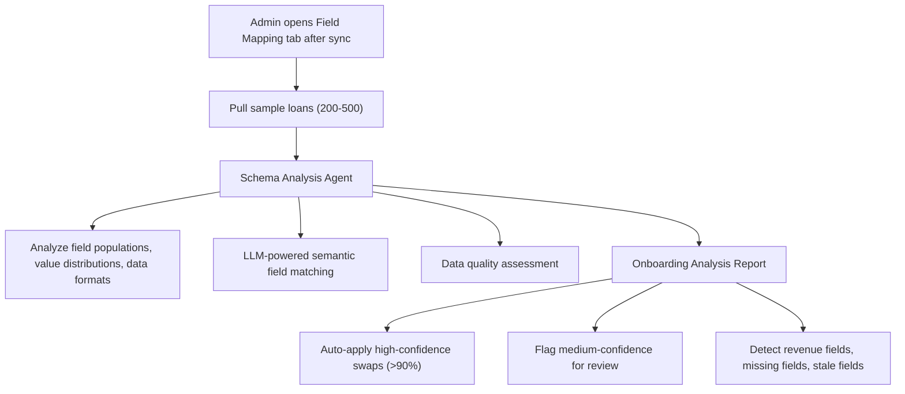
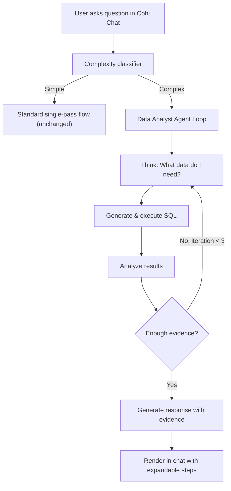

# Agent-Powered Platform Rearchitecture

## 1. Onboarding Analysis Agent

### Current State

- `[FieldMappingWizard](src/components/encompass/FieldMappingWizard.tsx)`: Rule-based 4-step wizard (Welcome -> Discovery -> Analysis -> Review -> Complete). Uses keyword similarity + population rates for matching (max 40pt description score). No LLM.
- `[FieldMappingTab](src/components/admin/tenant-config/FieldMappingTab.tsx)`: Three sub-tabs (Default Fields, Additional Fields, Population Stats). Has a "Setup Wizard" button that opens the wizard dialog.
- Revenue formulas, scoring weights, and additional fields are configured in separate tabs -- completely disconnected from the field mapping flow.
- The `AutoMapper` service has an unimplemented `semantic_match` strategy placeholder.

### Proposed: Agent-Powered Onboarding Flow

Replace the wizard with a two-phase agent system:

**Phase 1: Automated Schema Analysis** (runs automatically after first sync or on-demand)

- **New backend service**: `server/src/services/onboarding/onboardingAnalysisAgent.ts`
  - Reuses research tools: `safeExecuteSQL`, `getSchemaContext`, `callLLM` from `[server/src/services/research/tools.ts](server/src/services/research/tools.ts)`
  - Agent receives: Encompass field discovery results + sample loan data + current Coheus alias definitions + field population stats
  - LLM call with actual sample values to semantically match fields (not keyword matching)
  - Detects: which fields look like revenue components, which date fields exist, which fields are stale (populated but with old/garbage data), which custom fields (CX.) are actively used
  - Produces structured `OnboardingAnalysis` with: field swap recommendations (with confidence + reasoning), data quality flags, detected revenue fields, suggested additional fields
- **New SSE endpoint**: `POST /api/onboarding/analyze/:connectionId` in a new route file `server/src/routes/onboarding.ts`
  - Streams analysis progress (field discovery, sample analysis, LLM matching, quality checks)
  - Returns structured `OnboardingAnalysis`

**Phase 2: Interactive Onboarding Chat** (human-in-the-loop)

After the automated analysis produces its report, the admin enters an interactive chat to refine the setup. This is essentially a scoped Cohi Chat session with onboarding context.

- **Frontend**: Replace the wizard dialog with a new **Onboarding Panel** in `[FieldMappingTab](src/components/admin/tenant-config/FieldMappingTab.tsx)`:
  - Top section: Analysis summary (field match stats, quality flags, detected revenue fields)
  - Below: Suggested field swaps table with accept/reject per row
  - Right panel: Chat interface for onboarding conversation
  - The chat agent has full context: the analysis results, the tenant's data, the available fields
  - Example interactions:
    - "Your CTC date field is only 22% populated. Do you use a different field for clear-to-close tracking?"
    - "I detected these fields that look like revenue components: [list]. What's your revenue formula?"
    - "Do you want to add any of these custom fields to your loans view? [CX.CUSTOM1, CX.CUSTOM2...]"
    - "What weights do you use for your sales scorecard?"
  - Chat responses can include **action cards** (similar to workbench Cohi panel) that apply configuration changes with one click: "Apply these field swaps", "Set revenue formula to: ...", "Update sales scorecard weights"
- **Backend**: `server/src/services/onboarding/onboardingChatAgent.ts`
  - Single data analyst agent loop (reuse from research)
  - Has tools: query tenant data, apply field swaps, set revenue formula, update scoring weights, add additional fields
  - System prompt includes: analysis results, current tenant config, available Encompass fields

---

## 2. Tracked/Saved Insights

### Current State

- Insights are ephemeral: each refresh deletes all insights for that `date_filter` + `channel_group` and regenerates
- No versioning, no history, no tracking over time
- `generated_insights` table stores current batch only
- No post-sync hooks exist -- sync just updates `last_synced_at` and writes to `los_sync_history`

### Proposed: Insight Watchlist with Time-Series Tracking

**New database tables** (tenant DB migrations):

- `**tracked_insights**`: The watchlist
  - `id` (UUID)
  - `user_id`, `user_email` -- who pinned it
  - `headline` (TEXT) -- original insight headline
  - `understory` (TEXT) -- original understory
  - `metric_signature` (JSONB) -- the SQL query + conditions that define what this insight tracks (extracted from the insight's evidence_table SQL or generated by an agent)
  - `source_insight_id` (INT, nullable) -- FK to the original `generated_insights` row (may be deleted on next refresh)
  - `source_type` (TEXT) -- `'pipeline'` | `'research'` | `'manual'`
  - `status` (TEXT) -- `'active'` | `'resolved'` | `'archived'`
  - `alert_threshold` (JSONB, nullable) -- conditions for alerting (e.g., "notify if metric changes >20%")
  - `tags` (TEXT[]) -- user-defined tags for organization
  - `created_at`, `updated_at`
- `**tracked_insight_snapshots**`: Time-series evaluations
  - `id` (UUID)
  - `tracked_insight_id` (UUID FK)
  - `metric_values` (JSONB) -- the current metric values (e.g., `{ "pipeline_risk_pct": 23.5, "loans_at_risk": 47 }`)
  - `previous_values` (JSONB, nullable) -- values from prior snapshot
  - `change_summary` (TEXT) -- LLM-generated one-line summary of what changed
  - `trend` (TEXT) -- `'improving'` | `'worsening'` | `'stable'` | `'new'`
  - `evaluated_at` (TIMESTAMPTZ)

**Post-sync hook system**:

- **New service**: `server/src/services/hooks/postSyncHookService.ts`
  - Registered hook that runs after each successful data sync
  - Insertion points: after status update in `[encompassEtlService.ts](server/src/services/etl/encompassEtlService.ts)` (after line ~184), `[losApiService](server/src/services/)`, and `csvProcessor`
  - Hook receives: `{ tenantId, connectionId, syncType, recordsSynced }`
  - Calls `evaluateTrackedInsights(tenantId)` for that tenant
- **Insight evaluation service**: `server/src/services/insights/trackedInsightEvaluator.ts`
  - Loads all `active` tracked insights for the tenant
  - For each tracked insight:
    - Executes the `metric_signature` SQL against current data
    - Compares to previous snapshot
    - Generates a `change_summary` via lightweight LLM call (or rule-based for simple metrics)
    - Determines `trend` direction
    - Stores new snapshot in `tracked_insight_snapshots`
    - If `alert_threshold` is met, queue a notification (future: in-app notifications, email)

**Frontend changes**:

- **Save/Pin button** on insight cards (`[AletheiaPromptsCard](src/components/dashboard/AletheiaPromptsCard.tsx)`) and in `[InsightDetailModal](src/components/dashboard/InsightDetailModal.tsx)`:
  - When user pins an insight, the system extracts or generates the `metric_signature` from the insight's evidence_table SQL
  - Calls `POST /api/insights/track` with the insight data
- **Tracked Insights view**: New section on the Insights page (or a dedicated sub-tab)
  - List of tracked insights with current status and trend indicator
  - Click to expand: shows sparkline/time-series of metric values over time
  - "Last evaluated: 2 hours ago. Trend: improving (-8% from when you saved this)"
  - Actions: archive, set alert threshold, add tags, untrack
- **Research Report integration**: Add "Track This" button on ranked insights in `[ResearchReport.tsx](src/components/research/ResearchReport.tsx)` to pin research findings to the watchlist

**API endpoints** (new route `server/src/routes/trackedInsights.ts`):

- `POST /api/insights/track` -- pin an insight
- `GET /api/insights/tracked` -- list user's tracked insights with latest snapshot
- `GET /api/insights/tracked/:id/history` -- get time-series snapshots
- `PUT /api/insights/tracked/:id` -- update status, alert threshold, tags
- `DELETE /api/insights/tracked/:id` -- untrack

---

## 3. Simplified Agent for Cohi Chat

### Current State

- Single-pass: user question → LLM generates SQL → execute → LLM generates response
- Works well for simple questions but falls flat on complex analytical questions
- No iterative refinement, no depth

### Proposed: Iterative Agent Loop in Chat

**Not the full research pipeline** (no planner, no synthesis, no parallel agents). Just a single data analyst agent that can iterate.

**Backend changes**:

- **Complexity classifier** in `[cohiChatService.ts](server/src/services/ai/cohiChatService.ts)`:
  - Lightweight rule-based heuristic (not an LLM call): multi-metric keywords, comparison words ("vs", "compared to", "trend"), cross-entity references ("by officer", "per branch"), temporal depth ("over the last 6 months")
  - If complex, route to agent loop instead of single-pass
- **Reuse `runDataAnalystAgent**`from`[server/src/services/research/agents/dataAnalystAgent.ts](server/src/services/research/agents/dataAnalystAgent.ts)`:
  - Create a lightweight wrapper `runChatAnalystAgent()` that:
    - Uses max 3 iterations (instead of 5)
    - Skips steering/pause checks
    - Returns a `Finding` object
  - The existing agent already has the think → query → analyze → decide loop
- **SSE streaming** for agent-mode chat responses:
  - New endpoint: `POST /api/cohi-chat/ask-deep` (or modify `/ask` to support streaming)
  - Streams: `thinking`, `sql`, `result`, `response` events
  - Frontend renders these as expandable steps within the chat message bubble

**Frontend changes**:

- `[CohiChatPanel.tsx](src/components/dashboard/CohiChatPanel.tsx)`: When response includes agent steps, render a compact inline timeline:
  - Collapsible "Agent investigated in 3 steps" header
  - Expandable steps: thinking, SQL query, result summary
  - Final response text below
  - Similar feel to research timeline but compact, inline in a chat bubble

---

## Shared Infrastructure

### Post-Sync Hook System

Central to both tracked insights and future features (auto-refresh insights, cache invalidation, etc.):

- `server/src/services/hooks/postSyncHookService.ts` -- registry pattern, multiple hooks can register
- Inserted into `encompassEtlService`, `losApiService`, `csvProcessor` after successful sync
- Hooks run async (don't block sync completion)
- Initial hooks: tracked insight evaluation, (future: insight regeneration, cache busting)

### Agent Reuse

All three features reuse the same core from the research system:

- `safeExecuteSQL` from `[tools.ts](server/src/services/research/tools.ts)`
- `callLLM` from `[tools.ts](server/src/services/research/tools.ts)`
- `getSchemaContext` from `[tools.ts](server/src/services/research/tools.ts)` / `[schemaContextService.ts](server/src/services/ai/schemaContextService.ts)`
- `runDataAnalystAgent` pattern from `[dataAnalystAgent.ts](server/src/services/research/agents/dataAnalystAgent.ts)`

No new agent infrastructure needed -- just wrappers with different configs (iteration limits, temperature, system prompts).

---

## Implementation Order

**Phase 1: Foundations + Tracked Insights** (most user-visible, moderate complexity)

1. Post-sync hook system (enables everything)
2. `tracked_insights` + `tracked_insight_snapshots` tables (migration)
3. Tracked insight API routes
4. Insight evaluation service
5. Pin/Save UI on insight cards + tracked insights view
6. Wire post-sync hook to trigger evaluation

**Phase 2: Simplified Chat Agent** (builds on existing research agent, moderate complexity) 7. Complexity classifier in cohiChatService 8. `runChatAnalystAgent()` wrapper around existing data analyst agent 9. SSE streaming endpoint for deep chat responses 10. Compact inline agent timeline in CohiChatPanel

**Phase 3: Onboarding Analysis Agent** (most complex, touches admin flow) 11. Schema analysis agent service 12. Onboarding analysis SSE endpoint 13. Onboarding chat agent with tool actions (apply swaps, set formula, etc.) 14. Replace wizard with Onboarding Panel in FieldMappingTab 15. Interactive chat UI with action cards
