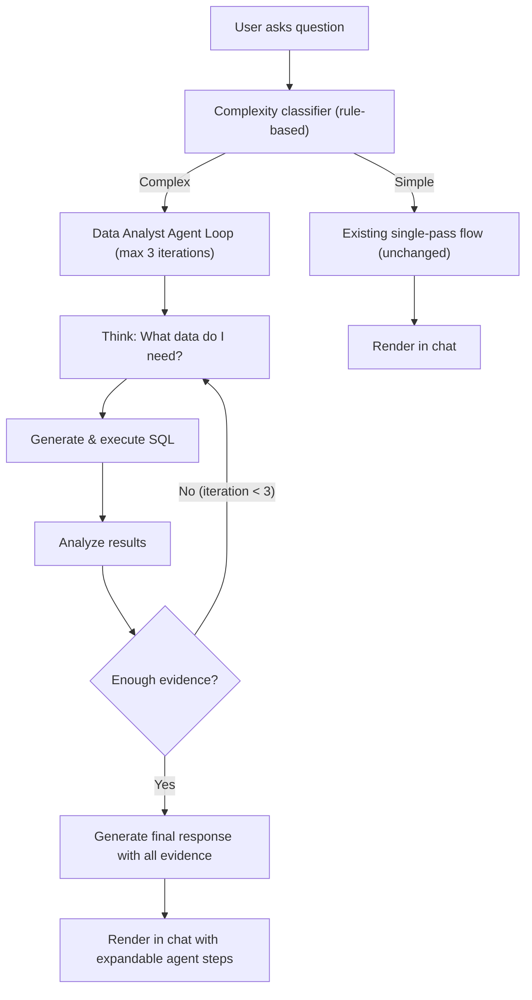

# Cohi Chat Agent Mode

## Current State

- `[cohiChatService.ts](server/src/services/ai/cohiChatService.ts)`: Single-pass flow -- user question -> LLM generates SQL -> execute -> LLM generates response. "Always gather, intelligently combine" pattern with parallel data query + RAG retrieval.
- `[cohiChat.ts](server/src/routes/cohiChat.ts)`: REST endpoints (`/ask`, `/refine`, `/sessions`, `/execute-sql`, `/edit-widget`). No streaming -- returns full JSON response.
- `[CohiChatPanel.tsx](src/components/dashboard/CohiChatPanel.tsx)`: Chat UI with message bubbles, visualizations (`EnhancedVisualization`), export (PDF/Excel/PPTX), voice input, file upload, workbench export.
- `[WorkbenchCohiPanel.tsx](src/components/workbench/WorkbenchCohiPanel.tsx)`: Workbench variant with action cards, dashboard browser, schema explorer.
- Works well for simple questions ("what's our pull-through rate?") but falls flat on complex analytical questions ("why is our FHA denial rate spiking compared to last quarter and which officers are most affected?").

## Architecture



## Backend Changes

### 1. Complexity Classifier

Add to `[cohiChatService.ts](server/src/services/ai/cohiChatService.ts)` -- a lightweight **rule-based heuristic** (no LLM call):

```typescript
function classifyComplexity(question: string): "simple" | "complex" {
  // Signals that suggest multi-step investigation
  const complexSignals = [
    /\b(why|how come|what.s causing|explain)\b/i, // causal questions
    /\b(compared? to|vs\.?|versus|relative to)\b/i, // comparisons
    /\b(trend|over time|month.over|year.over)\b/i, // temporal analysis
    /\b(by officer|by branch|per loan officer|breakdown)\b/i, // cross-entity
    /\b(correlat|relationship between|impact of)\b/i, // correlation
    /\band\b.*\band\b/i, // multiple conditions
  ];
  const hitCount = complexSignals.filter((r) => r.test(question)).length;
  return hitCount >= 2 ? "complex" : "simple";
}
```

Tunable threshold -- start conservative (>= 2 signals = complex) and adjust based on usage.

### 2. Chat Analyst Agent Wrapper

**New file**: `server/src/services/ai/chatAnalystAgent.ts`

Lightweight wrapper around the existing `[runDataAnalystAgent](server/src/services/research/agents/dataAnalystAgent.ts)` from the research system:

- **Max 3 iterations** (research uses 5)
- **No steering/pause checks** (those are research-specific)
- **No training examples lookup** (keeps it fast)
- **Same core loop**: Think -> Generate SQL -> Execute -> Analyze -> Decide (iterate or produce finding)
- **System prompt tailored for chat**: conversational tone, include visualization suggestions in the finding
- Returns a `ChatAgentResult`:

```typescript
interface ChatAgentResult {
  steps: Array<{
    type: "thinking" | "sql" | "result" | "analysis";
    content: string;
    sql?: string;
    rowCount?: number;
    rows?: Record<string, any>[];
  }>;
  response: string; // final natural language answer
  visualization?: object; // chart/table config (same format as existing chat responses)
  confidence: "high" | "medium" | "low";
}
```

Key difference from research agent: the output is a **chat response** (conversational text + optional visualization), not a structured `Finding`. The agent is told to answer the user's question directly, not produce an abstract finding.

### 3. SSE Streaming Endpoint

**New endpoint** in `[cohiChat.ts](server/src/routes/cohiChat.ts)`: `POST /api/cohi-chat/ask-deep`

- Same auth/tenant middleware as `/ask`
- Sets up SSE response headers (`text/event-stream`)
- Runs `chatAnalystAgent` with step callbacks that emit SSE events:
  - `thinking` -- agent's reasoning text
  - `sql` -- generated SQL query
  - `result` -- query results (truncated)
  - `analysis` -- agent's analysis of results
  - `response` -- final answer with visualization
  - `error` -- if something fails, falls back to single-pass
- On error or timeout, gracefully degrade to the standard `/ask` single-pass flow

The existing `/ask` endpoint stays unchanged -- the frontend decides which endpoint to call based on the complexity classification (which can also run client-side with the same heuristic, or the server can return a `"mode": "deep"` hint).

### 4. Integration with Existing Chat Context

The agent receives the same context as the current single-pass flow:

- Schema context from `[schemaContextService.ts](server/src/services/ai/schemaContextService.ts)`
- RAG/knowledge base results (fetched in parallel before agent starts, same as current flow)
- Conversation history (last N messages for continuity)
- Verified metric SQL formulas from `[metricsService.ts](server/src/services/metrics/metricsService.ts)`

Additionally, inject context about **active insights** and **recent research findings** (if they exist) so the agent can reference them:

- Last 10 active insights from `generated_insights` (headlines + understory only, not full evidence)
- Last 3 completed research sessions from `research_sessions` (topic + executive summary only)
- This enables: "Tell me more about the pipeline risk insight" or "What did my last investigation find about officer performance?"

## Frontend Changes

### 5. Complexity Detection + Endpoint Routing

In `[CohiChatPanel.tsx](src/components/dashboard/CohiChatPanel.tsx)` (and `[WorkbenchCohiPanel.tsx](src/components/workbench/WorkbenchCohiPanel.tsx)`):

- Run the same complexity classifier client-side before sending
- If complex: call `/api/cohi-chat/ask-deep` via `EventSource` and stream results
- If simple: call existing `/api/cohi-chat/ask` as before (no change)
- User can also force agent mode with a prefix like `/deep <question>` or a toggle button

### 6. Inline Agent Timeline in Chat

When a response comes from the agent endpoint, render it as a **compact inline timeline** within the chat message bubble:

- Collapsible header: "Investigated in 3 steps" with a small expand chevron
- When expanded, shows each step:
  - **Thinking**: Italic text with brain icon
  - **SQL**: Syntax-highlighted code block (collapsed by default, click to expand)
  - **Results**: "47 rows returned" summary (expandable to show table)
  - **Analysis**: Agent's interpretation
- Below the steps: the final response text + visualization (same rendering as current chat responses)
- Default state: collapsed (just shows final response). User can expand to see the agent's work.

This keeps the chat UI clean for users who don't care about the internals while giving power users full transparency.

### 7. Workbench Integration

The same agent mode works in `[WorkbenchCohiPanel](src/components/workbench/WorkbenchCohiPanel.tsx)`:

- Complex questions in the workbench chat also route to the agent endpoint
- Agent responses can include `create_widget` actions (the agent's finding data can be converted to a widget)
- "The agent investigated your question in 3 steps and found..." + action card to add the result as a canvas widget

## What Stays the Same

- The existing `/ask` endpoint and single-pass flow are **completely untouched**
- All current chat features (visualizations, export, voice, file upload, refine, sessions) continue to work
- The agent mode is additive -- simple questions still go through the fast path
- The workbench action framework (create/modify/delete widgets, generate reports) is unchanged
