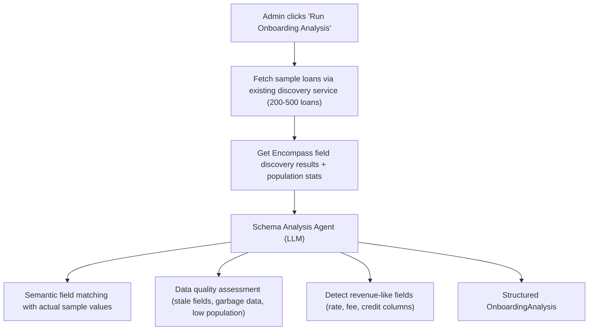

# Onboarding Analysis Agent

## Current State

- `[FieldMappingWizard](src/components/encompass/FieldMappingWizard.tsx)`: Rule-based 4-step wizard (Welcome -> Discovery -> Analysis -> Review -> Complete). Matching uses keyword similarity + population rates (max 40pt description score). No LLM involvement.
- `[FieldMappingTab](src/components/admin/tenant-config/FieldMappingTab.tsx)`: Three sub-tabs (Default Fields, Additional Fields, Population Stats). "Setup Wizard" button opens the wizard dialog.
- Revenue formulas (`[RevenueFormulaTab](src/components/admin/tenant-config/RevenueFormulaTab.tsx)`), scoring weights (`[ScoringWeightsTab](src/components/admin/tenant-config/ScoringWeightsTab.tsx)`), and additional fields (`[AdditionalFieldsTab](src/components/admin/tenant-config/AdditionalFieldsTab.tsx)`) are configured in completely separate tabs -- disconnected from the field mapping flow.
- The `AutoMapper` service has an unimplemented `semantic_match` strategy placeholder.
- Existing discovery service (`[encompassFieldDiscoveryService.ts](server/src/services/encompassFieldDiscoveryService.ts)`) already fetches RDB + custom fields, analyzes population rates from sample loans, and caches results.
- `[dataQuality.ts](server/src/routes/dataQuality.ts)` has 70+ data quality tests but isn't connected to onboarding.

## Trigger Point

Triggered from the `[FieldMappingTab](src/components/admin/tenant-config/FieldMappingTab.tsx)` after an Encompass connection exists and has synced data. Replaces (or augments) the current "Setup Wizard" button. The admin clicks "Run Onboarding Analysis" which kicks off the agent pipeline.

## Phase 1: Automated Schema Analysis



**New backend service**: `server/src/services/onboarding/onboardingAnalysisAgent.ts`

- Reuses research infrastructure: `safeExecuteSQL`, `getSchemaContext`, `callLLM` from `[server/src/services/research/tools.ts](server/src/services/research/tools.ts)`
- Input to LLM: Encompass discovered fields (name, description, format) + sample values from actual loans + current Coheus alias definitions (from `[defaultEncompassFieldMappings.ts](server/src/config/defaultEncompassFieldMappings.ts)`) + field population stats
- LLM reasons about actual data to match fields semantically (not keyword matching)
- Detects:
  - Which fields should map to which Coheus aliases (with confidence + reasoning)
  - Which fields look like revenue components (rate fields, fee fields, credit fields)
  - Which fields are stale (populated but with old/garbage data, e.g., CTC field only 22% populated)
  - Which custom fields (CX.) are actively used and worth adding
  - Data quality red flags (date inconsistencies, missing critical fields)
- Output: structured `OnboardingAnalysis`:

```typescript
interface OnboardingAnalysis {
  fieldSwapRecommendations: Array<{
    coheusAlias: string;
    recommendedFieldId: string;
    confidence: number;
    reasoning: string;
    currentPopulation: number;
    sampleValues: string[];
  }>;
  revenueFieldCandidates: Array<{
    fieldId: string;
    fieldDescription: string;
    detectedRole: "base_price" | "fee" | "credit" | "other";
    populationRate: number;
  }>;
  suggestedAdditionalFields: Array<{
    fieldId: string;
    description: string;
    populationRate: number;
    reason: string;
  }>;
  dataQualityFlags: Array<{
    field: string;
    issue: string;
    severity: "critical" | "warning" | "info";
    recommendation: string;
  }>;
  summary: string;
}
```

**New SSE endpoint**: `POST /api/onboarding/analyze/:connectionId` in `server/src/routes/onboarding.ts`

- Streams analysis progress: `discovery` -> `sampling` -> `analyzing` -> `matching` -> `quality_check` -> `complete`
- Returns structured `OnboardingAnalysis`
- Registered in `[server/src/routes/index.ts](server/src/routes/index.ts)`

## Phase 2: Interactive Onboarding Chat

After the automated analysis, the admin enters an interactive chat to finalize the setup. This is a scoped agent conversation with onboarding context and configuration tools.

**New backend service**: `server/src/services/onboarding/onboardingChatAgent.ts`

- Single data analyst agent loop (reuses pattern from `[dataAnalystAgent.ts](server/src/services/research/agents/dataAnalystAgent.ts)`)
- Max 3 iterations per question
- System prompt includes: the `OnboardingAnalysis` results, tenant's current config, available Encompass fields, current revenue formula (if any), current scoring weights
- **Agent tools** (actions the agent can execute):
  - `apply_field_swaps(swaps[])` -- writes to `encompass_field_swaps` table
  - `set_revenue_formula(components[])` -- writes to `tenant_calculations` table (same format as `[RevenueFormulaTab](src/components/admin/tenant-config/RevenueFormulaTab.tsx)` uses)
  - `update_scoring_weights(weights{})` -- writes to `scoring_weights` table
  - `add_additional_field(field)` -- adds to `additional_field_definitions` and creates column
  - `query_data(sql)` -- execute SQL against tenant data for exploratory questions
- Example conversation flows:
  - Agent: "Your CTC date field (`Fields.352`) is only 22% populated. Do you use a different field for clear-to-close tracking, or has this field been deprecated?"
  - Agent: "I detected these fields that look like revenue components: `rate_lock_buy_side_base_price_rate`, `orig_fee_borr_pd`, `orig_fees_seller`, `cd_lender_credits`. Is your revenue formula: Base Buy + Origination Fees + Seller Fees - Lender Credits?"
  - Agent: "For your sales scorecard, how do you weight volume vs. margin vs. pull-through?"
  - User: "We also track a custom field CX.HEDGE_PAIR for our secondary team"
  - Agent: (queries data to check population) "CX.HEDGE_PAIR is 87% populated across your loans. I'll add it as an additional field."

**SSE endpoint**: `POST /api/onboarding/chat/:connectionId` in the same route file

- Streams agent thinking, SQL queries, and responses
- Responses include **action cards** when the agent wants to apply changes

## Frontend: Onboarding Panel

Replace the wizard dialog trigger in `[FieldMappingTab](src/components/admin/tenant-config/FieldMappingTab.tsx)` with a full onboarding panel.

**New component**: `src/components/onboarding/OnboardingPanel.tsx`

Layout:

- **Top section**: Analysis summary cards (field matches found, quality flags, revenue fields detected)
- **Middle section**: Recommended field swaps table with accept/reject checkboxes per row, confidence badges, reasoning tooltips. Bulk actions: "Accept all high-confidence", "Accept all".
- **Bottom section**: Chat interface for the onboarding conversation
  - Chat messages with embedded **action cards** (similar to workbench Cohi panel):
    - "Apply these 47 field swaps" [Apply] [Review individually]
    - "Set revenue formula to: Base Buy + Orig Fees + Seller Fees - Credits" [Apply] [Customize]
    - "Update sales scorecard weights: Volume 25%, Margin 25%, Pull-Through 20%, ..." [Apply] [Adjust]
  - Action cards call the backend tools and show confirmation toasts

**New hook**: `src/hooks/useOnboardingAnalysis.ts`

- `startAnalysis(connectionId)` -- SSE stream for Phase 1
- `sendMessage(message)` -- SSE stream for Phase 2 chat
- Manages state: `analysis`, `chatMessages`, `appliedActions`, `phase`

**Integration into `[FieldMappingTab](src/components/admin/tenant-config/FieldMappingTab.tsx)**`:

- Replace the "Setup Wizard" button with "Run Onboarding Analysis"
- Open the OnboardingPanel as a full-width section (or large dialog) within the tab
- Keep the existing manual field mapping UI (`EncompassFieldMapping`) accessible for fine-tuning after onboarding
- After onboarding completes, refresh the field mapping display to reflect applied changes

## Existing Infrastructure Reused

- Field discovery + population analysis from `[encompassFieldDiscoveryService.ts](server/src/services/encompassFieldDiscoveryService.ts)` (already fetches RDB/custom fields, calculates population rates)
- Default field mapping definitions from `[defaultEncompassFieldMappings.ts](server/src/config/defaultEncompassFieldMappings.ts)`
- SQL execution via `safeExecuteSQL` from `[tools.ts](server/src/services/research/tools.ts)`
- LLM calls via `callLLM` from `[tools.ts](server/src/services/research/tools.ts)`
- Schema context via `[schemaContextService.ts](server/src/services/ai/schemaContextService.ts)`
- Data quality tests from `[dataQuality.ts](server/src/routes/dataQuality.ts)` (can run a subset during analysis)
