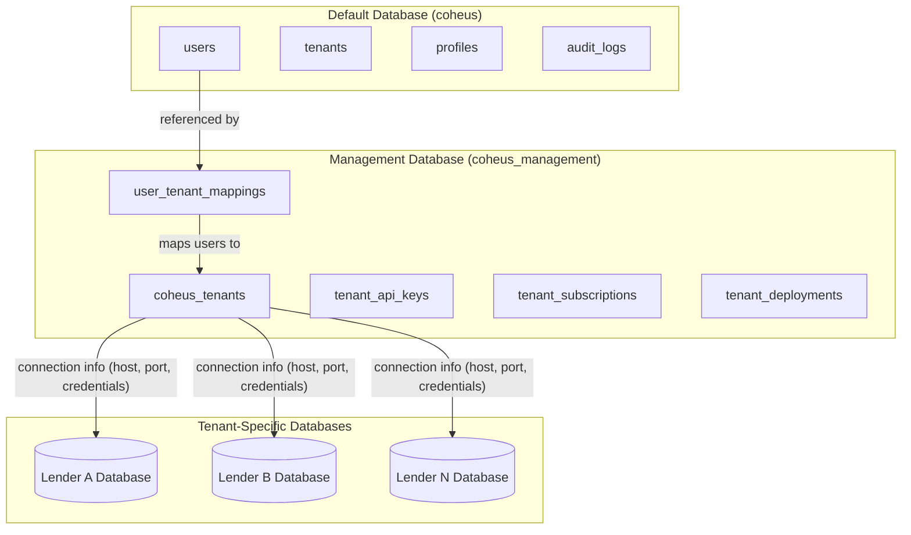
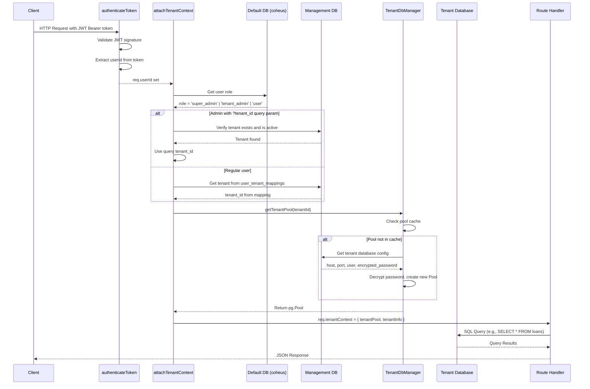

# Coheus Backend Architecture Documentation

This document provides comprehensive documentation for the Coheus backend architecture, including the multi-tenant database system, metrics service, API patterns, and Docker setup for development teams.

## Table of Contents

- [1. Multi-Tenant Database Architecture](#1-multi-tenant-database-architecture)
- [2. Request Flow and Tenant Context](#2-request-flow-and-tenant-context)
- [3. Metrics Service Architecture](#3-metrics-service-architecture)
- [4. API Route Patterns](#4-api-route-patterns)
- [5. Key Database Tables](#5-key-database-tables)
- [6. Environment Configuration](#6-environment-configuration)
- [7. Docker Setup](#7-docker-setup)
- [8. Sharing Databases with Team Members](#8-sharing-databases-with-team-members)
- [9. Troubleshooting](#9-troubleshooting)

---

## 1. Multi-Tenant Database Architecture

Coheus uses a **database-per-tenant** isolation model combined with a central **management database** for tenant registry and configuration.

### Architecture Diagram



### Three Database Types

| Database | Purpose | Key Tables |
|----------|---------|------------|
| **Default (coheus)** | User authentication, legacy support | `users`, `tenants`, `profiles`, `audit_logs` |
| **Management (coheus_management)** | Tenant registry, connection metadata | `coheus_tenants`, `user_tenant_mappings`, `tenant_api_keys` |
| **Tenant DBs** | Isolated loan data per lender | `public.loans` (296 columns) |

### Key Components

#### 1. Management Database (`server/src/config/managementDatabase.ts`)

The management database stores tenant metadata and connection information:

```typescript
// Schema for coheus_tenants table
{
  id: UUID,                          // Tenant unique identifier
  name: TEXT,                        // Display name (e.g., "ABC Mortgage")
  slug: TEXT,                        // URL-safe identifier
  database_name: TEXT,               // Tenant database name
  database_host: TEXT,               // Database host (can be remote RDS)
  database_port: INTEGER,            // Database port (default: 5432)
  database_user: TEXT,               // Database username
  database_password_encrypted: TEXT, // Encrypted password
  status: TEXT,                      // 'active', 'suspended', 'deleted', 'provisioning'
  deployment_type: TEXT,             // 'cloud', 'on_premise', 'per_lender_aws'
}
```

**Connection:**
```typescript
import { pool as managementPool } from '../config/managementDatabase.js';

// Query tenant info
const result = await managementPool.query(
  `SELECT * FROM coheus_tenants WHERE id = $1 AND status = 'active'`,
  [tenantId]
);
```

#### 2. Tenant Database Manager (`server/src/config/tenantDatabaseManager.ts`)

Manages connection pools for tenant-specific databases with caching and automatic cleanup:

```typescript
import { tenantDbManager } from '../config/tenantDatabaseManager.js';

// Get a connection pool for a specific tenant
const tenantPool = await tenantDbManager.getTenantPool(tenantId);

// Query the tenant's database
const loans = await tenantPool.query('SELECT * FROM public.loans LIMIT 10');
```

**Features:**
- **Connection Pool Caching**: Up to 50 tenant pools cached in memory
- **Idle Pool Cleanup**: Pools unused for 30 minutes are automatically closed
- **SSL Auto-detection**: SSL enabled for non-localhost connections
- **Password Decryption**: Encrypted passwords decrypted at runtime

#### 3. Tenant Context Middleware (`server/src/middleware/tenantContext.ts`)

Attaches the correct tenant database pool to each HTTP request:

```typescript
import { attachTenantContext, getTenantContext } from '../middleware/tenantContext.js';

// In route definition
router.get('/loans', authenticateToken, attachTenantContext, async (req, res) => {
  const { tenantPool, tenantInfo } = getTenantContext(req);
  
  // tenantPool is a pg.Pool connected to the tenant's database
  // tenantInfo contains { id, name, slug, database_name }
});
```

**Admin Tenant Selection:**
Admins can query any tenant by passing `?tenant_id=<uuid>` in the URL:
```
GET /api/loans?tenant_id=4ea27f49-7863-40a5-bd72-0f76cfd19e0b
```

---

## 2. Request Flow and Tenant Context

### Sequence Diagram



### Tenant Context Interface

```typescript
interface TenantContext {
  tenantId: string;
  tenantPool: pg.Pool;
  tenantInfo: {
    id: string;
    name: string;
    slug: string;
    database_name: string;
  };
}

// Access in route handlers
const ctx = getTenantContext(req);
console.log(ctx.tenantInfo.name); // "ABC Mortgage"
```

---

## 3. Metrics Service Architecture

The metrics service (`server/src/services/metrics/metricsService.ts`) provides a centralized catalog of pre-defined metrics with SQL implementations aligned to the Qlik Logic Dictionary.

### Metrics Catalog Structure

```typescript
interface MetricDefinition {
  id: string;                    // Unique metric identifier
  name: string;                  // Display name
  description: string;           // What this metric measures
  category: 'status' | 'turn_time' | 'revenue' | 'pull_through' | 'volume' | 'count';
  formula: string;               // Reference formula (Qlik syntax for documentation)
  sqlQuery: string;              // Actual PostgreSQL implementation
  dependencies: string[];        // Other metrics this depends on
  defaultDateField?: string;     // Which date field to filter on
  ignoreDateFilter?: boolean;    // For current-state metrics like active_loans
}
```

### Available Metrics

#### Status Metrics
| Metric ID | Description | Date Field |
|-----------|-------------|------------|
| `active_loans` | Loans with Active Loan Flag = Yes | `application_date` (ignores date filter) |
| `closed_loans` | Loans with Funded Flag = Yes | `funding_date` |
| `locked_loans` | Loans locked within date range | `lock_date` |

#### Turn Time Metrics
| Metric ID | Description | Date Field |
|-----------|-------------|------------|
| `avg_cycle_time` | Avg days from Application to Closing | `closing_date` |
| `avg_app_to_lock` | Avg days from Application to Lock | `lock_date` |
| `avg_lock_to_close` | Avg days from Lock to Close | `closing_date` |

#### Volume Metrics
| Metric ID | Description | Date Field |
|-----------|-------------|------------|
| `total_volume` | Sum of all loan amounts | `application_date` |
| `closed_volume` | Sum of funded loan amounts | `funding_date` |
| `locked_volume` | Sum of locked loan amounts | `lock_date` |

#### Funnel Metrics (Qlik Logic Dictionary aligned)
| Metric ID | Description | Date Field |
|-----------|-------------|------------|
| `loans_started` | Total loans started | `started_date` |
| `loans_with_respa_app` | Loans with application_date | `started_date` |
| `loans_no_respa_app` | Loans without application_date | `started_date` |
| `originated_loans` | Pull Through Originated = Yes | `funding_date` |
| `fallout_withdrawn` | Withdrawn/cancelled loans | `application_date` |
| `fallout_denied` | Denied loans | `application_date` |

#### Personnel Metrics
| Metric ID | Description | Use With |
|-----------|-------------|----------|
| `lo_loan_count` | Loan count by loan officer | `groupBy: 'loan_officer'` |
| `lo_volume` | Volume by loan officer | `groupBy: 'loan_officer'` |
| `lo_avg_cycle_time` | Cycle time by loan officer | `groupBy: 'loan_officer'` |
| `lo_pull_through` | Pull-through rate by LO | `loan_officer` filter |
| `branch_loan_count` | Loan count by branch | `groupBy: 'branch'` |
| `branch_volume` | Volume by branch | `groupBy: 'branch'` |

### Using the Metrics Service

#### Query a Single Metric

```typescript
import { queryMetric } from '../services/metrics/metricsService.js';

const result = await queryMetric(tenantPool, 'active_loans', {
  dateRange: { start: new Date('2024-01-01'), end: new Date() },
  additionalFilters: { branch: 'Main Office' }
});

// result = { metricId: 'active_loans', value: 142, metadata: {...} }
```

#### Query Multiple Metrics in Parallel

```typescript
import { queryMetrics } from '../services/metrics/metricsService.js';

const results = await queryMetrics(tenantPool, [
  'active_loans',
  'closed_loans',
  'total_volume',
  'avg_cycle_time'
], {
  dateRange: { start: new Date('2024-01-01'), end: new Date() }
});

// results = {
//   active_loans: { metricId: 'active_loans', value: 142 },
//   closed_loans: { metricId: 'closed_loans', value: 89 },
//   total_volume: { metricId: 'total_volume', value: 45000000 },
//   avg_cycle_time: { metricId: 'avg_cycle_time', value: 32 }
// }
```

#### Query Metrics Grouped by Field

```typescript
import { queryMetricGroupedBy } from '../services/metrics/metricsService.js';

const loPerformance = await queryMetricGroupedBy(
  tenantPool,
  'lo_volume',
  'loan_officer',
  { dateRange: { start: new Date('2024-01-01'), end: new Date() } }
);

// loPerformance = [
//   { groupKey: 'Sarah Chen', value: 12500000, metadata: { count: 45 } },
//   { groupKey: 'Mike Rodriguez', value: 9800000, metadata: { count: 38 } },
//   ...
// ]
```

#### Get Distinct Values for Filters

```typescript
import { getDistinctFieldValues } from '../services/metrics/metricsService.js';

const loanOfficers = await getDistinctFieldValues(tenantPool, 'loan_officer');
// ['Sarah Chen', 'Mike Rodriguez', 'Jennifer Smith', ...]

const branches = await getDistinctFieldValues(tenantPool, 'branch');
// ['Main Office', 'Downtown', 'Westside', ...]
```

### Adding Custom Metrics

Add new metrics to `METRICS_CATALOG` in `server/src/services/metrics/metricsService.ts`:

```typescript
export const METRICS_CATALOG: Record<string, MetricDefinition> = {
  // ... existing metrics ...
  
  'my_custom_metric': {
    id: 'my_custom_metric',
    name: 'My Custom Metric',
    description: 'Description of what this measures',
    category: 'count',
    formula: 'Count([Some Field])',  // For documentation
    sqlQuery: `COUNT(CASE WHEN l.some_field = 'value' THEN 1 END)`,
    dependencies: [],
    defaultDateField: 'application_date'
  }
};
```

---

## 4. API Route Patterns

All API routes follow a consistent pattern with authentication, tenant context, and rate limiting.

### Standard Route Pattern

```typescript
import { Router } from 'express';
import { authenticateToken, AuthRequest } from '../middleware/auth.js';
import { attachTenantContext, getTenantContext } from '../middleware/tenantContext.js';
import { apiLimiter } from '../middleware/rateLimiter.js';

const router = Router();

router.get('/endpoint', 
  authenticateToken,      // 1. Validate JWT token
  attachTenantContext,    // 2. Attach tenant database pool
  apiLimiter,             // 3. Apply rate limiting
  async (req: AuthRequest, res) => {
    try {
      const { tenantPool, tenantInfo } = getTenantContext(req);
      
      // Query tenant-specific database
      const result = await tenantPool.query(
        'SELECT * FROM public.loans WHERE loan_type = $1',
        ['Conventional']
      );
      
      res.json({ 
        data: result.rows,
        tenant: tenantInfo.name 
      });
    } catch (error: any) {
      console.error('[API] Error:', error.message);
      res.status(500).json({ error: 'Internal server error' });
    }
  }
);

export default router;
```

### Route Files Structure

```
server/src/routes/
├── auth.ts              # Authentication (login, register, password reset)
├── loans.ts             # Loan data endpoints (/api/loans/*)
├── metrics.ts           # Metrics endpoints (/api/metrics/*)
├── admin/
│   └── tenants.ts       # Tenant management (super_admin only)
└── dashboard/
    └── analytics.ts     # Dashboard analytics (/api/dashboard/*)
```

### Key Endpoints

| Endpoint | Method | Description |
|----------|--------|-------------|
| `/api/auth/login` | POST | Authenticate user, return JWT |
| `/api/auth/me` | GET | Get current user info |
| `/api/loans` | GET | List loans with filtering/pagination |
| `/api/loans/schema` | GET | Get loans table column metadata |
| `/api/loans/funnel` | GET | Get loan funnel metrics |
| `/api/metrics` | GET | Query multiple metrics |
| `/api/metrics/:id` | GET | Query single metric |
| `/api/dashboard/leaderboard` | GET | Loan officer leaderboard |
| `/api/dashboard/insights` | GET | AI-generated insights |
| `/api/admin/tenants` | GET/POST | Manage tenants (admin only) |

---

## 5. Key Database Tables

### Default Database (coheus)

#### `public.users`
```sql
CREATE TABLE public.users (
  id UUID PRIMARY KEY DEFAULT gen_random_uuid(),
  email TEXT NOT NULL UNIQUE,
  encrypted_password TEXT NOT NULL,
  full_name TEXT,
  role TEXT NOT NULL DEFAULT 'user' 
    CHECK (role IN ('admin', 'user', 'viewer', 'super_admin', 'tenant_admin', 'loan_officer', 'processor')),
  tenant_id UUID REFERENCES public.tenants(id),
  is_active BOOLEAN NOT NULL DEFAULT true,
  last_login_at TIMESTAMPTZ,
  created_at TIMESTAMPTZ NOT NULL DEFAULT now(),
  updated_at TIMESTAMPTZ NOT NULL DEFAULT now()
);
```

### Management Database (coheus_management)

#### `coheus_tenants`
```sql
CREATE TABLE coheus_tenants (
  id UUID PRIMARY KEY DEFAULT gen_random_uuid(),
  name TEXT NOT NULL,
  slug TEXT UNIQUE NOT NULL,
  database_name TEXT UNIQUE NOT NULL,
  database_host TEXT NOT NULL,
  database_port INTEGER DEFAULT 5432,
  database_user TEXT NOT NULL,
  database_password_encrypted TEXT NOT NULL,
  status TEXT DEFAULT 'active' 
    CHECK (status IN ('active', 'suspended', 'deleted', 'provisioning')),
  deployment_type TEXT NOT NULL 
    CHECK (deployment_type IN ('cloud', 'on_premise', 'per_lender_aws')),
  aws_account_id TEXT,
  rds_instance_id TEXT,
  created_at TIMESTAMPTZ DEFAULT NOW(),
  updated_at TIMESTAMPTZ DEFAULT NOW()
);
```

#### `user_tenant_mappings`
```sql
CREATE TABLE user_tenant_mappings (
  id UUID PRIMARY KEY DEFAULT gen_random_uuid(),
  user_id UUID NOT NULL,
  tenant_id UUID NOT NULL REFERENCES coheus_tenants(id) ON DELETE CASCADE,
  role TEXT DEFAULT 'user' 
    CHECK (role IN ('admin', 'user', 'viewer', 'super_admin', 'tenant_admin', 'loan_officer', 'processor')),
  is_primary BOOLEAN DEFAULT true,
  created_at TIMESTAMPTZ DEFAULT NOW(),
  updated_at TIMESTAMPTZ DEFAULT NOW(),
  UNIQUE(user_id, tenant_id)
);
```

### Tenant Databases

#### `public.loans` (296 columns)

Key columns include:

| Category | Columns |
|----------|---------|
| **Identifiers** | `id`, `loan_id`, `loan_number`, `guid` |
| **Core** | `loan_amount`, `loan_type`, `loan_program`, `loan_purpose`, `current_loan_status` |
| **Dates** | `started_date`, `application_date`, `lock_date`, `closing_date`, `funding_date` |
| **Financial** | `interest_rate`, `ltv_ratio`, `be_dti_ratio`, `fico_score` |
| **Property** | `property_street`, `property_city`, `property_state`, `property_zip` |
| **Personnel** | `loan_officer`, `processor`, `underwriter`, `closer`, `branch` |
| **Revenue** | `origination_points`, `pa_sell_amt`, `pa_srp_amt`, `net_buy`, `net_sell` |

---

## 6. Environment Configuration

### Required Environment Variables

Create a `.env` file in the `server/` directory:

```env
# Database Configuration
DB_HOST=localhost              # Use 127.0.0.1 to avoid IPv6 issues
DB_PORT=5432
DB_NAME=coheus                 # Default database name
DB_USER=postgres
DB_PASSWORD=your_secure_password

# Management Database (separate from default)
MANAGEMENT_DB_NAME=coheus_management

# Authentication
JWT_SECRET=your-super-secret-jwt-key-min-32-characters-long

# Server Configuration
PORT=3001
NODE_ENV=development
FRONTEND_URL=http://localhost:5174

# Optional: AI Features
OPENAI_API_KEY=sk-...
GEMINI_API_KEY=...

# Optional: Multi-tenant Settings
TENANT_ISOLATION_ENABLED=true
TENANT_DEFAULT_ID=              # Default tenant for new users
```

### SSL Configuration

SSL is automatically enabled for non-localhost database hosts:

```typescript
// From server/src/config/database.ts
const isLocalHost = dbHost === '127.0.0.1' || dbHost === 'localhost';
const sslEnabled = !isLocalHost;  // Enable SSL for remote databases
```

Override with `DB_SSL=true` or `DB_SSL=false`.

---

## 7. Docker Setup

### Development Environment

```bash
# Navigate to docker dev directory
cd docker/dev

# Copy environment template
cp .env.example.dev .env

# Edit .env with your configuration
# Minimum required:
# DB_PASSWORD=your_password
# JWT_SECRET=your-32-character-minimum-secret

# Start all services
docker compose -f docker-compose.dev.yml up -d

# View logs
docker compose -f docker-compose.dev.yml logs -f

# Stop services
docker compose -f docker-compose.dev.yml down
```

### Services and Ports

| Service | Container Name | Port | Description |
|---------|----------------|------|-------------|
| PostgreSQL | coheus-postgres-dev | 5432 | Database server |
| Redis | coheus-redis-dev | 6379 | Cache server |
| Backend | coheus-backend-dev | 3001 | Node.js API server |
| Frontend | coheus-frontend-dev | 8080 | Vite dev server |

### Hot Reload

Both frontend and backend support hot-reload in development:

- **Frontend**: Changes to `src/` automatically reload the browser
- **Backend**: Changes to `server/src/` automatically restart the server

### Production Environment

```bash
cd docker/prod

# Copy and configure environment
cp .env.example.prod .env
# Edit .env with production values

# Deploy with build
docker compose -f docker-compose.prod.yml up -d --build

# Health check
../scripts/health-check.sh prod
```

---

## 8. Sharing Databases with Team Members

When working with frontend developers who need access to your database with loan data, use one of these methods:

### Option A: Export/Import Docker Volume (Recommended)

This preserves all databases and data exactly as-is.

**On your machine (the one with data):**

```bash
# Windows PowerShell
docker run --rm -v cohi_postgres_data:/data -v ${PWD}:/backup alpine tar cvf /backup/postgres_backup.tar /data

# macOS/Linux
docker run --rm -v cohi_postgres_data:/data -v $(pwd):/backup alpine tar cvf /backup/postgres_backup.tar /data
```

**Share the `postgres_backup.tar` file** (upload to shared drive, send via Slack, etc.)

**On team member's machine:**

```bash
# Stop any running postgres container first
docker compose -f docker/dev/docker-compose.dev.yml down

# Import the volume
# Windows PowerShell
docker run --rm -v cohi_postgres_data:/data -v ${PWD}:/backup alpine sh -c "rm -rf /data/* && tar xvf /backup/postgres_backup.tar -C /"

# macOS/Linux
docker run --rm -v cohi_postgres_data:/data -v $(pwd):/backup alpine sh -c "rm -rf /data/* && tar xvf /backup/postgres_backup.tar -C /"

# Start services
docker compose -f docker/dev/docker-compose.dev.yml up -d
```

### Option B: SQL Dump/Restore

Export all databases to a SQL file.

**On your machine:**

```bash
# Dump all databases
docker exec coheus-postgres-dev pg_dumpall -U postgres > cohi_full_backup.sql

# Or dump specific databases
docker exec coheus-postgres-dev pg_dump -U postgres coheus > coheus_backup.sql
docker exec coheus-postgres-dev pg_dump -U postgres coheus_management > management_backup.sql
docker exec coheus-postgres-dev pg_dump -U postgres tenant_db_name > tenant_backup.sql
```

**Share the `.sql` files.**

**On team member's machine:**

```bash
# Ensure postgres container is running
docker compose -f docker/dev/docker-compose.dev.yml up -d postgres

# Wait for postgres to be ready
docker exec coheus-postgres-dev pg_isready -U postgres

# Restore full dump
docker exec -i coheus-postgres-dev psql -U postgres < cohi_full_backup.sql

# Or restore individual databases
docker exec -i coheus-postgres-dev psql -U postgres -d coheus < coheus_backup.sql
docker exec -i coheus-postgres-dev psql -U postgres -d coheus_management < management_backup.sql
```

### Option C: Shared Remote Database

All team members connect to a shared development database.

**Setup a shared database** (AWS RDS, Supabase, etc.)

**Configure each developer's environment:**

```env
# docker/dev/.env or server/.env
DB_HOST=shared-dev-db.abc123.us-east-1.rds.amazonaws.com
DB_PORT=5432
DB_NAME=coheus
DB_USER=dev_team
DB_PASSWORD=shared_dev_password
MANAGEMENT_DB_NAME=coheus_management

# For backend-only development (no local postgres needed)
# Comment out the postgres service in docker-compose.dev.yml
```

### Option D: Database Seed Script (For Fresh Setup)

If you have seed data scripts:

```bash
# On team member's machine after fresh docker setup
docker compose -f docker/dev/docker-compose.dev.yml up -d postgres

# Run migrations
cd server
npm run migrate

# Run seed script (if available)
npm run seed
```

---

## 9. Troubleshooting

### Database Connection Issues

**Error: `ECONNREFUSED 127.0.0.1:5432`**

PostgreSQL container is not running:
```bash
docker compose -f docker/dev/docker-compose.dev.yml up -d postgres
docker exec coheus-postgres-dev pg_isready -U postgres
```

**Error: `password authentication failed`**

Check your `.env` file has the correct `DB_PASSWORD` and the database was initialized with that password.

**Error: `Tenant not found or inactive`**

The tenant doesn't exist in the management database:
```bash
docker exec -it coheus-postgres-dev psql -U postgres -d coheus_management -c "SELECT id, name, status FROM coheus_tenants;"
```

### Checking Database Contents

```bash
# List all databases
docker exec coheus-postgres-dev psql -U postgres -c "\l"

# Connect to management database
docker exec -it coheus-postgres-dev psql -U postgres -d coheus_management

# List tenants
SELECT id, name, database_name, status FROM coheus_tenants;

# Connect to tenant database
\c tenant_database_name

# List loans
SELECT COUNT(*) FROM public.loans;
```

### Backend Not Starting

Check logs:
```bash
docker compose -f docker/dev/docker-compose.dev.yml logs backend
```

Common issues:
- Missing environment variables
- Database not ready (check `depends_on` in docker-compose)
- Port 3001 already in use

### Resetting Everything

```bash
# Stop all containers and remove volumes
docker compose -f docker/dev/docker-compose.dev.yml down -v

# Remove all coheus containers and volumes
docker rm -f $(docker ps -a -q --filter "name=coheus")
docker volume rm $(docker volume ls -q --filter "name=cohi")

# Start fresh
docker compose -f docker/dev/docker-compose.dev.yml up -d
```

---

## Quick Reference

### Common Commands

```bash
# Start development environment
docker compose -f docker/dev/docker-compose.dev.yml up -d

# View backend logs
docker compose -f docker/dev/docker-compose.dev.yml logs -f backend

# Connect to database
docker exec -it coheus-postgres-dev psql -U postgres

# Run backend locally (without Docker)
cd server && npm run dev

# Run frontend locally (without Docker)
npm run dev
```

### File Locations

| File | Purpose |
|------|---------|
| `server/.env` | Backend environment variables |
| `docker/dev/.env` | Docker development environment |
| `docker/dev/docker-compose.dev.yml` | Development services |
| `docker/prod/docker-compose.prod.yml` | Production services |
| `server/src/config/database.ts` | Default database connection |
| `server/src/config/managementDatabase.ts` | Management database connection |
| `server/src/config/tenantDatabaseManager.ts` | Tenant pool management |
| `server/src/middleware/tenantContext.ts` | Tenant middleware |
| `server/src/services/metrics/metricsService.ts` | Metrics catalog |

---

## Related Documentation

### Data Architecture
- [Data Architecture Overview](./data/OVERVIEW.md) - High-level data flow and principles
- [Universal Connector](./data/UNIVERSAL_CONNECTOR.md) - LOS-agnostic integration layer
- [Incremental Sync](./data/INCREMENTAL_SYNC.md) - How data syncs from LOS systems
- [CSV Import Guide](./data/CSV_IMPORT.md) - Manual and scheduled file imports
- [Data Quality Framework](./data/DATA_QUALITY.md) - Validation and monitoring

### LOS Integrations
- [Encompass Integration](./data/integrations/ENCOMPASS_INTEGRATION.md) - ICE Mortgage Technology LOS
- [MeridianLink Integration](./data/integrations/MERIDIANLINK_INTEGRATION.md) - LendingQB, OpenClose (planned)
- [Servicing Integration](./data/integrations/SERVICING_INTEGRATION.md) - Post-origination data (parking lot)

### Architecture & Security
- [Architecture Overview](./architecture/OVERVIEW.md)
- [Multi-Tenant Architecture](./architecture/MULTI_TENANT.md)
- [Self-Hosted Deployment](./architecture/SELF_HOSTED.md)
- [Auth Refactor Plan](./security/AUTH_REFACTOR.md)

### Admin & Deployment
- [Client Admin Requirements](./architecture/CLIENT_ADMIN_REQUIREMENTS.md)
- [Internal Admin Requirements](./architecture/INTERNAL_ADMIN_REQUIREMENTS.md)
- [Terraform Modules](./deployment/TERRAFORM_MODULES.md)
- [AWS Marketplace](./deployment/AWS_MARKETPLACE.md)
