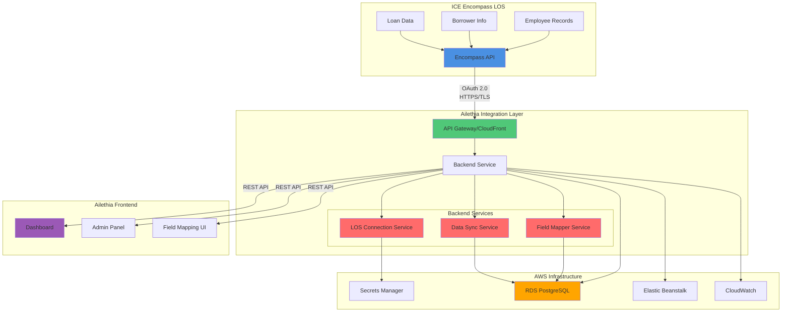
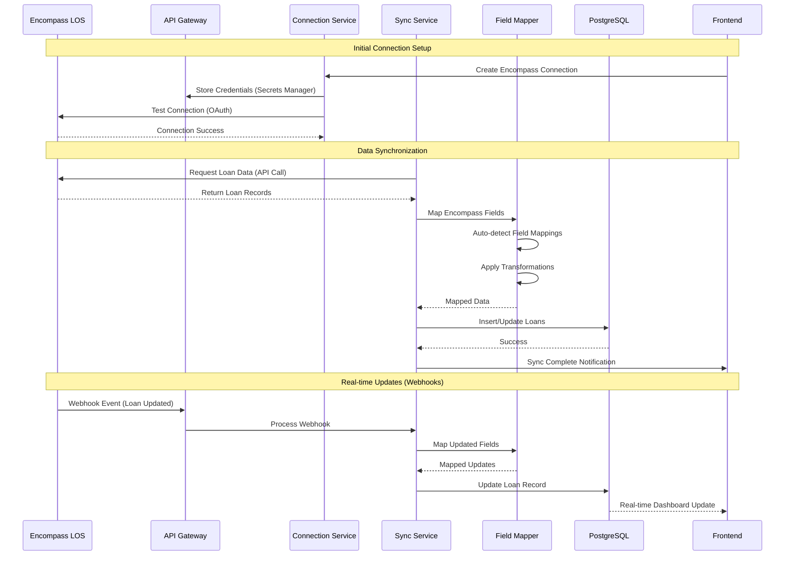
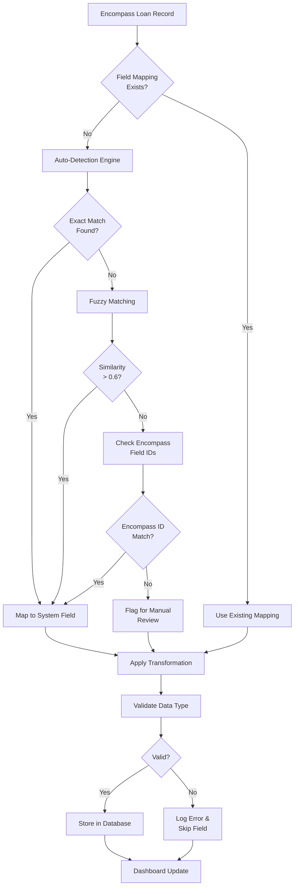
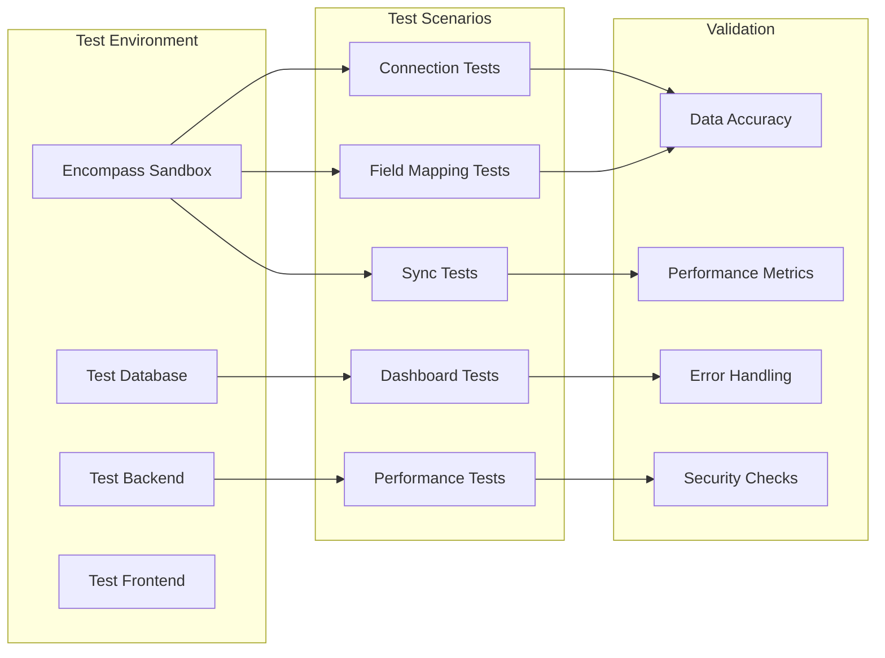
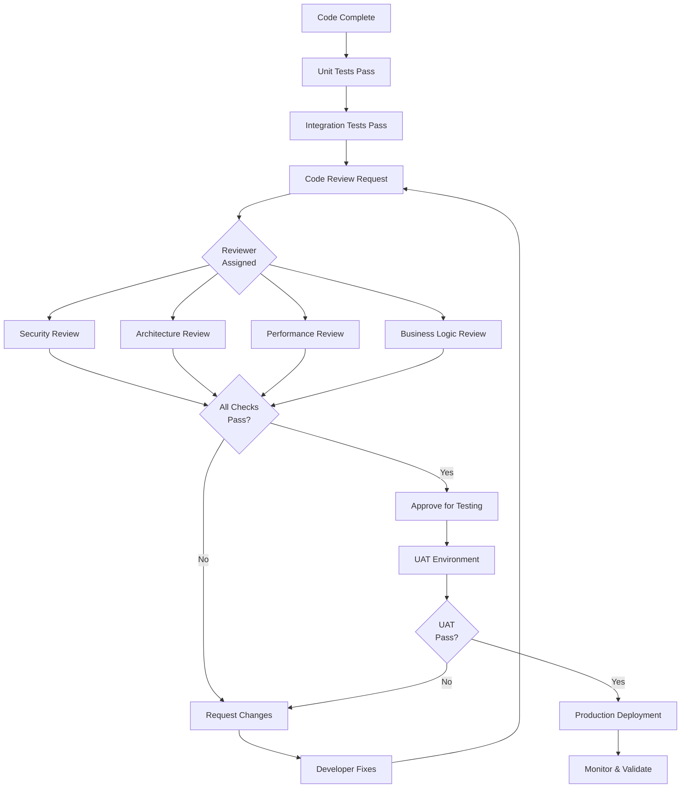

# ICE Encompass Integration Architecture

## System Architecture



## Data Flow Diagram



## Field Mapping Flow



## Testing Architecture



## Code Review Process



---

## Connection Components

### 1. Authentication Flow

```
┌─────────────┐         ┌─────────────┐         ┌─────────────┐
│  Ailethia   │         │   OAuth     │         │  Encompass  │
│   Backend   │────────>│   Server    │────────>│     API     │
└─────────────┘         └─────────────┘         └─────────────┘
      │                        │                        │
      │  1. Request Token     │                        │
      │──────────────────────>│                        │
      │                        │  2. Validate Creds    │
      │                        │──────────────────────>│
      │                        │  3. Return Access     │
      │                        │<──────────────────────│
      │  4. Access Token      │                        │
      │<──────────────────────│                        │
      │                        │                        │
      │  5. API Request + Token                        │
      │───────────────────────────────────────────────>│
      │                        │                        │
      │  6. Loan Data          │                        │
      │<───────────────────────────────────────────────│
```

### 2. Field Mapping Process

```
Encompass Field          Mapping Process          Ailethia Field
─────────────────        ────────────────        ───────────────
CX.LOANAMOUNT     ──>    Exact Match      ──>    loan_amount
Loan Amount       ──>    Display Name     ──>    loan_amount
Principal         ──>    Alias Match      ──>    loan_amount
LoanAmt           ──>    Fuzzy Match      ──>    loan_amount
Unknown Field     ──>    Manual Review    ──>    [Flagged]
```

### 3. Sync Process Flow

```
┌─────────────────────────────────────────────────────────────┐
│                    Sync Process                              │
├─────────────────────────────────────────────────────────────┤
│                                                              │
│  1. Schedule Trigger (Cron/Webhook)                        │
│     │                                                        │
│     ├─> 2. Fetch Last Sync Timestamp                        │
│     │                                                        │
│     ├─> 3. Query Encompass API                              │
│     │   - Filter by last_updated > last_sync               │
│     │                                                        │
│     ├─> 4. Process Each Loan Record                         │
│     │   │                                                    │
│     │   ├─> 5. Map Fields (Auto-detect)                     │
│     │   │                                                    │
│     │   ├─> 6. Transform Data                                │
│     │   │   - Date formats                                   │
│     │   │   - Number formats                                 │
│     │   │   - String sanitization                            │
│     │   │                                                    │
│     │   ├─> 7. Validate Data                                │
│     │   │   - Required fields                                │
│     │   │   - Data types                                     │
│     │   │                                                    │
│     │   └─> 8. Upsert to Database                           │
│     │       - INSERT if new                                  │
│     │       - UPDATE if exists                               │
│     │                                                        │
│     └─> 9. Update Sync Timestamp                            │
│                                                              │
│  10. Notify Frontend (WebSocket/SSE)                        │
│                                                              │
└─────────────────────────────────────────────────────────────┘
```

---

## Testing Matrix

| Feature | Unit Test | Integration Test | E2E Test | Performance Test |
|---------|-----------|------------------|----------|------------------|
| Connection Management | ✅ | ✅ | ✅ | ✅ |
| Field Mapping | ✅ | ✅ | ✅ | - |
| Data Sync | ✅ | ✅ | ✅ | ✅ |
| Dashboard Rendering | ✅ | - | ✅ | ✅ |
| Ailethia Prompts | ✅ | ✅ | ✅ | - |
| Error Handling | ✅ | ✅ | ✅ | - |
| Security | ✅ | ✅ | ✅ | - |

---

## Deployment Checklist

### Pre-Deployment
- [ ] Code review completed and approved
- [ ] All unit tests passing
- [ ] Integration tests passing
- [ ] Security scan completed
- [ ] Performance testing completed
- [ ] Documentation updated

### Deployment
- [ ] Encompass API credentials configured (Secrets Manager)
- [ ] Database migrations applied
- [ ] Environment variables set
- [ ] Monitoring and alerting configured
- [ ] Rollback plan documented

### Post-Deployment
- [ ] Connection test successful
- [ ] Initial sync completed
- [ ] Dashboard data validated
- [ ] Error monitoring active
- [ ] Performance metrics baseline established

---

**Document Version**: 1.0  
**Last Updated**: January 3, 2026
