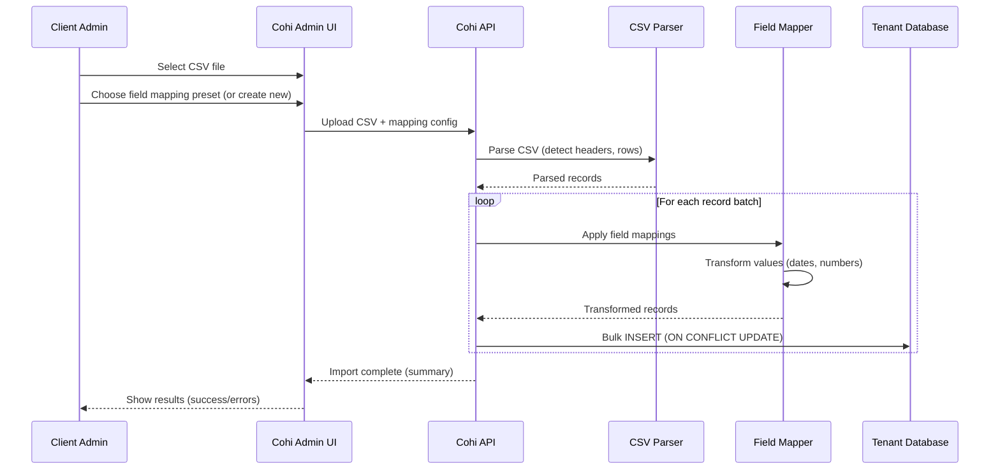

# CSV Import Guide

This document describes how to import loan data into Cohi via CSV files, including manual uploads, scheduled SFTP/S3 pulls, and field mapping configuration.

## Table of Contents

- [1. Overview](#1-overview)
- [2. Manual CSV Upload](#2-manual-csv-upload)
- [3. Scheduled File Imports](#3-scheduled-file-imports)
- [4. Field Mapping](#4-field-mapping)
- [5. Data Validation](#5-data-validation)
- [6. Best Practices](#6-best-practices)
- [7. Related Documentation](#7-related-documentation)

---

## 1. Overview

### When to Use CSV Import

| Scenario | Recommendation |
|----------|----------------|
| **LOS without API** | Primary data source via scheduled CSV |
| **Initial Migration** | Bulk load historical data from legacy system |
| **Data Correction** | One-time fix for specific loan records |
| **Backup/Fallback** | Secondary source if API is unavailable |
| **Small Lenders** | May prefer CSV over API complexity |

### Import Methods

| Method | Description | Use Case |
|--------|-------------|----------|
| **Manual Upload** | Upload CSV via admin UI | Ad-hoc imports, corrections |
| **Scheduled SFTP** | Pull files from SFTP server on schedule | Automated daily/weekly feeds |
| **Scheduled S3** | Pull files from AWS S3 bucket | Cloud-native automation |
| **API Upload** | POST CSV via API endpoint | Integration with other systems |

---

## 2. Manual CSV Upload

### Upload Flow



### CSV Requirements

| Requirement | Description |
|-------------|-------------|
| **Format** | UTF-8 encoded, comma-delimited (or configurable delimiter) |
| **Header Row** | First row must contain column names |
| **Loan ID** | Must include a unique loan identifier column |
| **File Size** | Max 100MB per upload (configurable) |

### Sample CSV Format

```csv
Loan Number,Loan Amount,Loan Type,Application Date,Closing Date,Loan Officer,Branch
ABC-001,450000,Conventional,2026-01-15,2026-02-28,John Smith,Main Office
ABC-002,325000,FHA,2026-01-16,,Jane Doe,Downtown
ABC-003,550000,VA,2026-01-17,2026-03-15,John Smith,Main Office
```

### Upload UI (Mockup)

```
┌─────────────────────────────────────────────────────────────────────────┐
│  Import Loans from CSV                                                  │
├─────────────────────────────────────────────────────────────────────────┤
│                                                                          │
│  Step 1: Upload File                                                    │
│  ┌────────────────────────────────────────────────────────────────────┐ │
│  │  📁 Drag and drop CSV file here, or click to browse                │ │
│  │                                                                     │ │
│  │  [Browse Files]                                                     │ │
│  └────────────────────────────────────────────────────────────────────┘ │
│                                                                          │
│  Step 2: Select Field Mapping                                           │
│  ┌─────────────────────────────────────────────────────────────────┐   │
│  │  Mapping Preset: [Standard Export ▼]                            │   │
│  │                                                                  │   │
│  │  [Create New Mapping] [Edit Current Mapping]                     │   │
│  └─────────────────────────────────────────────────────────────────┘   │
│                                                                          │
│  Step 3: Preview & Import                                               │
│  ┌─────────────────────────────────────────────────────────────────┐   │
│  │  Preview (first 5 rows):                                        │   │
│  │  ┌──────────────────────────────────────────────────────────┐   │   │
│  │  │ loan_id  │ loan_amount │ loan_type    │ application_date│   │   │
│  │  ├──────────┼─────────────┼──────────────┼─────────────────┤   │   │
│  │  │ ABC-001  │ 450,000     │ Conventional │ 2026-01-15      │   │   │
│  │  │ ABC-002  │ 325,000     │ FHA          │ 2026-01-16      │   │   │
│  │  └──────────────────────────────────────────────────────────┘   │   │
│  │                                                                  │   │
│  │  ☑ Skip rows with errors  ☐ Update existing loans only         │   │
│  │                                                                  │   │
│  │  [Cancel]                                      [Import 1,203 Loans] │
│  └─────────────────────────────────────────────────────────────────┘   │
│                                                                          │
└─────────────────────────────────────────────────────────────────────────┘
```

---

## 3. Scheduled File Imports

### SFTP Configuration

**Status**: 🟡 Planned

Scheduled SFTP pulls allow automated import of CSV files placed on an SFTP server.

```typescript
// los_connections configuration for SFTP
{
  los_type: 'csv_sftp',
  connection_method: 'csv_upload',
  
  // SFTP connection
  sftp_host: 'sftp.lender.com',
  sftp_port: 22,
  sftp_username_encrypted: '...',
  sftp_private_key_encrypted: '...',
  sftp_remote_path: '/exports/daily/',
  
  // File pattern
  csv_file_pattern: 'loans_export_*.csv',
  csv_archive_after_import: true,
  csv_archive_path: '/exports/processed/',
  
  // Schedule
  csv_upload_schedule: 'daily',  // daily, weekly, hourly
  csv_upload_time: '02:00',      // 2 AM
  
  // Field mapping
  csv_field_mapping: { /* ... */ }
}
```

### S3 Configuration

**Status**: 🟡 Planned

Pull CSV files from AWS S3 buckets.

```typescript
// los_connections configuration for S3
{
  los_type: 'csv_s3',
  connection_method: 'csv_upload',
  
  // S3 connection
  s3_bucket: 'lender-exports-bucket',
  s3_prefix: 'cohi/daily/',
  s3_region: 'us-east-1',
  s3_access_key_encrypted: '...',
  s3_secret_key_encrypted: '...',
  // Or use IAM role: s3_use_iam_role: true
  
  // File pattern
  csv_file_pattern: 'loans_*.csv',
  csv_archive_after_import: true,
  csv_archive_prefix: 'cohi/processed/',
  
  // Schedule
  csv_upload_schedule: 'daily',
  
  // Field mapping
  csv_field_mapping: { /* ... */ }
}
```

### Schedule Options

| Schedule | Description | Typical Use Case |
|----------|-------------|------------------|
| `manual` | Only import when triggered by admin | Ad-hoc corrections |
| `hourly` | Every hour | High-volume, near-real-time needs |
| `daily` | Once per day (configurable time) | Standard daily feed |
| `weekly` | Once per week (configurable day/time) | Low-volume lenders |

---

## 4. Field Mapping

### Mapping Configuration

Field mappings are stored per LOS connection:

```sql
-- In los_connections table
csv_field_mapping JSONB
```

```json
{
  "Loan Number": {
    "cohi_column": "loan_id",
    "required": true
  },
  "Loan Amount": {
    "cohi_column": "loan_amount",
    "transform": "parse_decimal"
  },
  "Application Date": {
    "cohi_column": "application_date",
    "transform": "parse_date",
    "date_format": "MM/DD/YYYY"
  },
  "Loan Status": {
    "cohi_column": "current_loan_status",
    "transform": "normalize_status",
    "status_map": {
      "In Process": "Active Loan",
      "Closed": "Originated",
      "Cancelled": "Withdrawn"
    }
  }
}
```

### Mapping UI

```
┌─────────────────────────────────────────────────────────────────────────┐
│  CSV Field Mapping: Daily Export                            [Save]      │
├─────────────────────────────────────────────────────────────────────────┤
│                                                                          │
│  CSV Column          │ Cohi Field          │ Transform    │ Required   │
│  ────────────────────┼─────────────────────┼──────────────┼────────────│
│  Loan Number         │ loan_id          ▼  │ None         │ ☑          │
│  Loan Amount         │ loan_amount      ▼  │ parse_decimal│ ☐          │
│  Application Date    │ application_date ▼  │ parse_date   │ ☐          │
│  Closing Date        │ closing_date     ▼  │ parse_date   │ ☐          │
│  Loan Officer Name   │ loan_officer     ▼  │ None         │ ☐          │
│  Branch Name         │ branch           ▼  │ None         │ ☐          │
│  Status              │ current_loan_sta.▼  │ normalize_st.│ ☐          │
│  Custom Field 1      │ [Unmapped]       ▼  │ --           │ ☐          │
│  ────────────────────┴─────────────────────┴──────────────┴────────────│
│                                                                          │
│  Unmapped columns will be stored in raw_data JSONB field.               │
│                                                                          │
│  [Auto-Detect Mappings]  [Import Mapping Template]  [Export Template]   │
│                                                                          │
└─────────────────────────────────────────────────────────────────────────┘
```

### Transform Functions

| Function | Input Example | Output | Use Case |
|----------|---------------|--------|----------|
| `parse_decimal` | "450,000.00" | 450000.00 | Currency amounts |
| `parse_integer` | "30" | 30 | Integer fields |
| `parse_date` | "01/15/2026" | 2026-01-15 | Date fields |
| `parse_datetime` | "01/15/2026 3:45 PM" | ISO timestamp | Datetime fields |
| `parse_boolean` | "Yes", "Y", "1" | true | Boolean fields |
| `normalize_status` | "In Process" | "Active Loan" | Status standardization |
| `trim` | "  ABC  " | "ABC" | Remove whitespace |
| `uppercase` | "abc" | "ABC" | Case conversion |
| `lowercase` | "ABC" | "abc" | Case conversion |

---

## 5. Data Validation

### Validation Rules

| Rule | Description | Action on Failure |
|------|-------------|-------------------|
| **Required Fields** | `loan_id` must be present | Skip row, log error |
| **Type Validation** | Amount must be numeric | Set to NULL, log warning |
| **Date Validation** | Dates must be parseable | Set to NULL, log warning |
| **Range Validation** | LTV between 0-200 | Flag in data quality report |
| **Duplicate Check** | Duplicate `loan_id` in file | Keep last occurrence |

### Validation Report

After import, a validation report is generated:

```
┌─────────────────────────────────────────────────────────────────────────┐
│  Import Summary: loans_export_20260123.csv                              │
├─────────────────────────────────────────────────────────────────────────┤
│                                                                          │
│  Total Rows:        1,250                                               │
│  Imported:          1,203 (96.2%)                                       │
│  Updated:           847                                                  │
│  New:               356                                                  │
│  Skipped:           47                                                   │
│  Duration:          12.3 seconds                                        │
│                                                                          │
│  ─────────────────────────────────────────────────────────────────────  │
│                                                                          │
│  Warnings (23):                                                         │
│  • Row 45: "Application Date" could not be parsed: "N/A"                │
│  • Row 89: "Loan Amount" is not a number: "TBD"                         │
│  • Row 156: Duplicate loan_id "ABC-123" (kept last occurrence)          │
│  [Show All Warnings...]                                                 │
│                                                                          │
│  Errors (47):                                                           │
│  • Row 12: Missing required field "Loan Number"                         │
│  • Row 34: Missing required field "Loan Number"                         │
│  [Download Error Report CSV]                                            │
│                                                                          │
└─────────────────────────────────────────────────────────────────────────┘
```

---

## 6. Best Practices

### File Preparation

1. **Consistent Headers**: Use the same column names in every export
2. **UTF-8 Encoding**: Ensure files are UTF-8 encoded to handle special characters
3. **No Empty Rows**: Remove empty rows before import
4. **Consistent Date Format**: Use the same date format throughout (ISO 8601 preferred)
5. **Unique Loan IDs**: Ensure every row has a unique loan identifier

### Mapping Setup

1. **Start with Auto-Detection**: Let Cohi suggest mappings first
2. **Map Required Fields First**: `loan_id`, `loan_amount`, key dates
3. **Test with Sample Data**: Import a small file to verify mappings
4. **Document Custom Mappings**: Note any non-obvious field relationships

### Ongoing Imports

1. **Incremental Preferred**: Export only changed/new loans when possible
2. **Consistent Schedule**: Match export schedule to import schedule
3. **Monitor Import Logs**: Review warnings/errors after each import
4. **Archive Processed Files**: Keep history for troubleshooting

---

## 7. Related Documentation

- [Data Architecture Overview](./OVERVIEW.md)
- [Universal Connector](./UNIVERSAL_CONNECTOR.md)
- [Data Quality Framework](./DATA_QUALITY.md)
- [Field Mapping Configuration](../architecture/CLIENT_ADMIN_REQUIREMENTS.md#field-mapping-management)
