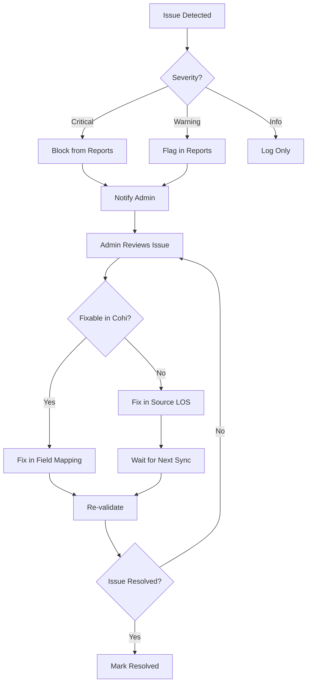

# Data Quality Framework

This document describes Cohi's data quality monitoring, validation, and reporting capabilities for client administrators.

## Table of Contents

- [1. Overview](#1-overview)
- [2. Data Quality Categories](#2-data-quality-categories)
- [3. Validation Rules](#3-validation-rules)
- [4. Data Quality Dashboard](#4-data-quality-dashboard)
- [5. AI-Powered Insights](#5-ai-powered-insights)
- [6. Remediation Workflows](#6-remediation-workflows)
- [7. Implementation Status](#7-implementation-status)
- [8. Related Documentation](#8-related-documentation)

---

## 1. Overview

### Purpose

The Data Quality Framework helps client administrators:
- Identify data issues proactively
- Understand the impact of bad data on analytics
- Fix issues at the source (LOS)
- Maintain confidence in Cohi metrics and insights

### Design Principles

| Principle | Description |
|-----------|-------------|
| **Non-Blocking** | Data quality issues don't prevent import; they're flagged for review |
| **Domain-Aware** | Leverage mortgage industry knowledge for intelligent validation |
| **AI-Enhanced** | Use AI to detect anomalies human rules might miss |
| **Actionable** | Every issue includes remediation guidance |
| **Trend-Aware** | Track quality metrics over time to show improvement |

---

## 2. Data Quality Categories

### Issue Severity Levels

| Level | Description | Dashboard Display |
|-------|-------------|-------------------|
| **Critical** | Data unusable for analytics (missing loan_id, corrupt records) | 🔴 Red |
| **Warning** | Data questionable, affects accuracy (weird dates, outliers) | 🟡 Yellow |
| **Info** | Data complete but could be improved (missing optional fields) | 🔵 Blue |

### Issue Categories

```
┌─────────────────────────────────────────────────────────────────────────┐
│                     DATA QUALITY CATEGORIES                              │
├─────────────────────────────────────────────────────────────────────────┤
│                                                                          │
│  1. COMPLETENESS                                                        │
│     ├── Missing required fields (loan_id, loan_amount)                  │
│     ├── Missing recommended fields (dates, personnel)                   │
│     └── Sparse records (< 50% fields populated)                         │
│                                                                          │
│  2. ACCURACY                                                            │
│     ├── Out-of-range values (LTV > 200%, rate > 20%)                   │
│     ├── Impossible dates (future dates, dates before 1900)             │
│     ├── Inconsistent calculations (LTV vs loan_amount/appraised_value) │
│     └── Status/date mismatches (funded status but no funding_date)     │
│                                                                          │
│  3. CONSISTENCY                                                         │
│     ├── Duplicate loan_ids                                              │
│     ├── Conflicting data from multiple sources                         │
│     └── Format inconsistencies (mixed date formats, case variations)   │
│                                                                          │
│  4. TIMELINESS                                                          │
│     ├── Stale records (no updates in 30+ days for active loans)        │
│     ├── Sync gaps (missing expected incremental updates)               │
│     └── Late data (records appearing after expected timeline)          │
│                                                                          │
│  5. DOMAIN VALIDITY                                                     │
│     ├── Invalid loan types / statuses                                   │
│     ├── Regulatory field violations (HMDA, TRID)                       │
│     ├── Business logic violations (originated but never locked)        │
│     └── Milestone sequence violations (closed before approved)         │
│                                                                          │
└─────────────────────────────────────────────────────────────────────────┘
```

---

## 3. Validation Rules

### Core Validation Rules

#### Completeness Rules

| Rule ID | Field | Severity | Description |
|---------|-------|----------|-------------|
| `REQ001` | `loan_id` | Critical | Loan identifier is required |
| `REQ002` | `loan_amount` | Critical | Loan amount is required |
| `REQ003` | `loan_type` | Warning | Loan type should be populated |
| `REQ004` | `started_date` | Warning | Started date needed for funnel |
| `REQ005` | `application_date` | Info | Application date recommended |
| `REQ006` | `current_loan_status` | Warning | Status needed for analytics |

#### Range Validation Rules

| Rule ID | Field | Valid Range | Severity |
|---------|-------|-------------|----------|
| `RNG001` | `loan_amount` | $1,000 - $50,000,000 | Warning |
| `RNG002` | `interest_rate` | 0.1% - 20% | Warning |
| `RNG003` | `ltv_ratio` | 1% - 200% | Warning |
| `RNG004` | `be_dti_ratio` | 1% - 100% | Warning |
| `RNG005` | `fico_score` | 300 - 850 | Warning |
| `RNG006` | `loan_term` | 1 - 480 months | Warning |

#### Date Validation Rules

| Rule ID | Description | Severity |
|---------|-------------|----------|
| `DT001` | Date not in future (except estimated dates) | Warning |
| `DT002` | Date not before year 2000 | Warning |
| `DT003` | `application_date` <= `lock_date` <= `closing_date` <= `funding_date` | Warning |
| `DT004` | `started_date` should be earliest date | Info |
| `DT005` | Active loans shouldn't have `funding_date` | Warning |

#### Domain Logic Rules

| Rule ID | Description | Severity |
|---------|-------------|----------|
| `DOM001` | If status = "Originated", must have `funding_date` | Warning |
| `DOM002` | If status = "Locked", must have `lock_date` | Warning |
| `DOM003` | If `loan_type` = "VA", should have VA-specific fields | Info |
| `DOM004` | If `loan_type` = "FHA", should have MI fields | Info |
| `DOM005` | `loan_amount` should match `loan_amount` = `ltv_ratio` * `appraised_value` (±5%) | Warning |

### Qlik Logic Dictionary Alignment

These rules align with Coheus (legacy Qlik) "Out of Range" flags:

```sql
-- From Transform.qvs lines 671-675
-- Interest Rate Out of Range: rate <= 0 OR rate >= 15
-- FICO Out of Range: score < 350 OR score >= 900
-- LTV Out of Range: ltv >= 110 OR ltv <= 0
-- DTI Out of Range: dti >= 70 OR dti <= 0
```

---

## 4. Data Quality Dashboard

### Dashboard Overview

**Status**: 🟡 Planned (Client Admin Feature)

```
┌─────────────────────────────────────────────────────────────────────────┐
│  Data Quality Dashboard                                     Jan 23, 2026│
├─────────────────────────────────────────────────────────────────────────┤
│                                                                          │
│  Overall Data Quality Score: 94.2%  ↑ 1.3% vs last week                │
│  ┌──────────────────────────────────────────────────────────────────┐  │
│  │ ████████████████████████████████████████░░░░ 94.2%               │  │
│  └──────────────────────────────────────────────────────────────────┘  │
│                                                                          │
│  ┌────────────────┐ ┌────────────────┐ ┌────────────────┐              │
│  │ 🔴 Critical    │ │ 🟡 Warnings    │ │ 🔵 Info        │              │
│  │     12         │ │     347        │ │     1,203      │              │
│  │  ↓ 3 vs last  │ │  ↓ 45 vs last │ │  ↑ 12 vs last │              │
│  └────────────────┘ └────────────────┘ └────────────────┘              │
│                                                                          │
│  ═══════════════════════════════════════════════════════════════════   │
│                                                                          │
│  Top Issues by Category                                                 │
│  ┌─────────────────────────────────────────────────────────────────┐   │
│  │ Category        │ Issues │ Affected Loans │ Trend        │ Action│  │
│  ├─────────────────┼────────┼────────────────┼──────────────┼───────│  │
│  │ Missing Dates   │ 203    │ 156 loans      │ ↓ improving  │ [Fix] │  │
│  │ Out of Range    │ 89     │ 67 loans       │ → stable     │ [Fix] │  │
│  │ Status Mismatch │ 45     │ 45 loans       │ ↑ worsening  │ [Fix] │  │
│  │ Duplicate IDs   │ 10     │ 20 loans       │ → stable     │ [Fix] │  │
│  └─────────────────────────────────────────────────────────────────┘   │
│                                                                          │
│  ═══════════════════════════════════════════════════════════════════   │
│                                                                          │
│  Quality Trend (Last 30 Days)                                           │
│  ┌─────────────────────────────────────────────────────────────────┐   │
│  │ 100% │                                                     ──── │   │
│  │  95% │                              ─────────────────────       │   │
│  │  90% │      ───────────────────────                             │   │
│  │  85% │ ─────                                                    │   │
│  │      └──────────────────────────────────────────────────────── │   │
│  │       Dec 24    Dec 31    Jan 7     Jan 14    Jan 21           │   │
│  └─────────────────────────────────────────────────────────────────┘   │
│                                                                          │
└─────────────────────────────────────────────────────────────────────────┘
```

### Issue Detail View

```
┌─────────────────────────────────────────────────────────────────────────┐
│  Issue: Missing Funding Date on Originated Loans (DOM001)               │
├─────────────────────────────────────────────────────────────────────────┤
│                                                                          │
│  Severity: 🟡 Warning                                                    │
│  Category: Domain Validity                                              │
│  Affected Loans: 45                                                     │
│                                                                          │
│  ─────────────────────────────────────────────────────────────────────  │
│                                                                          │
│  Description:                                                           │
│  These loans have status "Originated" but no funding_date recorded.     │
│  This affects revenue timing reports and cycle time calculations.       │
│                                                                          │
│  Impact:                                                                │
│  • Cycle time metrics: Cannot calculate accurate origination time       │
│  • Revenue reports: Revenue may be attributed to wrong period           │
│  • Funnel metrics: May undercount "Originated" in date-filtered views   │
│                                                                          │
│  Remediation:                                                           │
│  1. In your LOS, locate these loans and verify the funding date         │
│  2. Update the funding date field in Encompass                          │
│  3. Wait for next sync (or trigger manual sync)                         │
│                                                                          │
│  ─────────────────────────────────────────────────────────────────────  │
│                                                                          │
│  Affected Loans:                                                        │
│  ┌─────────────────────────────────────────────────────────────────┐   │
│  │ Loan ID     │ Status     │ Closing Date │ Funding Date │ LO     │   │
│  ├─────────────┼────────────┼──────────────┼──────────────┼────────│   │
│  │ ABC-12345   │ Originated │ 2026-01-10   │ --           │ J.Smith│   │
│  │ ABC-12346   │ Originated │ 2026-01-12   │ --           │ J.Doe  │   │
│  │ ABC-12347   │ Originated │ 2026-01-15   │ --           │ J.Smith│   │
│  └─────────────────────────────────────────────────────────────────┘   │
│  [Export to CSV]  [View in Loan Details]                                │
│                                                                          │
└─────────────────────────────────────────────────────────────────────────┘
```

---

## 5. AI-Powered Insights

### Anomaly Detection

Beyond rule-based validation, Cohi uses AI to detect subtle data quality issues:

| Detection Type | Description | Example |
|----------------|-------------|---------|
| **Statistical Outliers** | Values far outside normal distribution | Loan amount 10x average |
| **Temporal Anomalies** | Unusual patterns in time-series data | Sudden spike in denied loans |
| **Correlation Breaks** | Expected relationships not holding | High income but low loan amount |
| **Pattern Deviations** | Records that don't match peers | FHA loan missing typical FHA fields |

### AI Insight Examples

```
┌─────────────────────────────────────────────────────────────────────────┐
│  🤖 AI Data Quality Insights                                            │
├─────────────────────────────────────────────────────────────────────────┤
│                                                                          │
│  1. Unusual Pattern Detected                                   🟡       │
│     "15 loans from Branch 'Downtown' have LTV ratios exactly 80.00%.   │
│      This precision is unusual and may indicate default values being   │
│      used instead of actual calculated LTVs."                          │
│     [View Affected Loans]                                               │
│                                                                          │
│  2. Data Entry Anomaly                                         🟡       │
│     "Loan ABC-45678 has an interest rate of 45%. This appears to be    │
│      a data entry error (likely 4.5%). Recommend verification."        │
│     [View Loan]                                                         │
│                                                                          │
│  3. Missing Data Pattern                                       🔵       │
│     "Loans processed by 'Jane Doe' are 3x more likely to be missing   │
│      application dates. This may indicate a training opportunity."     │
│     [View Analysis]                                                     │
│                                                                          │
└─────────────────────────────────────────────────────────────────────────┘
```

---

## 6. Remediation Workflows

### Issue Resolution Flow



### Resolution Actions

| Issue Type | Resolution Location | Action |
|------------|---------------------|--------|
| Missing field | Source LOS | Add data to LOS, wait for sync |
| Wrong mapping | Cohi Field Mapping | Update field mapping config |
| Format issue | Cohi Transform | Add/modify transform function |
| Invalid value | Source LOS | Correct value in LOS |
| Duplicate ID | Source LOS | Merge/delete duplicate |
| Impossible date | Source LOS | Correct date in LOS |

### Export for LOS Correction

Admins can export affected loans for bulk correction in the LOS:

```
┌─────────────────────────────────────────────────────────────────────────┐
│  Export Issues for LOS Correction                                       │
├─────────────────────────────────────────────────────────────────────────┤
│                                                                          │
│  Issue Category: [Missing Funding Dates ▼]                              │
│  Export Format:  [CSV ▼]                                                │
│                                                                          │
│  Include Fields:                                                        │
│  ☑ Loan ID (for matching in LOS)                                       │
│  ☑ Current Value (what Cohi has)                                       │
│  ☑ Expected Value (if determinable)                                    │
│  ☑ Issue Description                                                   │
│  ☐ All Loan Fields                                                     │
│                                                                          │
│  [Cancel]                                    [Export 45 Records]        │
│                                                                          │
└─────────────────────────────────────────────────────────────────────────┘
```

---

## 7. Implementation Status

### Current State

| Feature | Status | Notes |
|---------|--------|-------|
| Basic validation during import | ✅ Implemented | Type conversion, null handling |
| Out-of-range flagging | ✅ Implemented | Aligns with Qlik flags |
| Data quality dashboard | 🟡 Planned | Part of Client Admin panel |
| AI anomaly detection | 🟡 Planned | Leverages existing AI infrastructure |
| Export for correction | 🟡 Planned | CSV export from issue view |
| Quality score trending | 🟡 Planned | Requires historical tracking |

### Roadmap

1. **Phase 1**: Basic quality dashboard with rule-based validation
2. **Phase 2**: AI-powered anomaly detection integration
3. **Phase 3**: Automated remediation suggestions
4. **Phase 4**: Integration with LOS for direct correction (if bidirectional added)

---

## 8. Related Documentation

- [Data Architecture Overview](./OVERVIEW.md)
- [CSV Import Guide](./CSV_IMPORT.md)
- [Universal Connector](./UNIVERSAL_CONNECTOR.md)
- [Client Admin Requirements](../architecture/CLIENT_ADMIN_REQUIREMENTS.md)
- [AI Insights Architecture](../ALETHEIA_INSIGHTS_ARCHITECTURE_REVIEW.md)
