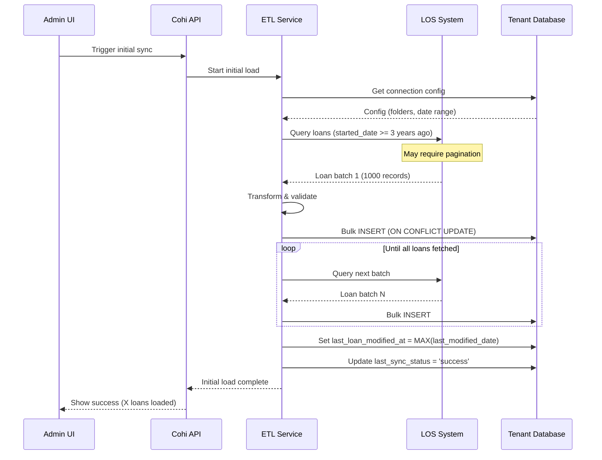
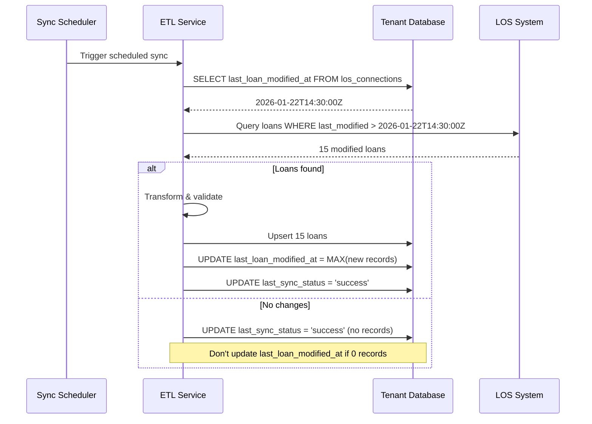

# Incremental Sync Mechanism

This document describes how Cohi handles initial data loading and subsequent incremental synchronization with LOS systems.

## Table of Contents

- [1. Overview](#1-overview)
- [2. Initial Load](#2-initial-load)
- [3. Incremental Sync](#3-incremental-sync)
- [4. Sync Scheduler](#4-sync-scheduler)
- [5. Conflict Resolution](#5-conflict-resolution)
- [6. Monitoring & Troubleshooting](#6-monitoring--troubleshooting)
- [7. Related Documentation](#7-related-documentation)

---

## 1. Overview

### Sync Strategy

| Phase | Description | Typical Duration |
|-------|-------------|------------------|
| **Initial Load** | Bulk load historical data (configurable, default 3 years) | Minutes to hours |
| **Incremental Sync** | Load only new/modified records since last sync | Seconds to minutes |

### Key Principle: `last_modified_date` Tracking

Cohi tracks the maximum `last_modified_date` from the LOS to determine which records need syncing:

```sql
-- In los_connections table
last_loan_modified_at TIMESTAMPTZ  -- MAX(Loan.LastModified) from last sync
```

This approach mirrors how the legacy Coheus Qlik app worked (`RetrieveLastModDate`) and ensures:
- No duplicate data transfer
- Minimal API calls to LOS
- Consistent incremental updates

---

## 2. Initial Load

### Configuration

Initial load parameters are configured per LOS connection:

| Parameter | Default | Description |
|-----------|---------|-------------|
| `loan_start_date_years` | 3 | How many years of historical data to load |
| `loan_start_date_field` | `started_date` | Which date field to filter on |
| `batch_size` | 1000 | Records per API call (LOS-dependent) |
| `folders` | All | Specific LOS folders to include |

### Initial Load Flow



### Initial Load SQL Pattern

```sql
-- Initial load query (conceptual)
SELECT * FROM loans
WHERE started_date >= CURRENT_DATE - INTERVAL '3 years'
ORDER BY last_modified_date ASC;
```

### Bulk Insert Strategy

```sql
-- ON CONFLICT ensures idempotent inserts
INSERT INTO public.loans (loan_id, loan_amount, loan_type, ...)
VALUES ($1, $2, $3, ...)
ON CONFLICT (loan_id) DO UPDATE SET
  loan_amount = EXCLUDED.loan_amount,
  loan_type = EXCLUDED.loan_type,
  ...,
  updated_at = NOW();
```

---

## 3. Incremental Sync

### Incremental Sync Flow



### Critical: Don't Update Timestamp on Zero Records

```typescript
// From encompassEtlService.ts
if (recordsSynced > 0) {
  // Query the MAX(last_modified_date) from loans table
  const maxModifiedResult = await tenantPool.query(
    `SELECT MAX(last_modified_date) as max_modified FROM public.loans`
  );
  
  // Update both timestamps
  await tenantPool.query(
    `UPDATE los_connections 
     SET last_synced_at = NOW(),
         last_loan_modified_at = $1,
         last_sync_status = 'success'
     WHERE id = $2`,
    [maxModifiedResult.rows[0].max_modified, losConnectionId]
  );
} else {
  // DON'T update last_loan_modified_at if no loans synced
  // This prevents "drift" where the timestamp advances without data
  await tenantPool.query(
    `UPDATE los_connections 
     SET last_sync_status = 'success'
     WHERE id = $1`,
    [losConnectionId]
  );
}
```

### Why This Matters

If we updated `last_loan_modified_at` even when no loans were synced:
1. The timestamp would drift forward
2. Next sync would miss loans modified between old timestamp and new timestamp
3. Data would slowly become stale

---

## 4. Sync Scheduler

### Scheduler Configuration

| Setting | Default | Description |
|---------|---------|-------------|
| `scheduler_interval` | 15 minutes | How often the scheduler checks for due syncs |
| `sync_frequency` | Per connection | `hourly`, `daily`, `weekly`, `realtime` |
| `batch_connections` | 5 | Max concurrent connections to sync |

### Scheduler Implementation

**Location**: `server/src/services/losSyncScheduler.ts`

```typescript
// Runs every 15 minutes
export function startSyncScheduler(): void {
  console.log('🔄 Starting LOS sync scheduler...');
  
  // Run immediately on start
  runScheduledSyncs().catch(console.error);
  
  // Then run every 15 minutes
  setInterval(() => {
    runScheduledSyncs().catch(console.error);
  }, 15 * 60 * 1000);
}
```

### Frequency Calculation

```typescript
function calculateNextSync(frequency: string, lastSync?: Date): Date {
  const now = new Date();
  
  switch (frequency) {
    case 'realtime':
      return now;  // Always due (handled by webhooks in future)
    case 'hourly':
      const nextHour = new Date(now);
      nextHour.setHours(nextHour.getHours() + 1, 0, 0, 0);
      return nextHour;
    case 'daily':
      const nextDay = new Date(now);
      nextDay.setDate(nextDay.getDate() + 1);
      nextDay.setHours(2, 0, 0, 0);  // 2 AM
      return nextDay;
    case 'weekly':
      // Next Monday at 2 AM
      const nextWeek = new Date(now);
      const daysUntilMonday = (1 + 7 - nextWeek.getDay()) % 7 || 7;
      nextWeek.setDate(nextWeek.getDate() + daysUntilMonday);
      nextWeek.setHours(2, 0, 0, 0);
      return nextWeek;
    default:
      return new Date(now.getTime() + 60 * 60 * 1000);  // 1 hour
  }
}
```

### Sync Status Tracking

```sql
-- los_connections table fields for sync tracking
sync_enabled BOOLEAN DEFAULT true,
sync_frequency TEXT DEFAULT 'hourly',
last_synced_at TIMESTAMPTZ,           -- When sync job ran
last_loan_modified_at TIMESTAMPTZ,    -- MAX(Loan.LastModified) - key for incremental
last_sync_status TEXT,                -- 'success', 'partial', 'failed', 'in_progress'
last_sync_error TEXT                  -- Error message if failed
```

---

## 5. Conflict Resolution

### Conflict Scenarios

| Scenario | Resolution |
|----------|------------|
| Same loan modified in LOS and CSV upload | LOS wins (more recent `updated_at`) |
| Duplicate `loan_id` in same batch | Keep last occurrence |
| Field type mismatch | Transform or set to NULL with warning |
| Missing required field | Use default or store in `raw_data` |

### Upsert Strategy

Cohi uses `ON CONFLICT DO UPDATE` to handle duplicates:

```sql
INSERT INTO public.loans (loan_id, loan_amount, ...)
VALUES ($1, $2, ...)
ON CONFLICT (loan_id) DO UPDATE SET
  loan_amount = EXCLUDED.loan_amount,
  -- All other fields...
  updated_at = NOW()
WHERE loans.updated_at < EXCLUDED.updated_at 
   OR EXCLUDED.updated_at IS NULL;
```

### Multi-Source Handling

If a tenant has multiple LOS connections (e.g., Encompass + CSV backup):

1. Each connection has its own `last_loan_modified_at`
2. Loans are identified by `loan_id` (must be unique across sources)
3. Most recent update wins based on `updated_at` timestamp
4. `raw_data` JSONB tracks which fields came from which source

---

## 6. Monitoring & Troubleshooting

### Sync Status Dashboard (Admin)

```
┌─────────────────────────────────────────────────────────────────────────┐
│  LOS Connection Sync Status                                             │
├─────────────────────────────────────────────────────────────────────────┤
│                                                                          │
│  Connection          │ Type      │ Last Sync       │ Status  │ Records  │
│  ──────────────────────────────────────────────────────────────────────│
│  Encompass Prod      │ API       │ 5 min ago       │ ✅       │ 47       │
│  Encompass Sandbox   │ API       │ 2 hours ago     │ ⚠️       │ 0        │
│  Daily CSV Import    │ CSV       │ Yesterday 2 AM  │ ✅       │ 1,203    │
│                                                                          │
│  ⚠️ Encompass Sandbox: No new loans found. Verify folder selection.     │
│                                                                          │
└─────────────────────────────────────────────────────────────────────────┘
```

### Common Issues

| Issue | Symptom | Resolution |
|-------|---------|------------|
| **Timestamp Drift** | Loans missing after sync | Check `last_loan_modified_at` vs actual data |
| **Auth Expired** | 401 errors in logs | Refresh OAuth token or re-authenticate |
| **Folder Mismatch** | 0 loans returned | Verify `encompass_selected_folders` config |
| **Rate Limiting** | 429 errors | Reduce batch size, increase sync interval |
| **Field Mapping** | NULL values for expected fields | Review field mappings, check source field IDs |

### Debug Queries

```sql
-- Check sync status for all connections
SELECT 
  name, 
  los_type,
  last_synced_at,
  last_loan_modified_at,
  last_sync_status,
  last_sync_error
FROM los_connections
WHERE is_active = true
ORDER BY last_synced_at DESC;

-- Check loan count by last_modified_date
SELECT 
  DATE(last_modified_date) as modified_date,
  COUNT(*) as loan_count
FROM loans
WHERE last_modified_date IS NOT NULL
GROUP BY DATE(last_modified_date)
ORDER BY modified_date DESC
LIMIT 30;

-- Find loans modified since last sync
SELECT COUNT(*)
FROM loans
WHERE last_modified_date > (
  SELECT last_loan_modified_at 
  FROM los_connections 
  WHERE id = 'YOUR_CONNECTION_ID'
);
```

---

## 7. Related Documentation

- [Data Architecture Overview](./OVERVIEW.md)
- [Universal Connector](./UNIVERSAL_CONNECTOR.md)
- [Encompass Integration](./integrations/ENCOMPASS_INTEGRATION.md)
- [Backend Architecture](../BACKEND_ARCHITECTURE.md)
