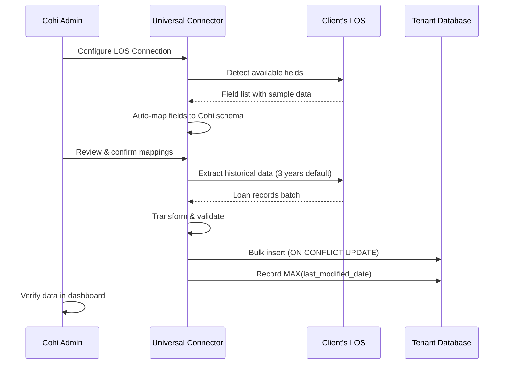
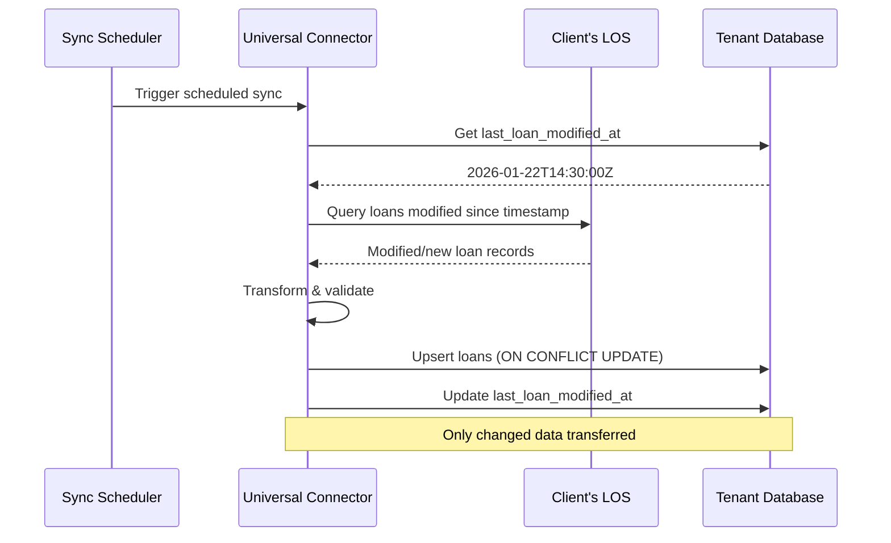

# Cohi Data Architecture Overview

This document provides a comprehensive overview of Cohi's data architecture, including how loan data flows into the system, the Universal Connector vision, and the unified schema approach.

## Table of Contents

- [1. Architecture Principles](#1-architecture-principles)
- [2. High-Level Data Flow](#2-high-level-data-flow)
- [3. Data Sources](#3-data-sources)
- [4. Unified Schema (Data Dictionary)](#4-unified-schema-data-dictionary)
- [5. Multi-Tenant Data Isolation](#5-multi-tenant-data-isolation)
- [6. Related Documentation](#6-related-documentation)

---

## 1. Architecture Principles

### Core Design Goals

| Principle | Description |
|-----------|-------------|
| **LOS Agnostic** | Any Loan Origination System can integrate via the Universal Connector |
| **Unified Schema** | Single canonical data model that all sources map to |
| **Read-Only** | Cohi consumes data from sources; no write-back to LOS |
| **Incremental First** | After initial load, only sync changed/new records |
| **Tenant Isolation** | Each client's data is in a separate database |
| **Extensible** | Easy to add new data sources (LOS, servicing, CSV) |

### Data Ownership Model

```
┌─────────────────────────────────────────────────────────────────────┐
│                     CLIENT'S SOURCE SYSTEMS                          │
│  ┌─────────────┐  ┌─────────────┐  ┌─────────────┐  ┌─────────────┐ │
│  │ Encompass   │  │ MeridianLink│  │  Servicing  │  │  CSV/SFTP   │ │
│  │    LOS      │  │    LOS      │  │   System    │  │   Uploads   │ │
│  └──────┬──────┘  └──────┬──────┘  └──────┬──────┘  └──────┬──────┘ │
└─────────┼────────────────┼────────────────┼────────────────┼────────┘
          │                │                │                │
          ▼                ▼                ▼                ▼
┌─────────────────────────────────────────────────────────────────────┐
│                      UNIVERSAL CONNECTOR                             │
│  ┌─────────────────────────────────────────────────────────────────┐│
│  │                    Field Mapping Layer                          ││
│  │   Source Fields  ──►  Auto-Mapper  ──►  Cohi Unified Schema    ││
│  └─────────────────────────────────────────────────────────────────┘│
│  ┌─────────────────────────────────────────────────────────────────┐│
│  │                  Transform & Validate Layer                     ││
│  │   Type Conversion │ Date Normalization │ Status Standardization ││
│  └─────────────────────────────────────────────────────────────────┘│
│  ┌─────────────────────────────────────────────────────────────────┐│
│  │                     Data Quality Layer                          ││
│  │   Anomaly Detection │ Missing Fields │ Domain Rule Validation   ││
│  └─────────────────────────────────────────────────────────────────┘│
└─────────────────────────────────────────────────────────────────────┘
          │
          ▼
┌─────────────────────────────────────────────────────────────────────┐
│                    COHI TENANT DATABASE                              │
│  ┌──────────────────────────────────────────────────────────────┐  │
│  │                    public.loans                               │  │
│  │   (Unified Schema - 296 columns from Data Dictionary)         │  │
│  └──────────────────────────────────────────────────────────────┘  │
│  ┌──────────────────────────────────────────────────────────────┐  │
│  │                 public.los_connections                        │  │
│  │   (Connection configs, sync status, field mappings)           │  │
│  └──────────────────────────────────────────────────────────────┘  │
└─────────────────────────────────────────────────────────────────────┘
          │
          ▼
┌─────────────────────────────────────────────────────────────────────┐
│                      COHI ANALYTICS                                  │
│  Dashboard │ Funnel │ Leaderboard │ Metrics │ AI Insights           │
└─────────────────────────────────────────────────────────────────────┘
```

---

## 2. High-Level Data Flow

### Initial Onboarding Flow



### Incremental Sync Flow



---

## 3. Data Sources

### Currently Implemented

| Source | Type | Status | Documentation |
|--------|------|--------|---------------|
| **Encompass** | API | ✅ Production | [ENCOMPASS_INTEGRATION.md](./integrations/ENCOMPASS_INTEGRATION.md) |
| **CSV Upload** | File | ✅ Production | [CSV_IMPORT.md](./CSV_IMPORT.md) |

### Planned Integrations

| Source | Type | Priority | Status |
|--------|------|----------|--------|
| **MeridianLink** | API | 🔴 High | Planned - Next |
| **Calyx Point/Path** | Database/API | 🟡 Medium | Roadmap |
| **Byte Software** | API | 🟡 Medium | Roadmap |
| **Black Knight Empower** | API | 🟡 Medium | Roadmap |
| **SFTP/S3 Pulls** | File | 🟡 Medium | Roadmap |
| **Servicing Systems** | Various | 🟢 Future | [SERVICING_INTEGRATION.md](./integrations/SERVICING_INTEGRATION.md) |

---

## 4. Unified Schema (Data Dictionary)

Cohi uses a **unified schema** defined in the Cohi Data Dictionary. All data sources map their fields to this canonical schema.

### Schema Design Principles

1. **Comprehensive**: 296 fields covering all mortgage data points
2. **Standardized Naming**: `snake_case` column names with clear prefixes
3. **Type-Safe**: Explicit PostgreSQL types (DATE, DECIMAL, TEXT, etc.)
4. **Extensible**: `raw_data` JSONB column for unmapped fields
5. **Qlik Compatible**: Field names align with Coheus (legacy Qlik) for migration

### Source of Truth

> The current schema is governed through the tenant migration set, with
> **`server/migrations/tenant/002_loans_table.sql`** as the base `public.loans`
> definition and later files in `server/migrations/tenant/` evolving it over time.
>
> Runtime code such as `server/src/services/tenantSchemaResolver.ts` introspects
> actual tenant schemas and adapts safely when column differences exist.

### Schema Origin

The current schema was migrated from the legacy Qlik Coheus system:

1. **Legacy Reference**: `QlikAppsAndLogicDictionaryDocs/logic-dictionary-docs/data-dictionary/CoheusDataDictionary.xml`
   - This XML file defined the original Coheus data dictionary
   - Used as reference to build the new PostgreSQL schema
   - **No longer used** - kept for historical reference only

2. **Current schema implementation**: `server/migrations/tenant/002_loans_table.sql` + later tenant migrations
   - `002_loans_table.sql` contains the base `public.loans` CREATE TABLE statement
   - Later files in `server/migrations/tenant/` evolve the schema in a versioned, checksum-tracked way
   - Runtime schema inspection is handled by `server/src/services/tenantSchemaResolver.ts`

### Schema Validation

The Admin Panel provides a Dictionary Check feature (Admin → LOS Settings → Dictionary Check) that compares:

- **DB Columns**: Actual columns in the tenant's `public.loans` table
- **Valid Mappings**: Columns with working Encompass field mappings (client-specific)
- **Orphaned Columns**: DB columns without dictionary mappings (cannot be populated via sync)
- **Dictionary Aliases**: Aliases defined in the field mapper

> **Note**: "Valid Mappings" varies per client depending on their Encompass configuration and field swaps.

### System Columns (Not Part of Data Dictionary)

These columns exist in `public.loans` but are intentionally not part of the loan data dictionary:

| Column | Type | Purpose |
|--------|------|---------|
| `id` | UUID | Primary key |
| `loan_id` | TEXT | Unique loan identifier from LOS |
| `raw_data` | JSONB | Stores unmapped/raw LOS fields |
| `metadata` | JSONB | Extensibility for custom data |
| `embedding` | vector(3072) | AI/RAG vector embedding |
| `created_at` | TIMESTAMPTZ | Record creation timestamp |
| `updated_at` | TIMESTAMPTZ | Last modification timestamp |
| `created_by` | UUID | FK to users table |

### Field Categories

| Category | Example Fields |
|----------|----------------|
| **Dates (Milestones)** | `started_date`, `application_date`, `lock_date`, `funding_date`, `closing_date`, `approval_date`, `ctc_date`, `docs_out_date`, `shipped_date` |
| **Revenue/Pricing** | `origination_points`, `pa_sell_amt`, `pa_srp_amt`, `net_buy`, `net_sell`, `rate_lock_buy_side_*`, `srp_from_investor`, `msr_value` |
| **Personnel** | `loan_officer`, `processor`, `underwriter`, `closer`, `account_executive`, `loan_interviewer` + `*_id` variants |
| **Fee Details** | `fee_details_line_804_*` (appraisal), `fee_details_line_805_*` (credit), `fee_details_line_807_*` (flood) |
| **Financial** | `loan_amount`, `interest_rate`, `ltv_ratio`, `cltv`, `hcltv`, `be_dti_ratio`, `appraised_value`, `sales_price` |
| **Property** | `property_street`, `property_city`, `property_county`, `property_state`, `property_zip`, `property_type`, `occupancy_type` |
| **Borrower** | `borr_employer`, `borr_position`, `borr_yrs_on_job`, `borr_self_employed`, `fico_score`, `borrower_type` |
| **ARM/Rate** | `arm_program`, `margin`, `margin_index`, `floor_rate`, `life_cap`, `first_rate_adjustment_cap`, `adjustment_period_months` |
| **Compliance** | `mavent_*_result` (12 fields), `qm_loan_type`, `atr_loan_type`, `safe_harbor` |
| **Core Loan** | `loan_id`, `loan_number`, `loan_type`, `loan_purpose`, `loan_program`, `current_loan_status`, `channel` |
| **PMI** | `pmi_flag`, `mi_percent_coverage_1`, `mi_coverage_1_months`, `mortgage_insurance_company_name` |
| **Branch/Org** | `branch`, `orgid`, `investor`, `warehouse_co_name`, `broker_lender_name` |
| **Underwriting** | `fannie_au_decision`, `freddie_au_decision`, `underwriter_risk_assess_type`, `number_of_conditions` |
| **Document/GFE** | `document_type`, `du_lp_case_id`, `gfe_initial_gfe_disclosure_*_date` (4 fields) |
| **HELOC** | `heloc_initial_draw`, `heloc_draw_period`, `heloc_repayment_period` |
| **Credit** | `fico_score`, `cu_risk_score`, `freddie_loan_level_credit_score_value`, `freddie_loan_level_credit_score_method` |

### Field Management

#### Default Fields (All Clients)

TVMA maintains the default schema through tenant migrations. When new standard fields are added:

1. Add the column in a new tenant migration under `server/migrations/tenant/`
2. Add or update the field mapping in `encompassFieldMapper.ts` (alias → column name)
3. Apply the migration through the migration runner so all tenant databases converge on the new shape

#### Client Custom Fields

Clients can add custom fields to their tenant database:

1. Client admin requests new field via Admin Panel (planned feature)
2. Custom field is added to their tenant's `public.loans` table only
3. Client configures the LOS field mapping for their custom field
4. Custom fields are stored alongside standard fields

> **Note**: Custom fields are tenant-specific and do not affect other clients.

### Key Files

| File | Purpose |
|------|---------|
| `server/migrations/tenant/002_loans_table.sql` | Base `public.loans` schema definition |
| `server/migrations/tenant/*.sql` | Ongoing schema evolution through ordered migrations |
| `server/src/services/tenantSchemaResolver.ts` | Runtime schema introspection and alias resolution |
| `server/src/services/encompassFieldMapper.ts` | Alias ↔ column name mappings, field swaps |
| `QlikAppsAndLogicDictionaryDocs/.../CoheusDataDictionary.xml` | Legacy reference only (not used) |

---

## 5. Multi-Tenant Data Isolation

Cohi uses **database-per-tenant** isolation. Each client has their own PostgreSQL database.

```
┌─────────────────────────────────────────────────────────────────┐
│                   Management Database                            │
│              (coheus_management)                                 │
│  ┌────────────────────────────────────────────────────────────┐ │
│  │ coheus_tenants                                              │ │
│  │  - id: uuid                                                 │ │
│  │  - name: "ABC Mortgage"                                     │ │
│  │  - database_name: "tenant_abc_mortgage"                     │ │
│  │  - database_host: "abc-cluster.rds.amazonaws.com"           │ │
│  │  - database_password_encrypted: "..."                       │ │
│  └────────────────────────────────────────────────────────────┘ │
└─────────────────────────────────────────────────────────────────┘
          │
          │ Connection metadata lookup
          ▼
┌─────────────────────────────────────────────────────────────────┐
│                   Tenant Databases                               │
│  ┌──────────────────┐  ┌──────────────────┐  ┌────────────────┐ │
│  │ tenant_abc       │  │ tenant_xyz       │  │ tenant_n       │ │
│  │  - loans         │  │  - loans         │  │  - loans       │ │
│  │  - employees     │  │  - employees     │  │  - employees   │ │
│  │  - los_connections│ │  - los_connections│ │  - los_connect.│ │
│  └──────────────────┘  └──────────────────┘  └────────────────┘ │
└─────────────────────────────────────────────────────────────────┘
```

### Benefits of Database-per-Tenant

- **Complete Isolation**: No risk of data leakage between clients
- **Independent Scaling**: High-volume clients can be on larger instances
- **Custom Retention**: Different backup/retention policies per client
- **Self-Hosting Ready**: Easy to extract a single tenant for AWS Marketplace deployment

---

## 6. Related Documentation

### Data Integration
- [Universal Connector Architecture](./UNIVERSAL_CONNECTOR.md)
- [Incremental Sync Mechanism](./INCREMENTAL_SYNC.md)
- [CSV Import Guide](./CSV_IMPORT.md)
- [Data Quality Framework](./DATA_QUALITY.md)

### LOS-Specific Integrations
- [Encompass Integration](./integrations/ENCOMPASS_INTEGRATION.md)
- [MeridianLink Integration](./integrations/MERIDIANLINK_INTEGRATION.md) *(planned)*
- [Servicing Integration](./integrations/SERVICING_INTEGRATION.md) *(parking lot)*

### Architecture
- [Multi-Tenant Architecture](../architecture/MULTI_TENANT.md)
- [Backend Architecture](../BACKEND_ARCHITECTURE.md)
- [Self-Hosted Deployment](../architecture/SELF_HOSTED.md)

### Admin
- [Client Admin Requirements](../architecture/CLIENT_ADMIN_REQUIREMENTS.md)
- [Field Mapping Configuration](../architecture/CLIENT_ADMIN_REQUIREMENTS.md#field-mapping-management)
