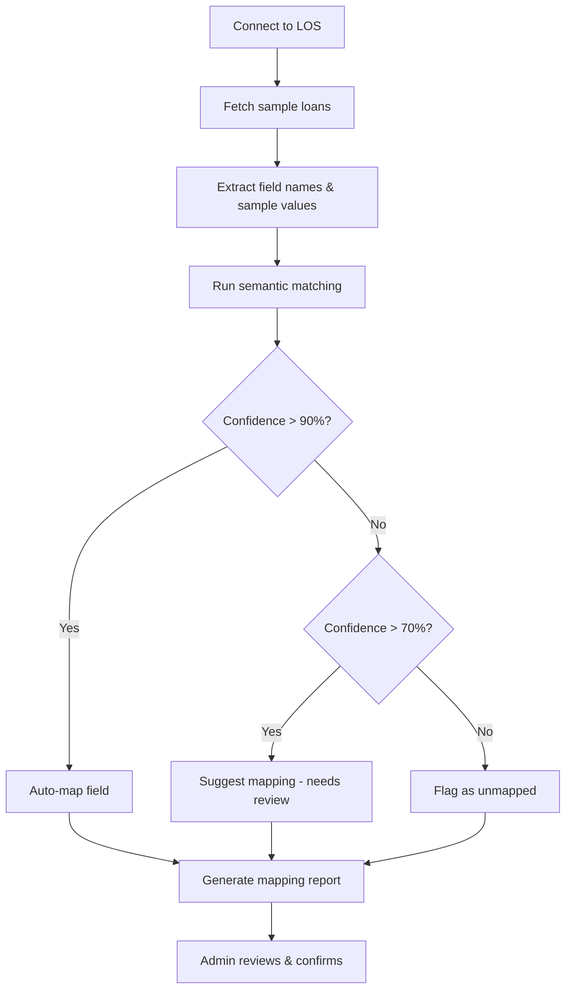

# Universal Connector Architecture

The Universal Connector is Cohi's abstraction layer that enables any Loan Origination System (LOS) to integrate with the platform through a unified field mapping approach.

## Table of Contents

- [1. Vision](#1-vision)
- [2. Architecture](#2-architecture)
- [3. Auto-Mapping Engine](#3-auto-mapping-engine)
- [4. Field Mapping Configuration](#4-field-mapping-configuration)
- [5. Connector Implementations](#5-connector-implementations)
- [6. Adding a New LOS Connector](#6-adding-a-new-los-connector)
- [7. Schema Management](#7-schema-management)
- [8. Related Documentation](#8-related-documentation)

---

## 1. Vision

### Goals

1. **LOS Agnostic**: Clients can use any LOS (Encompass, MeridianLink, Calyx, etc.) and still get full Cohi functionality
2. **Auto-Mapping**: Intelligent field detection reduces onboarding time from days to hours
3. **Single Schema**: All data maps to the Cohi Unified Schema regardless of source
4. **Extensible**: Adding new LOS integrations follows a standard pattern

### Non-Goals

- **Bidirectional Sync**: Cohi is read-only; we don't write back to the LOS
- **Real-Time First**: Initial focus is batch/incremental sync (webhooks are future)
- **Full LOS Replacement**: We complement, not replace, the LOS

---

## 2. Architecture

### Component Overview

```
┌─────────────────────────────────────────────────────────────────────────┐
│                        UNIVERSAL CONNECTOR                               │
├─────────────────────────────────────────────────────────────────────────┤
│                                                                          │
│  ┌────────────────────────────────────────────────────────────────────┐ │
│  │                      CONNECTOR LAYER                               │ │
│  │  ┌──────────────┐  ┌──────────────┐  ┌──────────────┐  ┌────────┐ │ │
│  │  │  Encompass   │  │ MeridianLink │  │    Calyx     │  │  CSV   │ │ │
│  │  │  Connector   │  │  Connector   │  │  Connector   │  │Connector│ │ │
│  │  └──────┬───────┘  └──────┬───────┘  └──────┬───────┘  └───┬────┘ │ │
│  │         │                 │                 │               │      │ │
│  │         └─────────────────┴─────────────────┴───────────────┘      │ │
│  │                                   │                                 │ │
│  │                                   ▼                                 │ │
│  │  ┌────────────────────────────────────────────────────────────────┐│ │
│  │  │              CONNECTOR INTERFACE (Abstract)                    ││ │
│  │  │  - extractLoans(options): Promise<RawLoanRecord[]>             ││ │
│  │  │  - detectFields(): Promise<FieldDefinition[]>                  ││ │
│  │  │  - testConnection(): Promise<ConnectionTestResult>             ││ │
│  │  │  - getLastModifiedTimestamp(): Promise<Date>                   ││ │
│  │  └────────────────────────────────────────────────────────────────┘│ │
│  └────────────────────────────────────────────────────────────────────┘ │
│                                   │                                      │
│                                   ▼                                      │
│  ┌────────────────────────────────────────────────────────────────────┐ │
│  │                     AUTO-MAPPING ENGINE                            │ │
│  │  ┌─────────────────┐  ┌─────────────────┐  ┌─────────────────────┐│ │
│  │  │ Field Detection │  │ Semantic Matcher│  │ Confidence Scorer   ││ │
│  │  │ (per LOS)       │  │ (ML/heuristic)  │  │ (threshold-based)   ││ │
│  │  └─────────────────┘  └─────────────────┘  └─────────────────────┘│ │
│  └────────────────────────────────────────────────────────────────────┘ │
│                                   │                                      │
│                                   ▼                                      │
│  ┌────────────────────────────────────────────────────────────────────┐ │
│  │                     FIELD MAPPING LAYER                            │ │
│  │  ┌─────────────────────────────────────────────────────────────┐  │ │
│  │  │ encompass_field_swaps / los_field_mappings table            │  │ │
│  │  │  - source_field_id: "Fields.4002"                           │  │ │
│  │  │  - cohi_column: "loan_amount"                               │  │ │
│  │  │  - transform_function: null | "parse_date" | "normalize_status"│ │
│  │  │  - is_active: true                                          │  │ │
│  │  └─────────────────────────────────────────────────────────────┘  │ │
│  └────────────────────────────────────────────────────────────────────┘ │
│                                   │                                      │
│                                   ▼                                      │
│  ┌────────────────────────────────────────────────────────────────────┐ │
│  │                   TRANSFORM & VALIDATE LAYER                       │ │
│  │  - Type conversion (string → date, number, boolean)                │ │
│  │  - Status normalization ("Funded" → "Originated")                  │ │
│  │  - Date format standardization (M/d/yyyy → ISO 8601)               │ │
│  │  - Null/empty handling                                             │ │
│  │  - Domain validation (0 < LTV < 200, etc.)                         │ │
│  └────────────────────────────────────────────────────────────────────┘ │
│                                   │                                      │
│                                   ▼                                      │
│  ┌────────────────────────────────────────────────────────────────────┐ │
│  │                         LOAD LAYER                                 │ │
│  │  - Batch insert with ON CONFLICT DO UPDATE                         │ │
│  │  - Track last_loan_modified_at for incremental sync                │ │
│  │  - Store unmapped fields in raw_data JSONB                         │ │
│  └────────────────────────────────────────────────────────────────────┘ │
└─────────────────────────────────────────────────────────────────────────┘
```

### Code Structure

```
server/src/services/
├── connectors/                    # Connector implementations
│   ├── BaseConnector.ts          # Abstract base class
│   ├── EncompassConnector.ts     # Encompass API connector
│   ├── MeridianLinkConnector.ts  # MeridianLink connector (planned)
│   ├── CSVConnector.ts           # CSV file connector
│   └── index.ts                  # Connector factory
├── etl/
│   ├── encompassEtlService.ts    # Current ETL (to be refactored)
│   └── universalEtlService.ts    # Unified ETL using connectors
├── mapping/
│   ├── autoMapper.ts             # Auto-mapping engine
│   ├── fieldMapper.ts            # Field mapping logic
│   └── transforms.ts             # Transform functions
└── losSyncScheduler.ts           # Sync scheduler
```

---

## 3. Auto-Mapping Engine

### Purpose

When onboarding a new client, the Auto-Mapping Engine analyzes their LOS field structure and automatically suggests mappings to the Cohi Unified Schema.

### Detection Process



### Matching Strategies

| Strategy | Description | Example |
|----------|-------------|---------|
| **Exact Match** | Field name matches Cohi alias exactly | `Loan Amount` → `loan_amount` |
| **Normalized Match** | After lowercasing/trimming | `LOAN_AMOUNT` → `loan_amount` |
| **Semantic Match** | Known synonyms from dictionary | `Principal Balance` → `loan_amount` |
| **Pattern Match** | Regex patterns for common formats | `Fields.4002` → (Encompass loan amount) |
| **Value-Based** | Infer from sample data types | Date-like values → date column |

### LOS-Specific Field Dictionaries

Each LOS has a pre-built dictionary of known field IDs and their Cohi mappings:

```typescript
// server/src/services/mapping/losDictionaries/encompass.ts
export const ENCOMPASS_FIELD_DICTIONARY = {
  'Fields.4002': { cohiColumn: 'loan_amount', confidence: 1.0 },
  'Fields.19': { cohiColumn: 'loan_type', confidence: 1.0 },
  'Fields.1393': { cohiColumn: 'application_date', confidence: 1.0 },
  'Fields.Log.MS.Date.Started': { cohiColumn: 'started_date', confidence: 1.0 },
  // ... hundreds more
};
```

### Confidence Levels

| Level | Threshold | Action |
|-------|-----------|--------|
| **Auto-Map** | ≥ 90% | Map automatically, no review needed |
| **Suggest** | 70-89% | Show in UI for admin review |
| **Unmapped** | < 70% | Requires manual mapping or goes to `raw_data` |

---

## 4. Field Mapping Configuration

### Database Schema

```sql
-- Per-tenant field mappings (in tenant database)
CREATE TABLE public.los_field_mappings (
  id UUID PRIMARY KEY DEFAULT gen_random_uuid(),
  los_connection_id UUID REFERENCES public.los_connections(id),
  
  -- Source field info
  source_field_id TEXT NOT NULL,        -- e.g., "Fields.4002" or "LoanAmount"
  source_field_name TEXT,               -- Human-readable name from LOS
  source_field_type TEXT,               -- Original data type
  
  -- Target mapping
  cohi_column TEXT NOT NULL,            -- Cohi schema column name
  transform_function TEXT,              -- Optional: "parse_date", "normalize_status"
  transform_config JSONB,               -- Config for transform function
  
  -- Mapping metadata
  mapping_source TEXT DEFAULT 'auto',   -- 'auto', 'manual', 'imported'
  confidence_score DECIMAL(3,2),        -- 0.00 to 1.00
  is_active BOOLEAN DEFAULT TRUE,
  
  -- Audit
  created_at TIMESTAMPTZ DEFAULT NOW(),
  updated_at TIMESTAMPTZ DEFAULT NOW(),
  created_by UUID,
  
  UNIQUE(los_connection_id, source_field_id, cohi_column)
);
```

### Mapping UI (Client Admin)

Client admins can review and modify field mappings through the admin panel:

```
┌─────────────────────────────────────────────────────────────────────────┐
│  Field Mapping Configuration                                [Save All]  │
├─────────────────────────────────────────────────────────────────────────┤
│                                                                          │
│  LOS Connection: Encompass Production  ▼                                │
│                                                                          │
│  Filter: [All Fields ▼] [Show Unmapped Only ☐]         Search: [____]   │
│                                                                          │
│  ┌────────────────────────────────────────────────────────────────────┐ │
│  │ Source Field        │ Sample Value    │ Cohi Field    │ Confidence │ │
│  ├─────────────────────┼─────────────────┼───────────────┼────────────┤ │
│  │ Fields.4002         │ 450000.00       │ loan_amount ▼ │ 100% ✓     │ │
│  │ Fields.19           │ Conventional    │ loan_type ▼   │ 100% ✓     │ │
│  │ Fields.1393         │ 2026-01-15      │ application_..│ 100% ✓     │ │
│  │ Fields.CX.CUSTOM1   │ ABC123          │ [Select...] ▼ │ -- ⚠️     │ │
│  │ Fields.CX.CUSTOM2   │ 2026-01-20      │ [Unmapped]    │ 45% ⚠️     │ │
│  └────────────────────────────────────────────────────────────────────┘ │
│                                                                          │
│  Unmapped fields are stored in raw_data and can be mapped later.        │
│                                                                          │
│  [Re-run Auto-Mapping]  [Import Mappings]  [Export Mappings]            │
│                                                                          │
└─────────────────────────────────────────────────────────────────────────┘
```

### Transform Functions

| Function | Input | Output | Use Case |
|----------|-------|--------|----------|
| `parse_date` | "1/15/2026" | 2026-01-15 | Encompass date format |
| `parse_datetime` | "1/15/2026 3:45 PM" | ISO timestamp | Datetime fields |
| `normalize_status` | "Funded" | "Originated" | Standardize statuses |
| `parse_boolean` | "Y", "Yes", "X" | true | Boolean fields |
| `parse_decimal` | "450,000.00" | 450000.00 | Currency fields |
| `extract_name` | "Smith, John" | "John Smith" | Name formatting |

---

## 5. Connector Implementations

### Base Connector Interface

```typescript
// server/src/services/connectors/BaseConnector.ts
export interface ConnectorConfig {
  losConnectionId: string;
  tenantPool: pg.Pool;
  // LOS-specific config loaded from los_connections table
}

export interface ExtractionOptions {
  modifiedSince?: Date;           // For incremental sync
  startDate?: Date;               // Loan started date filter
  limit?: number;                 // Max records to fetch
  folderNames?: string[];         // LOS-specific folder filter
}

export interface RawLoanRecord {
  sourceId: string;               // LOS-specific loan ID
  fields: Record<string, any>;    // Raw field values
  lastModified?: Date;            // For incremental tracking
}

export interface FieldDefinition {
  fieldId: string;                // LOS field identifier
  fieldName: string;              // Human-readable name
  fieldType: string;              // Data type
  sampleValues?: any[];           // Sample data for mapping
}

export abstract class BaseConnector {
  constructor(protected config: ConnectorConfig) {}
  
  // Required methods for all connectors
  abstract extractLoans(options: ExtractionOptions): Promise<RawLoanRecord[]>;
  abstract detectFields(): Promise<FieldDefinition[]>;
  abstract testConnection(): Promise<{ success: boolean; message: string }>;
  
  // Optional methods with default implementations
  async getLastModifiedTimestamp(): Promise<Date | null> {
    // Default: query from los_connections.last_loan_modified_at
  }
  
  async updateLastModifiedTimestamp(timestamp: Date): Promise<void> {
    // Default: update los_connections.last_loan_modified_at
  }
}
```

### Encompass Connector (Current Implementation)

**Location**: `server/src/services/encompassLoanExtractor.ts` (to be refactored to connector pattern)

**Features**:
- OAuth 2.0 authentication (Partner Connect, ROPC, API Key)
- Folder-based loan filtering
- Pipeline API for bulk extraction
- Field-level extraction with custom field support
- Concurrency limit monitoring

**Key Configuration** (stored in `los_connections`):
```typescript
{
  encompass_instance_id: "BE11111111",
  encompass_api_server: "https://api.elliemae.com",
  encompass_extraction_method: "partner" | "ropc" | "api",
  encompass_selected_folders: ["My Pipeline", "Processing"],
  // Encrypted credentials in encompass_secret_arn or inline
}
```

### CSV Connector

**Location**: `server/src/services/csvProcessor.ts`

**Features**:
- Parse CSV with configurable delimiters
- Header row detection
- Field mapping via `csv_field_mapping` config
- Manual upload or scheduled file path processing
- Duplicate detection

**Configuration** (stored in `los_connections`):
```typescript
{
  connection_method: "csv_upload",
  csv_upload_schedule: "daily" | "weekly" | "manual",
  csv_upload_path: "/path/to/sftp/incoming/",  // For scheduled pulls
  csv_field_mapping: {
    "Loan Number": "loan_id",
    "Amount": "loan_amount",
    // ...
  }
}
```

### MeridianLink Connector (Planned)

**Priority**: High (next integration)

**Planned Features**:
- REST API integration
- OAuth 2.0 authentication
- Loan and application data extraction
- Milestone/status mapping

---

## 6. Adding a New LOS Connector

### Step 1: Create Field Dictionary

```typescript
// server/src/services/mapping/losDictionaries/meridianlink.ts
export const MERIDIANLINK_FIELD_DICTIONARY: Record<string, FieldMapping> = {
  'loan.loanAmount': { cohiColumn: 'loan_amount', confidence: 1.0 },
  'loan.loanType': { cohiColumn: 'loan_type', confidence: 1.0 },
  'loan.applicationDate': { cohiColumn: 'application_date', confidence: 1.0 },
  // Add all known fields
};
```

### Step 2: Implement Connector

```typescript
// server/src/services/connectors/MeridianLinkConnector.ts
export class MeridianLinkConnector extends BaseConnector {
  async extractLoans(options: ExtractionOptions): Promise<RawLoanRecord[]> {
    const client = await this.getAuthenticatedClient();
    const loans = await client.getLoans({
      modifiedSince: options.modifiedSince,
      // ... other filters
    });
    return loans.map(loan => ({
      sourceId: loan.id,
      fields: loan,
      lastModified: new Date(loan.lastModifiedDate),
    }));
  }
  
  async detectFields(): Promise<FieldDefinition[]> {
    // Fetch sample loans and extract unique field paths
  }
  
  async testConnection(): Promise<{ success: boolean; message: string }> {
    // Test API connectivity and credentials
  }
}
```

### Step 3: Register in Connector Factory

```typescript
// server/src/services/connectors/index.ts
export function getConnector(losType: string, config: ConnectorConfig): BaseConnector {
  switch (losType) {
    case 'encompass':
      return new EncompassConnector(config);
    case 'meridianlink':
      return new MeridianLinkConnector(config);
    case 'csv':
      return new CSVConnector(config);
    default:
      throw new Error(`Unknown LOS type: ${losType}`);
  }
}
```

### Step 4: Add UI Support

- Add LOS type to connection wizard
- Include LOS-specific configuration fields
- Enable field detection and auto-mapping

---

## 7. Schema Management

### Default Schema (All Clients)

Cohi ships with 296 standard loan fields defined in `tenantDatabaseSchema.ts`. These fields were migrated from the legacy Qlik Coheus data dictionary and cover all common mortgage data points.

**Adding new default fields** (TVMA internal process):

1. Add the column to `public.loans` in `server/src/config/tenantDatabaseSchema.ts`
2. Add the alias mapping in `server/src/services/encompassFieldMapper.ts`
3. Schema migration runs automatically when tenant databases connect

### Client Custom Fields (Planned)

Clients may need fields specific to their business that aren't in the default schema.

**Custom Field Workflow**:

1. Client admin navigates to Admin → Data Settings → Custom Fields
2. Defines new field: name, data type, description
3. System adds column to their tenant's `public.loans` table
4. Client configures the LOS field mapping for extraction

**Custom Field Storage**:

```sql
-- Custom fields are added directly to the tenant's loans table
ALTER TABLE public.loans ADD COLUMN custom_field_name DATA_TYPE;

-- Or stored in the JSONB metadata column for flexibility
-- Access via: metadata->>'custom_field_name'
```

**Key Principles**:

- Custom fields are tenant-specific (don't affect other clients)
- Custom fields can be mapped to any LOS source field
- Custom fields are available in dashboards, exports, and AI queries
- Custom field metadata stored in `public.custom_field_definitions` (planned)

---

## 8. Related Documentation

- [Data Architecture Overview](./OVERVIEW.md)
- [Incremental Sync Mechanism](./INCREMENTAL_SYNC.md)
- [Encompass Integration](./integrations/ENCOMPASS_INTEGRATION.md)
- [MeridianLink Integration](./integrations/MERIDIANLINK_INTEGRATION.md) *(planned)*
- [Client Admin - Field Mapping](../architecture/CLIENT_ADMIN_REQUIREMENTS.md#field-mapping-management)
