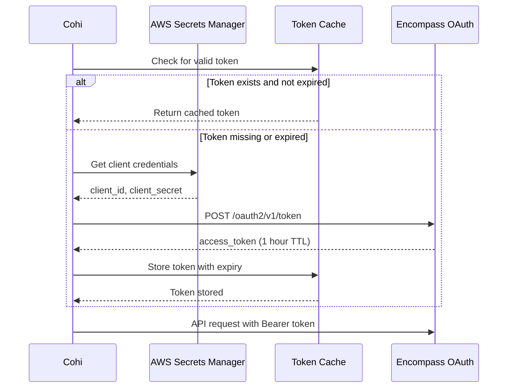

# Encompass Integration

This document provides detailed documentation for Cohi's integration with ICE Mortgage Technology's Encompass LOS.

## Table of Contents

- [1. Overview](#1-overview)
- [2. Authentication Methods](#2-authentication-methods)
- [3. Field Extraction](#3-field-extraction)
- [4. Incremental Sync](#4-incremental-sync)
- [5. Configuration](#5-configuration)
- [6. Troubleshooting](#6-troubleshooting)
- [7. Related Documentation](#7-related-documentation)

---

## 1. Overview

### Integration Summary

| Aspect | Details |
|--------|---------|
| **API Type** | REST API (Encompass Developer Connect) |
| **Authentication** | OAuth 2.0 (Partner Connect, ROPC, API Key) |
| **Data Direction** | Read-only (Cohi pulls from Encompass) |
| **Sync Method** | Batch extraction via Pipeline API |
| **Incremental** | Uses `Loan.LastModified` for change detection |

### Architecture

```
┌─────────────────────────────────────────────────────────────────────────┐
│                        ENCOMPASS INTEGRATION                             │
├─────────────────────────────────────────────────────────────────────────┤
│                                                                          │
│  ┌────────────────────────────────────────────────────────────────────┐ │
│  │                      Authentication Layer                          │ │
│  │  ┌─────────────────┐  ┌─────────────────┐  ┌─────────────────────┐│ │
│  │  │Partner Connect  │  │     ROPC        │  │    API Key          ││ │
│  │  │(Recommended)    │  │(Service Account)│  │(Legacy/Simple)      ││ │
│  │  └────────┬────────┘  └────────┬────────┘  └──────────┬──────────┘│ │
│  │           └──────────────┬─────────────────────────────┘           │ │
│  │                          ▼                                         │ │
│  │  ┌────────────────────────────────────────────────────────────────┐│ │
│  │  │                    Token Cache                                 ││ │
│  │  │  (encompass_token_cache table - avoids repeated auth)          ││ │
│  │  └────────────────────────────────────────────────────────────────┘│ │
│  └────────────────────────────────────────────────────────────────────┘ │
│                                   │                                      │
│                                   ▼                                      │
│  ┌────────────────────────────────────────────────────────────────────┐ │
│  │                       Extraction Layer                             │ │
│  │  ┌─────────────────┐  ┌─────────────────┐  ┌─────────────────────┐│ │
│  │  │ Pipeline Query  │  │  Loan Fields    │  │  Custom Fields      ││ │
│  │  │ (loan IDs)      │  │  Extraction     │  │  (CX.*, CUST*)      ││ │
│  │  └────────┬────────┘  └────────┬────────┘  └──────────┬──────────┘│ │
│  │           └──────────────┬─────────────────────────────┘           │ │
│  │                          ▼                                         │ │
│  │  ┌────────────────────────────────────────────────────────────────┐│ │
│  │  │                  EncompassLoanExtractor                        ││ │
│  │  │  - Batch loan ID retrieval                                     ││ │
│  │  │  - Field-level data extraction                                 ││ │
│  │  │  - Concurrency limit monitoring                                ││ │
│  │  └────────────────────────────────────────────────────────────────┘│ │
│  └────────────────────────────────────────────────────────────────────┘ │
│                                   │                                      │
│                                   ▼                                      │
│  ┌────────────────────────────────────────────────────────────────────┐ │
│  │                        Field Mapping Layer                         │ │
│  │  ┌────────────────────────────────────────────────────────────────┐│ │
│  │  │                 encompassFieldMapper                           ││ │
│  │  │  - Standard fields (Fields.XXXX → cohi_column)                 ││ │
│  │  │  - Custom field swaps (encompass_field_swaps table)            ││ │
│  │  │  - Type conversion (dates, numbers, booleans)                  ││ │
│  │  └────────────────────────────────────────────────────────────────┘│ │
│  └────────────────────────────────────────────────────────────────────┘ │
│                                   │                                      │
│                                   ▼                                      │
│  ┌────────────────────────────────────────────────────────────────────┐ │
│  │                         ETL Service                                │ │
│  │  ┌────────────────────────────────────────────────────────────────┐│ │
│  │  │                 EncompassEtlService                            ││ │
│  │  │  - Extract: EncompassLoanExtractor                             ││ │
│  │  │  - Transform: Field mapping + type conversion                  ││ │
│  │  │  - Load: Bulk INSERT with ON CONFLICT DO UPDATE                ││ │
│  │  └────────────────────────────────────────────────────────────────┘│ │
│  └────────────────────────────────────────────────────────────────────┘ │
│                                                                          │
└─────────────────────────────────────────────────────────────────────────┘
```

### Code Locations

| Component | File Path |
|-----------|-----------|
| API Service | `server/src/services/encompassApiService.ts` |
| Loan Extractor | `server/src/services/encompassLoanExtractor.ts` |
| Field Mapper | `server/src/services/encompassFieldMapper.ts` |
| ETL Service | `server/src/services/etl/encompassEtlService.ts` |
| Token Cache | `server/src/services/encompassTokenCache.ts` |

---

## 2. Authentication Methods

### Partner Connect (Recommended)

Partner Connect uses OAuth 2.0 with client credentials flow. This is the recommended method for production integrations.

**Requirements**:
- Registered ICE Partner account
- API client credentials from Encompass Developer Connect
- Client ID and Secret stored in AWS Secrets Manager

**Configuration**:
```typescript
{
  encompass_extraction_method: 'partner',
  encompass_instance_id: 'BE11111111',
  encompass_api_server: 'https://api.elliemae.com',
  encompass_secret_arn: 'arn:aws:secretsmanager:us-east-1:...'
}
```

**Token Flow**:


### ROPC (Resource Owner Password Credentials)

ROPC uses a service account username/password. Used when Partner Connect is not available.

**Requirements**:
- Encompass service account credentials
- Account must have API access enabled
- Account must have access to required loan folders

**Configuration**:
```typescript
{
  encompass_extraction_method: 'ropc',
  encompass_instance_id: 'BE11111111',
  encompass_sa_username_encrypted: '...',
  encompass_sa_password_encrypted: '...'
}
```

### API Key (Legacy)

Direct API key authentication. Simpler but less secure.

**Configuration**:
```typescript
{
  encompass_extraction_method: 'api',
  api_client_id_encrypted: '...',
  api_client_secret_encrypted: '...'
}
```

---

## 3. Field Extraction

### Standard Fields

Cohi extracts 296 fields from Encompass, mapping to the unified Cohi schema. The schema is defined in `tenantDatabaseSchema.ts` (source of truth) and the field mappings are implemented in `encompassFieldMapper.ts`.

**Sample Mappings**:

| Encompass Field | Cohi Column | Type |
|-----------------|-------------|------|
| `Fields.4002` | `loan_amount` | DECIMAL |
| `Fields.19` | `loan_type` | TEXT |
| `Fields.1393` | `application_date` | DATE |
| `Fields.Log.MS.Date.Started` | `started_date` | DATE |
| `Fields.748` | `lock_date` | TIMESTAMP |
| `Fields.1997` | `funding_date` | TIMESTAMP |
| `Fields.1` | `loan_id` | TEXT |

### Custom Fields (CX.*, CUST*)

Clients can use custom Encompass fields. These are mapped via the `encompass_field_swaps` table.

```sql
-- Example custom field swap
INSERT INTO encompass_field_swaps (
  los_connection_id,
  coheus_alias,
  encompass_field_id,
  swap_type
) VALUES (
  'uuid-here',
  'custom_revenue_field',
  'CX.REVENUE.TOTAL',
  'Profitability'
);
```

### Folder Filtering

Encompass loans are organized in folders. Cohi can sync from specific folders:

```typescript
{
  encompass_selected_folders: [
    "My Pipeline",
    "Processing",
    "Underwriting",
    "Closing"
  ]
}
```

If empty, all accessible folders are synced.

### Field List Configuration

The extraction process requests specific fields to minimize API payload:

```typescript
const ENCOMPASS_FIELDS_TO_EXTRACT = [
  'Loan.LoanNumber',
  'Loan.LoanAmount',
  'Loan.LastModified',
  'Fields.4002',
  'Fields.19',
  // ... 296 total fields
];
```

---

## 4. Incremental Sync

### Sync Strategy

Encompass sync uses the `Loan.LastModified` timestamp to identify changed loans:

```typescript
// Pipeline query for incremental sync
{
  "filter": {
    "operator": "and",
    "terms": [
      {
        "canonicalName": "Loan.LastModified",
        "matchType": "greaterThanOrEquals",
        "value": "2026-01-22T14:30:00Z"  // last_loan_modified_at from DB
      },
      {
        "canonicalName": "Loan.LoanFolder",
        "matchType": "contains",
        "value": "My Pipeline"  // if folder filtering enabled
      }
    ]
  }
}
```

### Initial Load vs Incremental

| Scenario | Query Filter | Expected Volume |
|----------|--------------|-----------------|
| **Initial Load** | `Loan.DateStarted >= 3 years ago` | Thousands of loans |
| **Incremental** | `Loan.LastModified > last_loan_modified_at` | Tens to hundreds |

### Timestamp Handling

```typescript
// After successful sync
if (recordsSynced > 0) {
  // Get MAX(last_modified_date) from loaded loans
  const maxModified = await tenantPool.query(
    `SELECT MAX(last_modified_date) FROM loans`
  );
  
  // Store for next incremental sync
  await tenantPool.query(
    `UPDATE los_connections 
     SET last_loan_modified_at = $1 
     WHERE id = $2`,
    [maxModified, connectionId]
  );
}
// NOTE: Don't update if 0 records - prevents timestamp drift
```

---

## 5. Configuration

### LOS Connection Setup

```sql
-- Example Encompass connection in los_connections table
INSERT INTO los_connections (
  los_type,
  name,
  connection_method,
  encompass_instance_id,
  encompass_api_server,
  encompass_extraction_method,
  encompass_secret_arn,
  encompass_selected_folders,
  sync_enabled,
  sync_frequency
) VALUES (
  'encompass',
  'Production Encompass',
  'api',
  'BE11111111',
  'https://api.elliemae.com',
  'partner',
  'arn:aws:secretsmanager:us-east-1:123456789:secret:encompass-prod',
  '["My Pipeline", "Processing", "Closing"]',
  true,
  'hourly'
);
```

### Environment Variables

```env
# Required for AWS Secrets Manager access (for Partner Connect)
AWS_REGION=us-east-1
AWS_ACCESS_KEY_ID=...
AWS_SECRET_ACCESS_KEY=...

# Or use IAM roles if running in AWS
```

### Concurrency Limits

Encompass has API concurrency limits. Cohi monitors and respects these:

```sql
-- Concurrency metrics table
CREATE TABLE encompass_concurrency_metrics (
  id UUID PRIMARY KEY,
  los_connection_id UUID,
  limit_value INTEGER,      -- e.g., 10
  remaining INTEGER,        -- e.g., 7
  utilized INTEGER,         -- e.g., 3
  utilization_ratio DECIMAL,
  exceeded_threshold BOOLEAN,
  timestamp TIMESTAMPTZ
);
```

When utilization exceeds 80%, Cohi backs off to avoid hitting limits.

---

## 6. Troubleshooting

### Common Issues

#### Authentication Failures

| Error | Cause | Resolution |
|-------|-------|------------|
| `401 Unauthorized` | Token expired or invalid | Check credentials, refresh token |
| `403 Forbidden` | Missing API permissions | Verify Encompass user/API access |
| `Invalid client_id` | Wrong credentials | Verify client_id in Secrets Manager |

#### Data Issues

| Issue | Symptom | Resolution |
|-------|---------|------------|
| **Missing loans** | Count lower than expected | Check folder selection, date filters |
| **Duplicate loans** | Same loan_id multiple times | Check for folder overlaps |
| **Stale data** | Recent changes not showing | Verify `last_loan_modified_at` timestamp |
| **Field not populated** | NULL values for expected field | Check field mapping, custom field ID |

#### Rate Limiting

| Error | Cause | Resolution |
|-------|-------|------------|
| `429 Too Many Requests` | Exceeded API rate limit | Reduce batch size, increase interval |
| Concurrency exceeded | Too many parallel requests | Reduce concurrent connections |

### Debug Logging

Enable verbose logging for troubleshooting:

```typescript
// In encompassEtlService.ts
console.log(`[EncompassEtlService] Starting extraction for connection: ${losConnectionId}`);
console.log(`[EncompassEtlService] Extracted ${loans.length} loans from Encompass API`);
console.log(`[EncompassEtlService] Sample raw loan object:`, JSON.stringify(loans[0], null, 2));
```

### Verification Queries

```sql
-- Check sync status
SELECT 
  name,
  last_synced_at,
  last_loan_modified_at,
  last_sync_status,
  last_sync_error
FROM los_connections
WHERE los_type = 'encompass';

-- Count loans by source
SELECT 
  COUNT(*) as total_loans,
  MAX(last_modified_date) as most_recent,
  MIN(last_modified_date) as oldest
FROM loans;

-- Check for missing expected fields
SELECT loan_id, application_date, lock_date, funding_date
FROM loans
WHERE current_loan_status ILIKE '%originated%'
  AND funding_date IS NULL
LIMIT 10;
```

---

## 7. Related Documentation

- [Universal Connector](../UNIVERSAL_CONNECTOR.md)
- [Incremental Sync Mechanism](../INCREMENTAL_SYNC.md)
- [Data Quality Framework](../DATA_QUALITY.md)
- [Backend Architecture](../../BACKEND_ARCHITECTURE.md)
- [Encompass Developer Connect Docs](https://docs.elliemae.com/developer-connect/)
