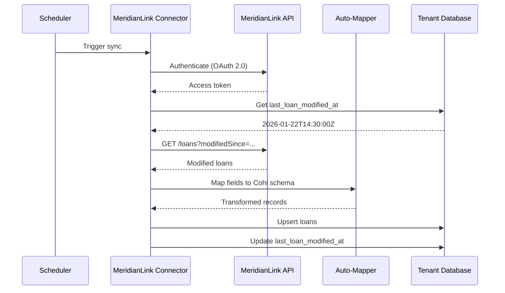

# MeridianLink Integration

> **Status**: 🟡 Planned (Next LOS Integration)

This document outlines the planned integration with MeridianLink LOS products (LendingQB, OpenClose).

## Table of Contents

- [1. Overview](#1-overview)
- [2. MeridianLink Products](#2-meridianlink-products)
- [3. Planned Architecture](#3-planned-architecture)
- [4. API Integration Points](#4-api-integration-points)
- [5. Field Mapping Strategy](#5-field-mapping-strategy)
- [6. Implementation Roadmap](#6-implementation-roadmap)
- [7. Related Documentation](#7-related-documentation)

---

## 1. Overview

### Integration Goals

MeridianLink is planned as the second LOS integration after Encompass. The goals are:

1. **Prove Universal Connector**: Validate that the connector abstraction works for a different LOS
2. **Auto-Mapping**: Build auto-mapping capabilities for MeridianLink field structures
3. **Incremental Sync**: Implement efficient change detection

### MeridianLink Background

MeridianLink provides mortgage LOS solutions including:
- **LendingQB**: Cloud-based LOS
- **OpenClose**: Comprehensive mortgage platform
- **Consumer lending solutions**

---

## 2. MeridianLink Products

### LendingQB

| Aspect | Details |
|--------|---------|
| **Type** | Cloud-hosted SaaS LOS |
| **API** | REST API with OAuth 2.0 |
| **Data Model** | Loan-centric with milestones |
| **Target Clients** | Mid-size lenders, credit unions |

### OpenClose

| Aspect | Details |
|--------|---------|
| **Type** | Comprehensive mortgage platform |
| **API** | REST API |
| **Data Model** | Full loan lifecycle |
| **Target Clients** | Enterprise lenders |

---

## 3. Planned Architecture

### Connector Design

```
┌─────────────────────────────────────────────────────────────────────────┐
│                    MERIDIANLINK CONNECTOR                                │
├─────────────────────────────────────────────────────────────────────────┤
│                                                                          │
│  ┌────────────────────────────────────────────────────────────────────┐ │
│  │                      Authentication                                │ │
│  │  ┌─────────────────────────────────────────────────────────────┐  │ │
│  │  │  OAuth 2.0 Client Credentials                               │  │ │
│  │  │  - Token caching (similar to Encompass)                     │  │ │
│  │  │  - Auto-refresh before expiry                               │  │ │
│  │  └─────────────────────────────────────────────────────────────┘  │ │
│  └────────────────────────────────────────────────────────────────────┘ │
│                                                                          │
│  ┌────────────────────────────────────────────────────────────────────┐ │
│  │                      BaseConnector Implementation                  │ │
│  │                                                                     │ │
│  │  class MeridianLinkConnector extends BaseConnector {               │ │
│  │    extractLoans(options): Promise<RawLoanRecord[]>                │ │
│  │    detectFields(): Promise<FieldDefinition[]>                     │ │
│  │    testConnection(): Promise<ConnectionTestResult>                │ │
│  │  }                                                                 │ │
│  │                                                                     │ │
│  └────────────────────────────────────────────────────────────────────┘ │
│                                                                          │
│  ┌────────────────────────────────────────────────────────────────────┐ │
│  │                      Field Dictionary                              │ │
│  │  ┌─────────────────────────────────────────────────────────────┐  │ │
│  │  │  MERIDIANLINK_FIELD_DICTIONARY = {                          │  │ │
│  │  │    'loan.loanAmount': { cohiColumn: 'loan_amount', ... },   │  │ │
│  │  │    'loan.applicationDate': { cohiColumn: 'application_date'},│  │ │
│  │  │    // ... hundreds of field mappings                        │  │ │
│  │  │  }                                                          │  │ │
│  │  └─────────────────────────────────────────────────────────────┘  │ │
│  └────────────────────────────────────────────────────────────────────┘ │
│                                                                          │
└─────────────────────────────────────────────────────────────────────────┘
```

### Data Flow



---

## 4. API Integration Points

### Planned Endpoints

| Endpoint | Purpose | Notes |
|----------|---------|-------|
| `GET /loans` | List loans with filters | Modified since, status filters |
| `GET /loans/{id}` | Get single loan details | Full loan object |
| `GET /loans/{id}/fields` | Get specific fields | Efficient for incremental |
| `GET /metadata/fields` | List available fields | For auto-mapping |

### Authentication

```typescript
// Planned configuration structure
interface MeridianLinkConfig {
  baseUrl: string;         // e.g., 'https://api.meridianlink.com'
  clientId: string;        // OAuth client ID
  clientSecret: string;    // OAuth client secret (encrypted)
  environment: 'sandbox' | 'production';
  productType: 'lendingqb' | 'openclose';
}
```

### Rate Limits

MeridianLink API rate limits will need to be determined during implementation. Expected to be similar to Encompass:
- Requests per minute
- Concurrent connections
- Daily quota

---

## 5. Field Mapping Strategy

### Auto-Mapping Approach

1. **Fetch Field Metadata**: Use MeridianLink API to get list of available fields
2. **Match to Dictionary**: Compare against pre-built MeridianLink field dictionary
3. **Semantic Matching**: Use field names and sample data for unmapped fields
4. **Admin Review**: Present suggested mappings for confirmation

### Field Categories

| Category | MeridianLink Fields | Cohi Columns |
|----------|---------------------|--------------|
| Identifiers | `loan.id`, `loan.loanNumber` | `loan_id`, `loan_number` |
| Core | `loan.amount`, `loan.type` | `loan_amount`, `loan_type` |
| Dates | `loan.applicationDate`, `loan.closeDate` | `application_date`, `closing_date` |
| Borrower | `borrower.creditScore`, `borrower.dti` | `fico_score`, `be_dti_ratio` |
| Property | `property.address`, `property.value` | `property_*`, `appraised_value` |

### Custom Fields

MeridianLink likely supports custom fields. These will be handled similarly to Encompass:
- Detect custom fields during sync
- Store in `raw_data` JSONB if unmapped
- Allow manual mapping via admin UI

---

## 6. Implementation Roadmap

### Phase 1: Research & Planning

| Task | Status | Notes |
|------|--------|-------|
| Obtain API documentation | ⬜ Pending | Need MeridianLink partnership |
| Analyze field structure | ⬜ Pending | Map to Cohi schema |
| Design connector interface | ⬜ Pending | Extend BaseConnector |
| Plan test environment | ⬜ Pending | Sandbox access needed |

### Phase 2: Development

| Task | Status | Notes |
|------|--------|-------|
| Implement authentication | ⬜ Pending | OAuth 2.0 |
| Build field dictionary | ⬜ Pending | Pre-mapped fields |
| Implement extractLoans() | ⬜ Pending | With pagination |
| Implement detectFields() | ⬜ Pending | For auto-mapping |
| Implement testConnection() | ⬜ Pending | Connectivity check |

### Phase 3: Testing & Launch

| Task | Status | Notes |
|------|--------|-------|
| Unit tests | ⬜ Pending | Mock API responses |
| Integration tests | ⬜ Pending | Against sandbox |
| Pilot with client | ⬜ Pending | Real data validation |
| Production deployment | ⬜ Pending | Full release |

---

## 7. Related Documentation

- [Universal Connector Architecture](../UNIVERSAL_CONNECTOR.md)
- [Data Architecture Overview](../OVERVIEW.md)
- [Encompass Integration](./ENCOMPASS_INTEGRATION.md) (reference implementation)
- [Adding New LOS Connectors](../UNIVERSAL_CONNECTOR.md#6-adding-a-new-los-connector)
