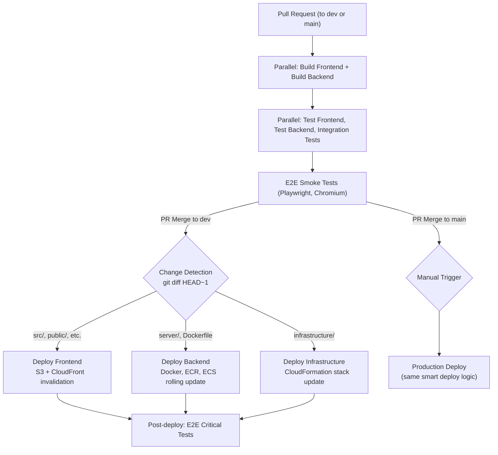
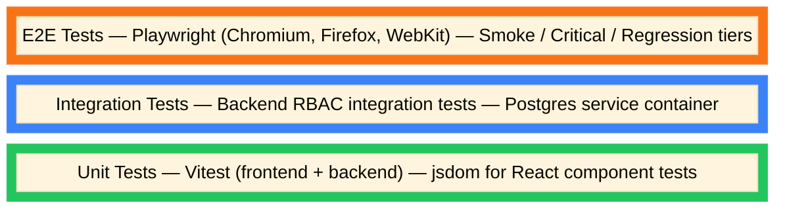

# Cohi — Software Development Lifecycle & Methodology

> Prepared for Technical Due Diligence Review
> Last updated: March 2026

---

## 1. Development Methodology

Cohi follows a **trunk-based development model** with short-lived feature branches. Development is organized around Jira tickets using a lightweight agile approach (closer to Kanban than Scrum), without formal sprints or fixed ceremonies.

### Workflow Summary

1. Developer picks up a Jira ticket (e.g., `COHI-12`)
2. Creates a feature/bugfix branch from `dev` (naming convention: `feature/COHI-12-description` or `bugfix/COHI-3-description`)
3. Develops locally with hot-reload (`npm run dev:all`)
4. Opens Pull Request targeting `dev`
5. CI pipeline runs: build, unit tests, integration tests, E2E smoke tests
6. Code review + merge to `dev`
7. CI deploys to dev environment automatically, runs E2E critical tests post-deploy
8. When ready for production: PR from `dev` → `main`
9. Production deploy is **manual trigger** (not automatic on merge)

---

## 2. Source Control

### Repository

| Attribute | Value |
|-----------|-------|
| Platform | Bitbucket (primary) |
| Repository | `teraverde/cohi` |
| Default Branch | `main` (production) |
| Development Branch | `dev` |
| Monorepo | Yes — frontend, backend, infrastructure, E2E tests, docs |

### Branch Strategy

| Branch Pattern | Purpose | Merge Target |
|----------------|---------|--------------|
| `main` | Production-ready code | — |
| `dev` | Integration branch, deployed to dev environment | `main` |
| `feature/COHI-{N}-{description}` | Feature development | `dev` |
| `bugfix/COHI-{N}-{description}` | Bug fixes | `dev` |

### Code Review

- All changes require Pull Request review before merging
- PRs to `dev` and `main` trigger CI validation (builds, tests, E2E smoke)
- No direct commits to `main` or `dev`

---

## 3. CI/CD Pipeline

### Primary CI: Bitbucket Pipelines

The canonical CI/CD system is **Bitbucket Pipelines** (`bitbucket-pipelines.yml`). A legacy GitHub Actions workflow also exists but Bitbucket is authoritative.

### Pipeline Architecture



### Change Detection

The pipeline includes intelligent change detection — it diffs the commit against `HEAD~1` and only deploys components that changed:

- **Frontend changes**: `src/`, `public/`, `index.html`, `package.json`, `vite.config`, `tailwind.config`, `tsconfig`
- **Backend changes**: `server/`, `Dockerfile.backend`
- **Infrastructure changes**: `infrastructure/cloudformation/`, `scripts/deploy/config`, `scripts/bitbucket/`

### Deployment Targets

| Component | Dev Deploy Method | Prod Deploy Method |
|-----------|-------------------|--------------------|
| Frontend | S3 upload + CloudFront cache invalidation | Same |
| Backend | Docker build → ECR push → ECS Fargate rolling update | Same (manual trigger) |
| Infrastructure | CloudFormation stack update | Same (manual trigger) |
| Database | Migration script via `run-migrations.sh` | Same (manual trigger) |

### Custom Pipelines

Bitbucket custom pipelines allow targeted deployments:

| Pipeline | Purpose |
|----------|---------|
| `frontend-dev` / `frontend-prod` | Frontend-only deploy |
| `backend-dev` / `backend-prod` | Backend-only deploy |
| `infrastructure-dev` / `infrastructure-prod` | CloudFormation-only update |
| `deploy-all-dev` / `deploy-all-prod` | Force deploy all components + run migrations |
| `run-migrations-dev` / `run-migrations-prod` | Database migrations only |
| `e2e-dev` / `e2e-regression` | On-demand E2E test suites |
| `e2e-prod-smoke` | Manual production smoke verification |

### CI Environment

| Setting | Value |
|---------|-------|
| Node.js | 20 (build, test, and runtime) |
| Docker | Enabled (for backend image builds) |
| AWS Auth | OIDC (no static credentials) |
| Playwright | v1.58.2 (pinned Docker image) |
| Test Database | Postgres 15 service container |

---

## 4. Testing Strategy

### Test Pyramid



### Test Frameworks

| Layer | Tool | Config |
|-------|------|--------|
| Frontend Unit | Vitest + React Testing Library | `vite.config.ts` (jsdom environment) |
| Backend Unit | Vitest | `server/vitest.config.ts` |
| Backend Integration | Vitest + Supertest + Postgres | Tests against real DB with migrations |
| E2E | Playwright | `playwright.config.ts` — 3 browser projects |

### E2E Test Tiers

| Tier | Tag | Scope | CI Gate |
|------|-----|-------|---------|
| Smoke | `@smoke` | Core routes, authentication, critical availability | PR validation (blocking) |
| Critical | `@critical` | Business workflows, auth/role controls, key flows | Post-deploy to dev (blocking) |
| Regression | `@regression` | Broad route-by-route validation, data/behavior checks | Nightly schedule |

### E2E Artifacts

All E2E runs retain:
- Playwright HTML reports
- JUnit XML (for CI dashboards)
- Screenshots on failure
- Video on failure
- Traces on first retry

### Two-Tier QA Model

Cohi operates a two-tier QA model documented in `docs/TESTING_STRATEGY.md`:

- **Tier 1 (Primary SOC 2 evidence):** Deterministic Playwright E2E tests committed in `e2e/*.spec.ts`, tagged with Jira ticket keys (`@COHI-{N}`). These are reviewed in PR, run identically every CI build, and produce consistent, auditable evidence linked to each Jira issue via Confluence QA pages.

- **Tier 2 (Supplementary):** AI-assisted AC validator (`ai-qa-dev` pipeline). An LLM reads Jira acceptance criteria and generates exploratory Playwright-like plans at runtime. Useful for coverage discovery on new features but non-deterministic — used as an advisory signal, not the primary evidence gate.

### QA Policy 

- No bug closes without an automated regression test
- Flaky rate target: < 2% rerun failure rate
- New features require: acceptance criteria, at least one `@critical @COHI-{N}` E2E test, `data-testid` selectors, route matrix update
- High-severity incidents: add failing test first, then fix
- AI AC validator evidence is supplementary; auditors are directed to Tier 1 tests as the primary control artifact

---

## 5. Database Migration Process

### Migration System

- **Tool**: Custom CLI built on `tsx` and `pg` (`server/src/migrations/cli.ts`)
- **File format**: Sequential numbered SQL files in `server/migrations/`
- **Current state**: 93+ migrations

### Migration Commands

| Command | Purpose |
|---------|---------|
| `npm run migrate` | Apply pending migrations (default database) |
| `npm run migrate:status` | Show migration state |
| `npm run migrate:dry-run` | Preview without applying |
| `npm run migrate:tenant` | Apply tenant-specific migrations |
| `npm run migrate:all` | Apply to all tenant databases |
| `npm run migrate:create` | Scaffold a new migration file |
| `npm run migrate:repair` | Repair schema inconsistencies |

### CI Migration Execution

- Migrations run as a dedicated Bitbucket pipeline step (`run-migrations.sh`)
- Separate from application deployment — can be run independently
- Production migrations require manual trigger

---

## 6. Local Development

### Setup

```bash
# Clone and install
git clone <repo-url> && cd cohi
npm run install:all

# Configure
cp .env.example .env
cp server/.env.example server/.env

# Start database
docker-compose up -d postgres

# Run migrations and seed
cd server && npm run migrate && npm run seed:users

# Start everything
npm run dev:all   # Frontend (Vite) + Backend (tsx watch) concurrently
```

### Local URLs

| Service | URL |
|---------|-----|
| Frontend | `http://localhost:8084` |
| Backend API | `http://localhost:3001` |

### Development Tools

| Tool | Purpose |
|------|---------|
| Vite HMR | Instant frontend hot-reload |
| tsx watch | Backend auto-restart on changes |
| Docker Compose | Local PostgreSQL |
| Playwright UI | Interactive E2E test development (`npm run test:e2e:ui`) |
| Vitest UI | Interactive unit test dashboard (`npm run test:ui`) |

---

## 7. Environments

| Environment | Branch | Deploy Trigger | URL |
|-------------|--------|----------------|-----|
| Local | Any | Manual (`npm run dev:all`) | `localhost:8084` |
| Dev | `dev` | Automatic on merge | Configured per deployment variables |
| Production | `main` | Manual trigger after merge | Configured per deployment variables |

### Environment Configuration

- **Frontend**: Build-time `VITE_*` environment variables
- **Backend**: Runtime `.env` or AWS Secrets Manager
- **Infrastructure**: Bitbucket deployment variables (per environment)
- **Secrets**: Never in code; managed via Bitbucket deployment variables + AWS Secrets Manager

---

## 8. Release Process

### Current State

The team does **continuous deployment** to dev and **manual promotion** to production. 

### Deployment Flow

1. Feature branches merge to `dev` (auto-deploys after CI passes)
2. Dev environment is validated (E2E critical + manual verification)
3. `dev` merged to `main` via PR
4. Production deploy triggered manually in Bitbucket Pipelines
5. Post-deploy: manual production smoke test (or custom pipeline `e2e-prod-smoke`)

### Rollback

- **Frontend**: CloudFront can serve previous S3 version (bucket versioning enabled)
- **Backend**: ECS Fargate can roll back to previous task definition
- **Database**: Migrations are forward-only; rollback requires manual intervention
- **Infrastructure**: CloudFormation supports stack rollback

---

## 9. Identified Process Gaps

| Gap                          | Impact                                 | Recommendation                   |
| ---------------------------- | -------------------------------------- | -------------------------------- |
| No staging environment       | Dev → Prod with no pre-prod validation | Add staging branch/environment   |


