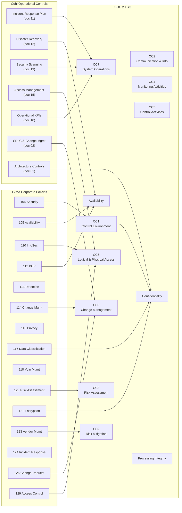

# Cohi — SOC 2 Trust Services Criteria Control Mapping

> Prepared for Technical Due Diligence Review — Last updated: March 2026
> **Purpose:** Master readiness document for SOC 2 Type II audit (planned Q4 2026)

---

## 1. Overview

This document maps each applicable SOC 2 Trust Services Criteria (TSC) criterion to:
1. The applicable **TVMA corporate policy** (governing framework)
2. The **Cohi-specific implementation** (technical or operational control)
3. The **evidence artifacts** available to demonstrate the control
4. The **gap status** and remediation plan

**Audit Scope:** Cohi's SOC 2 covers the **SaaS (Cohi-hosted) deployment mode** — the infrastructure, application, and operational controls managed by Cohi/Teraverde. **Self-Hosted** and **Partner Self-Hosted** deployments are operated by the customer or partner, respectively, and fall outside Cohi's SOC 2 audit boundary. For those modes, Cohi provides a **shared responsibility matrix** and **software-level evidence package** that partners and customers can reference in their own compliance efforts.

**SOC 2 Audit Timeline:**
- Q2 2026: Complete gap remediation (IRP, access review, security scans)
- Q3 2026: Penetration test + SAST implementation
- Q4 2026: Engage SOC 2 auditor — Type II observation period begins (6-month window)
- Q1/Q2 2027: SOC 2 Type II report issued

---

## 2. Control Coverage Map

---

## 3. CC1 — Control Environment

*Demonstrates that management and board establish and maintain an environment that sets the tone for the organization's commitment to integrity, ethical values, and competence.*

| CC# | Criterion | TVMA Policy | Cohi Implementation | Evidence | Status | Gap |
|-----|-----------|-------------|-------------------|---------|--------|-----|
| CC1.1 | Board oversight and accountability | Policy 100, 101 | TVMA board oversight of Cohi as product | TVMA policy documents | Active | — |
| CC1.2 | Management demonstrates commitment to integrity and ethical values | Policy 101 (Code of Conduct) | Team operates under TVMA code of conduct | Code of conduct signed acknowledgments | Partial | Acknowledgment tracking TBC |
| CC1.3 | Organizational structure | Policy 102 (Employee Handbook) | Org chart (doc 09); roles defined | Org chart document | Partial | Formal org chart to be finalized |
| CC1.4 | Commitment to competence | Policy 103 (Performance Mgmt) | Hiring criteria; code review culture | Job descriptions; PR history | Partial | No formal competency assessment |
| CC1.5 | Accountability | Policy 101, 104 | CTO/technical lead accountable for security | TVMA policy assignments | Partial | Formal CISO designation for Cohi TBC |

---

## 4. CC2 — Communication and Information

*Demonstrates that the entity obtains or generates and uses relevant, quality information to support the functioning of internal controls.*

| CC# | Criterion | TVMA Policy | Cohi Implementation | Evidence | Status | Gap |
|-----|-----------|-------------|-------------------|---------|--------|-----|
| CC2.1 | Information quality | Policy 125 (Communication Plan) | Documented architecture, specs, runbooks | `docs/` directory; Confluence pages | Active | — |
| CC2.2 | Internal communication | Policy 125, 127 (Training) | Team communication via [TBC — Teams/Slack]; Jira | Jira project; communication tools | Partial | Formal security awareness training TBC |
| CC2.3 | External communication | Policy 115 (Privacy) | Privacy policy; DPA with clients; customer communications | Privacy policy; IRP customer templates | Partial | DPA template to be completed |

---

## 5. CC3 — Risk Assessment

*Demonstrates that the entity specifies objectives and identifies, analyzes, and assesses risks to achieving those objectives.*

| CC# | Criterion | TVMA Policy | Cohi Implementation | Evidence | Status | Gap |
|-----|-----------|-------------|-------------------|---------|--------|-----|
| CC3.1 | Risk management objectives | Policy 120 (Risk Assessment) | Platform security and availability objectives defined | Architecture docs; this mapping | Partial | Formal Cohi-specific risk assessment not completed |
| CC3.2 | Risk identification | Policy 120 | Security gaps identified in docs 05, 13, 14 | Gap analysis documents | Partial | Annual risk assessment process TBC |
| CC3.3 | Fraud risk | Policy 120, 101 | RBAC prevents unauthorized access; audit logging | RBAC implementation; CloudTrail | Partial | Application-level audit log not complete |
| CC3.4 | Risk analysis | Policy 120 | Gap analysis; regulatory matrix (doc 14) | Regulatory matrix | Partial | Risk register to be formalized |

**Remediation:** Conduct formal Cohi-specific GLBA/SOC 2 risk assessment by Q3 2026. Document in Jira with owner and resolution tracking.

---

## 6. CC4 — Monitoring Activities

*Demonstrates that the entity monitors the system and its controls over time to evaluate whether those controls are present and functioning.*

| CC# | Criterion | TVMA Policy | Cohi Implementation | Evidence | Status | Gap |
|-----|-----------|-------------|-------------------|---------|--------|-----|
| CC4.1 | Ongoing monitoring | Policy 104, 110 | CloudWatch alarms; Sentry error tracking; GuardDuty; Security Hub | CloudWatch dashboards; Sentry project; GuardDuty console | Active | — |
| CC4.2 | Evaluation and communication of deficiencies | Policy 120, 124 | Security findings → Jira tickets; post-mortems | Jira incident tickets; post-mortem docs | Partial | Formal deficiency tracking process TBC |

---

## 7. CC5 — Control Activities

*Demonstrates that the entity selects and develops control activities that contribute to the mitigation of risks to the achievement of objectives.*

| CC# | Criterion | TVMA Policy | Cohi Implementation | Evidence | Status | Gap |
|-----|-----------|-------------|-------------------|---------|--------|-----|
| CC5.1 | Control selection | Policy 104, 110 | WAF, encryption, RBAC, MFA, input validation (Zod), rate limiting | Architecture docs; code; WAF config | Active | — |
| CC5.2 | Technology controls | Policy 121 (Encryption) | KMS encryption at rest; TLS 1.2+ in transit; JWT; Cognito | CloudFormation templates; KMS config | Active | — |
| CC5.3 | Policy deployment | Policy 104-129 | TVMA policies defined; Cohi-specific implementations documented | Policy documents; this gap analysis | Partial | Policy communication and training cadence TBC |

---

## 8. CC6 — Logical and Physical Access Controls

*Demonstrates that the entity implements logical access security software, infrastructure, and architectures to protect against threats from sources outside its system boundaries.*

| CC# | Criterion | TVMA Policy | Cohi Implementation | Evidence | Status | Gap |
|-----|-----------|-------------|-------------------|---------|--------|-----|
| CC6.1 | Access identification and authentication | Policy 129, 104 | Cognito user pools; MFA enforcement; RBAC (5 roles) | Cognito config; RBAC code; doc 15 | Active | MFA not mandated for all tenant admins |
| CC6.2 | Access provisioning | Policy 129 | Admin panel user creation; Cognito provisioning; onboarding flow | Doc 15; onboarding guide | Active | — |
| CC6.3 | Access removal | Policy 129 | Admin panel deactivation; Cognito disable; JWT invalidation | Doc 15 deprovisioning procedures | Partial | No automated deprovisioning on subscription cancellation |
| CC6.4 | Access restriction | Policy 104, 110 | VPC-only database access; no public database endpoints; IAM least privilege | CloudFormation VPC config; IAM policies | Active | — |
| CC6.5 | Physical access | Policy 111 (Physical Security) | AWS-managed data centers (SOC 2 certified); no self-managed hardware | AWS compliance page; SOC 2 reports available from AWS | Active | — |
| CC6.6 | Logical access to infrastructure | Policy 129 | AWS IAM; MFA required; OIDC CI/CD (no long-lived keys) | IAM policies; BitbucketPipelinesOIDCRole | Active | — |
| CC6.7 | Transmission of data | Policy 121 (Encryption) | TLS 1.2+ (CloudFront → ALB → ECS); no unencrypted channels | CloudFront HTTPS config; ALB listener | Active | — |
| CC6.8 | Intrusion detection | Policy 118, 104 | GuardDuty; WAF; Security Hub; CloudTrail | GuardDuty console; WAF logs | Active | SAST/DAST not yet implemented |

---

## 9. CC7 — System Operations

*Demonstrates that the entity manages the operation of infrastructure, software, and related processes to achieve the entity's operational objectives.*

| CC# | Criterion | TVMA Policy | Cohi Implementation | Evidence | Status | Gap |
|-----|-----------|-------------|-------------------|---------|--------|-----|
| CC7.1 | Configuration management | Policy 114, 126 | IaC (CloudFormation + Terraform); Docker containerization; immutable deployments | CloudFormation templates; Dockerfile; deployment scripts | Active | — |
| CC7.2 | Vulnerability management | Policy 118 | `npm audit` in CI; ECR image scanning; GuardDuty; planned Snyk | CI pipeline logs; Security Hub findings | Partial | Snyk/SAST not yet integrated; pen test not completed |
| CC7.3 | Environmental protections | Policy 104 | WAF (DDoS, OWASP rules); GuardDuty; multi-AZ deployment | WAF config; GuardDuty active | Active | — |
| CC7.4 | Incident response | Policy 124 | IRP documented (doc 11); Sentry + CloudWatch alerting | IRP document; alert configurations | Partial | No prior formal incidents logged; tabletop exercise TBC |
| CC7.5 | Change monitoring | Policy 114 | CloudTrail; GitAudit; Bitbucket PR history | CloudTrail logs; Bitbucket audit log | Active | — |

---

## 10. CC8 — Change Management

*Demonstrates that the entity authorizes, designs, develops, configures, tests, approves, implements, and documents changes to infrastructure, data, software, and procedures.*

| CC# | Criterion | TVMA Policy | Cohi Implementation | Evidence | Status | Gap |
|-----|-----------|-------------|-------------------|---------|--------|-----|
| CC8.1 | Change authorization | Policy 114, 126 | PR required for all changes; code review; branch protection | Bitbucket PR history; branch protection settings | Active | No formal change advisory board (CAB) — size-appropriate |
| CC8.2 | Design and implementation | Policy 114 | Sprint planning; acceptance criteria in Jira; architectural review for major changes | Jira sprint data; architecture docs | Active | — |
| CC8.3 | Testing | Policy 114 | Two-tier QA: Tier 1 deterministic Playwright E2E tests (`@COHI-{N}` tagged, committed, reviewed — primary SOC 2 evidence); Tier 2 AI-assisted exploratory validation (supplementary). Smoke / Critical / Regression tiers; Vitest unit tests. See `docs/TESTING_STRATEGY.md` | `e2e/*.spec.ts`; CI pipeline logs; Confluence QA pages; `docs/TESTING_STRATEGY.md` | Active | Test coverage metrics TBC |
| CC8.4 | Migration | Policy 114, 126 | Database migration CLI; version-controlled SQL migrations; rollback scripts | `server/migrations/`; migration CLI | Active | — |
| CC8.5 | Emergency change procedures | Policy 126 | Hotfix branch workflow; CTO approval required | Git workflow documentation | Partial | Formal emergency change procedure not documented |

---

## 11. CC9 — Risk Mitigation

*Demonstrates that the entity identifies, selects, and develops risk mitigation activities for risks arising from potential business disruptions and the use of vendors and business partners.*

| CC# | Criterion | TVMA Policy | Cohi Implementation | Evidence | Status | Gap |
|-----|-----------|-------------|-------------------|---------|--------|-----|
| CC9.1 | Risk mitigation | Policy 112, 120 | DR plan (doc 12); multi-AZ; automated backups; AWS Elastic DR | DR document; CloudFormation; Aurora config | Partial | Cross-region standby not yet configured |
| CC9.2 | Vendor risk management | Policy 123, 128 | Vendor inventory (doc 03); key vendors reviewed for security posture | Vendor inventory; vendor website compliance pages | Partial | Formal vendor security questionnaire process TBC |

---

## 12. Availability TSC

*Demonstrates that the system is available for operation and use as committed or agreed.*

| Criterion | TVMA Policy | Cohi Implementation | Evidence | Status | Gap |
|-----------|-------------|-------------------|---------|--------|-----|
| Availability commitments | Policy 105, 112 | Multi-AZ Aurora; ECS auto-scaling; CloudFront CDN; Aurora serverless auto-scale | Architecture doc; CloudFormation | Active | No formal SLA yet committed to clients |
| Capacity management | Policy 105 | Aurora auto-scaling (0.5–64 ACUs); ECS auto-scaling; CloudWatch capacity alarms | CloudWatch alarms; ECS service config | Active | Capacity planning not formally documented |
| Backup and recovery | Policy 112 | Aurora PITR (35 days); automated daily snapshots; pre-deploy manual snapshots | Aurora backup config; DR doc | Active | Cross-region backup not yet configured |
| DR testing | Policy 112 | DR plan defined (doc 12) | DR document | Partial | No DR drill completed yet |

---

## 13. Confidentiality TSC

*Demonstrates that information designated as confidential is protected as committed or agreed.*

| Criterion | TVMA Policy | Cohi Implementation | Evidence | Status | Gap |
|-----------|-------------|-------------------|---------|--------|-----|
| Data classification | Policy 116 | Tenant data treated as confidential; database-per-tenant isolation | Architecture doc; MULTI_TENANT.md | Active | Formal data classification labeling for each data type TBC |
| Encryption at rest | Policy 121 | KMS encryption for all Aurora clusters and S3 buckets | CloudFormation KMS config | Active | — |
| Encryption in transit | Policy 121 | TLS 1.2+ enforced end-to-end; HTTPS-only | CloudFront/ALB config | Active | — |
| Data retention and disposal | Policy 113 | Data retained in tenant DB; Stripe manages payment data | Retention policy; Stripe compliance | Partial | Automated data deletion on tenant offboarding TBC |
| Confidential data disclosure | Policy 115, 116 | RBAC restricts access; no cross-tenant data access | RBAC code; application-level data filtering; audit controls | Active | — |

---

## 14. Processing Integrity TSC

*Demonstrates that system processing is complete, valid, accurate, timely, and authorized.*

| Criterion | TVMA Policy | Cohi Implementation | Evidence | Status | Gap |
|-----------|-------------|-------------------|---------|--------|-----|
| Processing completeness | Policy 105 | Sync job monitoring; CloudWatch alarms on sync failures; Sentry error tracking | CloudWatch sync alarms; Sentry | Active | — |
| Input validation | — | Zod schema validation for all API inputs; type-safe TypeScript | Zod validators in API routes | Active | — |
| Error handling | — | Error middleware; Sentry capture; structured error responses | Sentry; error middleware code | Active | — |
| Data accuracy | — | LOS data validates against source before storage; HMDA field checks (in progress) | Data quality module; COHI-13 | Partial | HMDA validation not yet complete |
| Processing authorization | Policy 104 | JWT + RBAC on all API endpoints; tenant isolation enforced | Auth middleware; RBAC code | Active | — |

---

## 15. Privacy TSC

*Demonstrates that personal information is collected, used, retained, disclosed, and disposed of in conformity with the commitments in the entity's privacy notice.*

| Criterion | TVMA Policy | Cohi Implementation | Evidence | Status | Gap |
|-----------|-------------|-------------------|---------|--------|-----|
| Privacy notice | Policy 115 | TVMA Privacy and Confidentiality Policy | Privacy policy document | Partial | Cohi-specific user-facing privacy notice TBC |
| Collection limitation | Policy 115, 116 | LOS sync pulls loan data only; no unnecessary PII collection | Field mapping code; Universal Connector | Active | — |
| Use and disclosure | Policy 115 | Data used only for analytics within tenant boundary; no cross-tenant sharing | Architecture; RBAC controls | Active | — |
| Retention and disposal | Policy 113 | Data retained per policy; deletion on client offboarding | Retention policy | Partial | Automated deletion workflow TBC |
| Data subject rights | — | Not yet implemented for end consumer rights (CCPA) | — | Gap | CCPA data subject rights process to be defined |

---

## 16. Gap Summary and Remediation Tracker

| Gap | SOC 2 Criterion | Priority | Owner | Target |
|-----|----------------|----------|-------|--------|
| MFA not mandated for all tenant admins | CC6.1 | P1 | CTO | Q2 2026 |
| No formal risk assessment (Cohi-specific) | CC3.1, CC3.4 | P1 | CTO | Q3 2026 |
| No penetration test completed | CC7.2, CC6.8 | P1 | CTO | Q3 2026 |
| SAST not integrated in CI | CC7.2 | P1 | CTO | Q2 2026 |
| No formal incident log (pre-2026) | CC7.4 | P2 | CTO | Q2 2026 |
| Application-level audit log incomplete | CC3.3 | P2 | CTO | Q2 2026 |
| No formal SLA committed to clients | Availability | P2 | CPO | Q2 2026 |
| Cross-region backup not configured | Availability | P2 | CTO | Q3 2026 |
| DR drill not yet performed | Availability | P2 | CTO | Q2 2026 |
| No vendor security questionnaire process | CC9.2 | P2 | CTO | Q3 2026 |
| DPA with clients not formalized | CC2.3, GLBA | P1 | Legal | Q2 2026 |
| Security awareness training process TBC | CC2.2 | P3 | HR/CTO | Q3 2026 |
| HMDA analytics dashboard not built | PI, HMDA | P2 | Product | Q4 2026 |
| CCPA data subject rights process | Privacy | P2 | Legal | Q3 2026 |
| Cohi-specific privacy notice for users | Privacy | P3 | Legal | Q3 2026 |
| Automated tenant offboarding/data deletion | Confidentiality | P3 | CTO | Q4 2026 |

---

## 17. SOC 2 Audit Readiness Score

| Category | Weight | Score | Notes |
|----------|--------|-------|-------|
| Control Environment (CC1-CC5) | 20% | 60% | Policies exist; Cohi-specific process formalization needed |
| Logical Access (CC6) | 20% | 75% | Strong controls; MFA mandate gap |
| System Operations (CC7) | 15% | 55% | Monitoring active; scanning/pen test gaps |
| Change Management (CC8) | 15% | 85% | Strong CI/CD and PR process |
| Risk Mitigation (CC9) | 10% | 50% | DR plan exists; DR testing and vendor process needed |
| Availability | 10% | 65% | Architecture strong; SLA and DR drill needed |
| Confidentiality | 10% | 80% | Encryption and isolation strong; retention automation needed |
| **Overall Readiness** | | **~67%** | **On track for Q4 2026 audit start** |

---

## 18. SOC 2 Considerations for Partner Self-Hosted Deployments

Partners operating multi-tenant Cohi instances should pursue their own SOC 2 (or equivalent assurance framework) covering their infrastructure, operations, and tenant management practices. The following outlines the split:

| Control Domain | Cohi Provides (Software Level) | Partner Must Implement (Infrastructure + Ops) |
|---------------|-------------------------------|----------------------------------------------|
| CC1 — Control Environment | Secure SDLC practices; documented architecture | Organizational policies; staff management; partner code of conduct |
| CC6 — Logical Access | RBAC, tenant isolation, JWT auth, Cognito integration | IAM, MFA enforcement, access reviews, user provisioning |
| CC7 — System Operations | Application security; dependency scanning; incident guidance | Infrastructure monitoring; vulnerability patching; incident response |
| CC8 — Change Management | Versioned releases; release notes; migration scripts | Change deployment process; testing in partner environment |
| CC9 — Risk Mitigation | Software vendor risk documentation; DPA | Vendor management for their own third parties; business continuity |
| Availability | Multi-AZ application architecture; auto-scaling | Infrastructure availability; backups; DR drills |
| Confidentiality | Encryption at rest/in-transit (application level); tenant isolation | KMS key management; network security; data handling policies |

Cohi will provide a **Partner Compliance Kit** (planned Q4 2026) containing:
- Shared responsibility matrix
- Software-level SOC 2 evidence package
- Architecture documentation for auditors
- Partner DPA template
- Recommended security configurations
