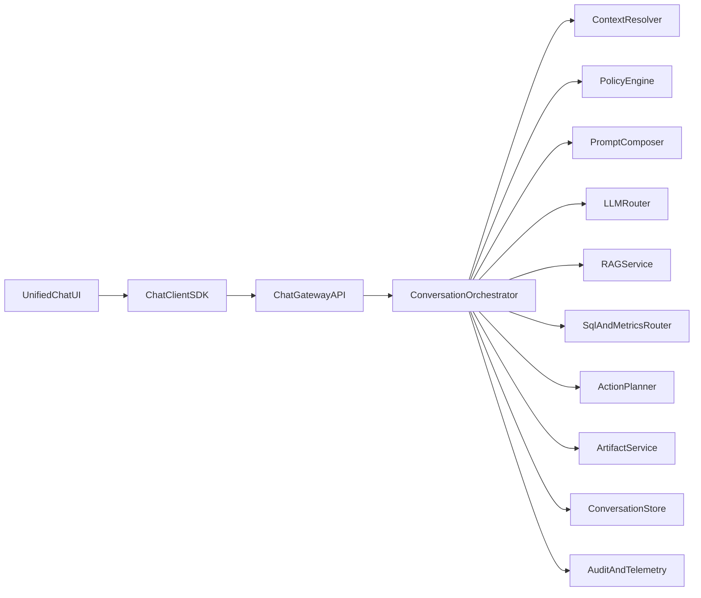
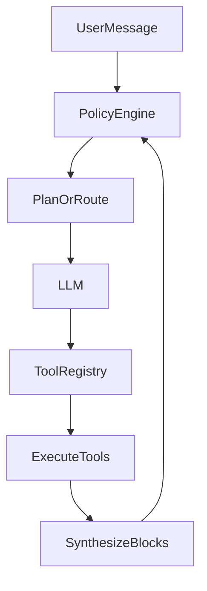

# Cohi Chat Unified Architecture (Big-Bang Target State)

**Status:** Target-state design (implementation roadmap)  
**Audience:** Engineering, product, security, operations  
**Related code (legacy, to retire after cutover):**  
`src/components/dashboard/CohiChatPanel.tsx`, `src/components/workbench/WorkbenchCohiPanel.tsx`, `src/components/workbench/AskCohiChat.tsx`, `src/hooks/useCohiChat.ts`, `src/hooks/useWorkbenchCohi.ts`, `server/src/routes/cohiChat.ts`, `server/src/routes/cohiWorkbench.ts`, `server/src/services/ai/cohiChatService.ts`, `server/src/services/ai/cohiConversationService.ts`, `server/src/services/promptConfigService.ts`

---

## 1. Executive summary

Today “Cohi Chat” is multiple **UI shells**, **HTTP contracts**, **session stores**, and **orchestrators** that share branding but diverge in behavior, permissions, and payloads. The target state is **one product surface**: a single **Chat Gateway API** (`/api/chat/*`), one **Conversation Orchestrator**, one **policy layer**, and one **client SDK** used by site and workbench. Location awareness (site route, workbench canvas, insight scope, widget edit) is expressed as **structured context** on every turn—not as separate products.

This document defines requirements, canonical contracts, security model, session migration, parity acceptance criteria, Jira breakdown, and big-bang cutover gates.

---

## 2. Problem statement and current-system gaps

| Gap | Today | Risk |
|-----|--------|------|
| **Multiple contracts** | `/api/cohi-chat/*`, `/api/cohi-chat/workbench`, `/api/workbench/ai/query`, insight chat routes | Inconsistent UX, drift, duplicate fixes |
| **Location context** | Workbench sends rich `canvasState`; global chat largely tenant/session only | “Same assistant” feels different; navigation help inconsistent |
| **Response shapes** | Narrative + `VisualizationConfig` vs `WidgetAction[]` vs plain `{ response }` | One UI cannot render all outcomes without forks |
| **Sessions** | Global chat sessions vs `cohi_conversations` keyed by `canvas_id` vs hub pages often stateless | History continuity and cross-surface resume unclear |
| **Authorization** | Global routes use `checkSectionAccess('cohi_chat', …)`; workbench routes differ | Unified UI must not widen or narrow access accidentally |
| **Prompt assembly** | Mix of DB-backed prompts (`cohi_chat.*`) and large inline workbench templates | Hard to audit, A/B, or enforce policy centrally |

---

## 3. Goals and non-negotiable capability matrix

The following must hold in **v1** of the unified platform (post–big-bang):

| Capability | Requirement |
|------------|-------------|
| **Workbench structured actions** | Model may return validated `actions[]` (create/modify widgets, `query_data`, etc.) with deterministic execution hooks |
| **Chat → Canvas / PPT** | Artifacts from chat (charts, exports) remain first-class with stable IDs for handoff (parity with current `VisualizationConfig` / export flows) |
| **Session history** | Users can resume conversations per **scope** (global, canvas, insight, draft); server is source of truth |
| **RAG / citations** | Retrieval runs under tenant policy; responses expose **citations** (doc IDs, titles, snippets) where grounding applies |
| **Role / tenant access** | Single policy engine gates retrieval, SQL/tools, and knowledge—**before** LLM and tool execution |

---

## 4. Target architecture

### 4.1 Logical components

| Component | Responsibility |
|-----------|----------------|
| **Chat Gateway API** | Auth, rate limits, request validation (JSON Schema), trace IDs, feature flags |
| **Context Resolver** | Merge JWT tenant/user, optional platform `tenant_id`, **LocationContext**, client snapshots (canvas, insight), prior turns |
| **Policy Engine** | Section/feature entitlements, row/field filters, tool allowlists, max data exposure |
| **Prompt Composer** | Deterministic assembly from templates + DB prompt configs + resolved context |
| **LLM Router** | Model selection, fallback, streaming; inject safety instructions |
| **RAG Service** | Tenant-scoped retrieval; citation packaging |
| **SQL / metrics router** | Executes approved SQL paths only after sanitization + policy |
| **Action Planner** | Validates and normalizes **Workbench actions**; optional auto-execute flags |
| **Artifact Service** | Charts/tables/files for export and canvas/PPT handoff |
| **Conversation Store** | Single abstraction over persisted threads (replaces dual stores) |
| **Audit & telemetry** | Prompt hashes, policy decisions, tool calls, errors |

### 4.2 Design rules

1. **One endpoint family:** `/api/chat/v1/*` (namespaced for versioning).
2. **One request envelope** with `location`, `scope`, `context`, `history`, `options`.
3. **One response envelope** with typed **blocks** (see §5).
4. **No silent context:** server logs what context tiers were included (`contextManifest`).
5. **Big-bang with safety net:** new stack behind flag until parity gates pass; one release window with rollback to legacy routes.

---

## 5. Canonical API contract

Machine-readable JSON Schemas live alongside this doc:

- [chat-request.schema.json](./schemas/cohi-chat-unified/chat-request.schema.json)
- [chat-response.schema.json](./schemas/cohi-chat-unified/chat-response.schema.json)
- [chat-event-stream.schema.json](./schemas/cohi-chat-unified/chat-event-stream.schema.json)

### 5.1 REST operations (target)

| Method | Path | Purpose |
|--------|------|---------|
| `POST` | `/api/chat/v1/messages` | Send user message; returns full assistant turn (non-streaming) |
| `POST` | `/api/chat/v1/messages:stream` | SSE or chunked streaming of `ChatStreamEvent` |
| `GET` | `/api/chat/v1/conversations` | List conversations for current user + optional scope filter |
| `POST` | `/api/chat/v1/conversations` | Create conversation with explicit `scope` |
| `GET` | `/api/chat/v1/conversations/:id` | Fetch transcript |
| `DELETE` | `/api/chat/v1/conversations/:id` | Delete / archive |
| `POST` | `/api/chat/v1/conversations/:id/rebind` | Change scope (e.g. draft → canvas), preserving messages |
| `GET` | `/api/chat/v1/permissions` | Effective entitlements + policy summary for UI |

### 5.2 Request envelope (conceptual)

- **`message`**: User text (required unless attachment-only flow in future).
- **`conversationId`**: Optional; server creates if missing when client starts a thread.
- **`scope`**: `{ type: global_session | canvas | draft | insight | widget_edit, id?: string }`.
- **`location`**: `{ surface: site | workbench_canvas | workbench_hub | insight_modal | data_chat_page, route?: string, locale?: string }`.
- **`context`**: Optional payloads—`canvasState`, `widgetCatalog`, `widgetEdit`, `insightContext`, etc.—**always** bounded by policy-trimmed size limits.
- **`history`**: Last N turns for clients that optimistically append (server still loads authoritative transcript when `conversationId` present).
- **`options`**: `stream`, `personaHints`, `includeRag`, `includeLiveCanvasData`, `maxHistoryTurns`, `qaAgentRunTag`, **`planningMode`** (`auto` | `always` | `never`; see §14.1), etc.
- **`clientMessageId`**: Optional UUID for **idempotent** message submission on retries (see §14.4).

### 5.3 Response envelope (conceptual)

Assistant turns are **arrays of blocks** so one UI can render narrative, citations, charts, and actions consistently:

| Block type | Purpose |
|------------|---------|
| `text` | Markdown-safe prose |
| `citations` | RAG sources |
| `visualization` | Chart/table/KPI (`VisualizationConfig` successor) |
| `actions` | Workbench `WidgetAction[]` (validated) |
| `artifacts` | Export handles (PPT/canvas build refs) |
| `navigation_hints` | Suggested routes or deep links (optional, policy-filtered) |
| `safety` | Refusal / escalation metadata |

### 5.4 Streaming events

Streaming uses the same block model as incremental updates:

- `turn.started` → `block.delta` / `block.completed` → `turn.completed`  
- Errors as `error` events with retry hints.

See `chat-event-stream.schema.json`.

---

## 6. Context resolution and policy enforcement

### 6.1 Context tiers

| Tier | Contents | When |
|------|-----------|------|
| **Identity** | `userId`, `tenantId`, role, email | Always |
| **Entitlements** | Section access (e.g. `cohi_chat`), feature flags | Always |
| **Location** | Surface + route | Always |
| **Scope** | Conversation scope key | Always |
| **Workbench snapshot** | Canvas + catalog + optional live widget data | Workbench modes only |
| **Insight payload** | Insight metadata for scoped Q&A | Insight mode |
| **Retrieval** | RAG chunks | When allowed |
| **Execution** | SQL / metrics / tools | After validation only |

### 6.2 Policy engine (authoritative)

All of the following must pass **before** calling the LLM or executing tools:

1. **Authentication** (JWT).
2. **Tenant resolution** (`attachTenantContext`; platform `tenant_id` only for allowed roles).
3. **Feature gate** aligned to **one** matrix for all modes (resolve historical asymmetry between `/ask` and workbench).
4. **Data policy**: row-level filters, field restrictions, caps on rows/cells returned.
5. **Tool policy**: which actions/SQL paths are allowed for this user and surface.
6. **Context budget**: truncate/summarize snapshots deterministically; never drop policy metadata silently—emit `contextManifest`.

### 6.3 Prompt composition

- **Templates** versioned in repo + **DB overrides** via existing prompt config service pattern.
- **Personas** resolved by router (keyword + widget selection + tenant defaults)—single registry.
- **No duplicate mega-templates**: workbench-specific instructions become **modules** plugged into composer.

---

## 7. Action execution and artifact pipeline

### 7.1 Actions (Workbench)

- Incoming model output → **schema validation** → **policy filter** → **executor** (today’s widget/canvas pipeline).
- Support **auto-execute** only when client explicitly opts in (matches current `onAutoExecuteActions` semantics).

### 7.2 Artifacts (charts, export, Canvas/PPT)

- **`visualization` blocks** carry stable **`artifactId`** references for history reload and export.
- **Artifact Service** registers blobs/config (chart JSON, export jobs) and returns handles to UI.
- **Chat → Canvas / PPT** flows consume artifact handles + tenant/user scope—same contract from site or workbench.

---

## 8. Unified session model and migration

### 8.1 Target model

- **Conversation** = `{ id, userId, tenantId, scope, title, messages[], createdAt, updatedAt }`.
- **`scope.type`**: `global_session` | `canvas` | `draft` | `insight` | `widget_edit`.
- **`scope.key`**: normalized string (e.g. `canvas:<uuid>`, `draft:<uuid>`, `insight:<id>`).

### 8.2 Legacy mapping

| Legacy | Target |
|--------|--------|
| Global chat sessions / history tables | `scope.type = global_session` |
| `cohi_conversations.canvas_id` | `scope.type = canvas` or `draft` after rebind |
| Stateless hub `/api/workbench/ai/query` | New conversations default to `workbench_hub` location + optional ephemeral scope policy (product choice: ephemeral vs persisted—default **persist** for parity with “assistant memory”) |

### 8.3 Backfill strategy

1. Inventory tables and rows per tenant.
2. Map IDs → new schema; store `legacy_ref` in migration metadata column or side table.
3. Read-only dual-read period optional; cutover with flag.

---

## 9. Parity and regression acceptance criteria

### 9.1 Functional parity (must pass before enabling big-bang)

- **Global chat**: metric Q&A, chart rendering, SQL visibility where applicable, suggested questions, session persistence.
- **Workbench**: widget actions execute; `query_data` path; conversation persists per canvas/draft; rebind scope works.
- **Hub Ask Cohi**: same contract as unified client (no separate `/api/workbench/ai/query` behavior in prod).
- **Insight chat** (if in scope): scoped answers + citations policy.
- **Exports**: PPT/canvas handoff produces equivalent artifacts vs baseline release.

### 9.2 Non-functional

- **Auth parity**: users blocked from legacy unauthorized capabilities remain blocked.
- **Latency**: P95 within agreed budget vs current (e.g. within +20% initially).
- **Cost**: token usage within agreed envelope or feature-flagged limits.

### 9.3 Test surfaces

- Extend E2E in `e2e/` for unified routes; replay golden prompts from staging logs.

---

## 10. Jira epic and story breakdown

**Implemented in Jira:** Epic **`COHI-386`** (placeholder updated by team). Full issue text, dependency diagram, and **acceptance criteria per story** live in **[cohi-chat-unified-jira-backlog.md](./cohi-chat-unified-jira-backlog.md)** — use that file when creating or refining tickets.

### Epic

**COHI-386 — Unified Cohi Chat Platform** — Single assistant UX, API, orchestrator, session store, and policy model across site and workbench.

### Stories (summary — see backlog doc for ACs)

| Key | Story |
|-----|--------|
| COHI-387 | Chat gateway: schemas, validation, OpenAPI draft |
| COHI-388 | Conversation orchestrator + `POST /messages` |
| COHI-389 | Policy engine consolidation (single gate matrix) |
| COHI-390 | Prompt composer modules + persona router |
| COHI-391 | RAG + citations block parity |
| COHI-392 | SQL/metrics execution path behind policy |
| COHI-393 | Action planner + widget executor integration |
| COHI-394 | Artifact service + visualization blocks |
| COHI-395 | Unified conversation store + migration scripts |
| COHI-396 | Chat Client SDK + unified UI shell (site + workbench + hub) |
| COHI-397 | E2E parity suite + replay harness |
| COHI-398 | Cutover runbook + feature flags + rollback drills |

### Readiness gates (all required for big-bang)

- [ ] Schema + policy tests green  
- [ ] Parity harness ≥ agreed pass rate  
- [ ] Security review (policy + data leakage)  
- [ ] Performance/cost budget sign-off  
- [ ] Support/runbook published  

---

## 11. Big-bang cutover, rollback, and operations

### 11.1 Cutover checklist

1. Freeze legacy chat UI entry points behind feature flag (`unified_chat_enabled`).
2. Enable unified API in staging; run replay + manual QA matrix.
3. Migrate/backfill conversations per §8.
4. Enable prod flag for internal tenants → beta tenants → all.
5. Monitor error rates, latency, token usage, policy denials.

### 11.2 Rollback triggers

- Auth regression (unexpected 403/401 spikes).
- Data policy failure (PII/tool misuse alerts).
- Action executor error rate above threshold.
- P95 latency above **X** ms for **Y** minutes.

### 11.3 Rollback procedure

1. Flip feature flag off → legacy routes (kept for **one release window** only).
2. Drain in-flight streams; notify status page if user-visible.
3. Post-incident: diff orchestrator version + policy hash.

### 11.4 Observability

- Structured logs: `conversationId`, `scope`, `policyDecisionId`, `modelId`, `promptHash`, `ragChunkCount`, `toolCalls`.
- Metrics: success/failure by surface, tokens in/out, truncation counts.

---

## 12. Definition of done (architecture phase)

- [x] Target-state architecture documented (this file).
- [x] Canonical request/response/stream schemas checked in.
- [x] Policy, actions, artifacts, sessions, parity, Jira, cutover documented.

---

## 13. Industry patterns and external references

This section ties our target design to patterns used at scale elsewhere—not as copy-paste requirements, but as **validation** that the gateway + orchestrator + policy + tools split is directionally sound.

| Pattern | What vendors / literature emphasize | How it maps to Cohi |
|--------|-------------------------------------|----------------------|
| **Orchestration layer** | Coordinate agents/tools, enforce rules, monitor outcomes—not only “call an LLM.” Industry writeups stress workflow routing, governance, and observability as first-class. See [Google Cloud — agentic AI: orchestrate access to disparate systems](https://docs.cloud.google.com/architecture/agenticai-orchestrate-access-disparate-systems) and orchestration overviews (e.g. [Rasa — enterprise agent orchestration](https://rasa.com/guides/the-enterprise-guide-to-ai-agent-orchestration)). | Our **Conversation Orchestrator** + **Policy Engine** + **Audit** align with that separation; LLM calls are one step inside the orchestrator, not the whole system. |
| **Unified API + versioning** | Normalize schema, streaming, and routing behind one surface so product surfaces do not fork contracts. Common in SaaS AI backend guidance (e.g. unified gateway patterns). | **`/api/chat/v1/*`** + JSON Schemas + OpenAPI (implementation task UCP-1). |
| **Retrieval + citations** | Enterprise assistants pair **private knowledge** with **verifiable citations**. OpenAI describes retrieval blueprints and cited answers from organizational data ([Knowledge retrieval blueprint](https://openai.com/solutions/blueprints/knowledge-retrieval/)); ChatGPT Business/Enterprise surfaces **company knowledge** with citations ([Help Center — company knowledge](https://help.openai.com/en/articles/12628342)). | Our **`citations` blocks** + tenant-scoped RAG match this expectation; consider **inline citation anchors** in `text` blocks (see §14). |
| **Planner + tools + knowledge** | Microsoft Copilot Studio describes **generative orchestration**: planner selects tools/knowledge with guardrails ([Generative orchestration](https://learn.microsoft.com/en-us/microsoft-copilot-studio/guidance/generative-orchestration)); multi-agent patterns stress **handoffs, security, and audit** when composing sub-agents ([Multi-agent patterns](https://learn.microsoft.com/en-us/microsoft-copilot-studio/guidance/multi-agent-patterns)). | Maps to **Prompt Composer + Action Planner + RAG/SQL routers**; optional **sub-orchestrators** only where governance or tool sets differ (§14). |
| **Integration boundary** | Google’s agentic reference architecture highlights **standardized integration** (e.g. isolating agents from backends—conceptually similar to **Model Context Protocol** servers in some stacks). | Long term: optional **Tool Adapter** layer so tenant DB, metrics, and external APIs are not embedded raw inside prompt strings (§14). |

**Takeaway:** Our architecture is consistent with common enterprise patterns. The highest-value improvements (§14) are **explicit tool contracts**, **context compaction**, **evaluation discipline**, and **human gates** for risky actions—areas where public vendor docs also spend disproportionate effort.

---

## 14. Second-pass improvements (recommended additions)

These refine the v1 design without replacing it. Prioritize items marked **P0** before wide prod cutover.

### 14.1 Orchestration and tools

| Improvement | Rationale | Priority |
|-------------|-----------|----------|
| **Tool registry** | Treat RAG, SQL/metrics, and `WidgetAction` execution as **named tools** with JSON Schema inputs/outputs, timeouts, and idempotency keys—parallel to connector/plugin models ([Copilot plugins / tools](https://learn.microsoft.com/en-us/microsoft-copilot-studio/copilot-plugins-overview)). Reduces one-off prompt spaghetti. | P0 |
| **Planner vs single-shot mode** | For complex workbench turns, allow an internal **plan → validate → execute** loop (inspired by [generative orchestration](https://learn.microsoft.com/en-us/microsoft-copilot-studio/guidance/generative-orchestration)) while keeping simple Q&A as one pass. Prevents invalid action batches. | P1 |
| **Sub-agents only when justified** | Follow [multi-agent guidance](https://learn.microsoft.com/en-us/microsoft-copilot-studio/guidance/multi-agent-patterns): separate orchestration only for distinct governance, tool sets, or reuse—not for every feature. | P1 |

### 14.2 Context, memory, and cost

| Improvement | Rationale | Priority |
|-------------|-----------|----------|
| **Context compaction job** | When transcript + `canvasState` exceed budget, **summarize** older turns and large snapshots deterministically; persist `compactionWatermark` on the conversation. Aligns with enterprise guidance on **stable state across long tasks** ([orchestration guides](https://rasa.com/guides/the-enterprise-guide-to-ai-agent-orchestration)). | P0 |
| **Tiered retrieval** | Mirror hybrid ideas (direct context + indexed retrieval) described in enterprise knowledge products ([OpenAI retrieval blueprint](https://openai.com/solutions/blueprints/knowledge-retrieval/)): always retrieve **top-k** with scores; optional **second-stage rerank** for quality. | P1 |
| **Per-tenant budgets** | Hard caps on tokens/turn, rows returned, and concurrent streams; surface **429 + Retry-After** with policy-friendly messages. | P0 |

### 14.3 Trust, safety, and governance

| Improvement | Rationale | Priority |
|-------------|-----------|----------|
| **Human confirmation for risky tools** | Actions that mutate canvas heavily or run broad SQL require **explicit UI confirmation** (transaction pattern common in governed automation). | P0 |
| **Citation fidelity** | Support **inline markers** in markdown text linked to `citations.items[]` (similar to cited enterprise chat UX). | P1 |
| **Evaluation harness** | Beyond log replay: **golden prompts** per surface, structured rubrics (correctness, citation presence, policy adherence), and regression on each release. | P0 |
| **Prompt/package versioning** | Pin **prompt bundle version + hash** per tenant for reproducibility and instant rollback (extends `promptHash` in metadata). | P1 |

### 14.4 Operations and reliability

| Improvement | Rationale | Priority |
|-------------|-----------|----------|
| **Idempotent message POST** | Client sends `clientMessageId` (UUID) to prevent duplicate turns on retry; server dedupes. | P0 |
| **Kill switches** | Feature flags per **surface** (`site`, `workbench_canvas`, …) and per **tool** class (SQL, actions). | P0 |
| **DR for conversation store** | Backup/restore and RPO/RTO targets for unified threads—especially if chat becomes compliance-relevant. | P2 |

### 14.5 Optional diagram: planner loop (advanced)

This does not replace the simpler single-pass path; it is an **optional** branch when `options.planningMode: auto|always|never` is enabled.

---

## 15. Research Lab integration (deep-dive escalation)

Unified Cohi Chat and **Research Lab** solve different depths of work:

| Aspect | Unified chat (target) | Research Lab (today: `/api/research/*`) |
|--------|------------------------|----------------------------------------|
| **Primary job** | Fast answers, charts, workbench actions, navigation help within tenant context | Multi-step **agentic** investigation (timeline, findings, follow-ups, steer/pause) |
| **Typical runtime** | Seconds to low tens of seconds | Minutes; SSE-backed session |
| **Best for** | Operational questions, dashboard-like viz, canvas edits | Hypothesis exploration, broader synthesis, “investigate this properly” |

Research Lab is **not** a fourth duplicate chat skin—it is an **escalation target** when the orchestrator judges that a question needs deeper investigation than chat should attempt in one turn (cost, latency, and accuracy trade-offs).

### 15.1 How the product connects today (baseline)

- **Session seeding:** Features already create a research session with `initialContext` and navigate to `/research?session=…` (e.g. deep-dive paths from insights and agent findings). Same pattern can be reused from unified chat.
- **Workbench lineage:** Canvas widgets can originate from Research Lab (`sourceType: 'research'`), preserving provenance on the canvas.
- **Shared plumbing:** Global chat SQL execution aligns with research tooling where applicable (`cohiChat` ↔ research `tools`), so “same data plane” is already partially true even though UX and orchestrators differ.

### 15.2 Target behavior: optional “Continue in Research Lab”

After each assistant turn (or when `planningMode` evaluates intent), the orchestrator may attach **structured next steps**:

1. **`navigation_hints`** (existing block)—for shallow links (“Open Research Hub”).
2. **Recommended extension:** a **`deep_dive`** response block (or `artifacts` entry with `kind: research_lab_seed`) containing:
   - `rationale` — one line for the user (why deeper investigation helps).
   - `seedTopic` — suggested session topic string (derived from user question + resolved context).
   - `seedPayload` — optional structured seed compatible with `POST /api/research/sessions` (`initialContext` shape): headline, metrics focus, SQL hints, insight IDs, conversation excerpt IDs.

The **unified UI** renders a primary button: **“Open in Research Lab”** that:

1. Calls `POST /api/research/sessions` with tenant + seed payload (same as existing flows).
2. Navigates to `/research/session` or `/research?session=…` per current routing conventions.

### 15.3 When to suggest Research Lab (orchestrator rules)

Suggest escalation only when policy allows **and** signals indicate chat-only paths are insufficient—for example:

- User asks for **multi-angle analysis**, root-cause exploration, or **compare across many dimensions** beyond safe SQL+RAG in one shot.
- User explicitly asks to **“research”, “investigate deeply”, “stress-test”, or “explore hypotheses”**.
- Internal **confidence / complexity score** from the planner exceeds a threshold (tunable per tenant).

Avoid suggesting by default on every turn (noise + cost).

### 15.4 Policy and governance

- **Entitlements:** Research Lab must respect the same **section/feature** model as chat (align `research_lab` or equivalent with unified policy matrix).
- **Quotas:** Session creation from chat counts toward per-user / per-tenant research budgets (reuse metering story from platform insights).
- **Data minimization:** `seedPayload` should include only policy-approved fields—never dump full canvas snapshots blindly into research seeds.

### 15.5 Relation to §14 (tools)

Research Lab session creation becomes a **first-class tool** in the registry (e.g. `research.open_session`) that returns a block + optional redirect metadata—implemented once and reused from site and workbench surfaces.

---

## Appendix A. Product decisions (locked)

Appendix A originally tracked **open product choices** that would otherwise block schema, policy, and UI work. The following defaults are **approved for implementation** unless product revises them in a formal change request.

### A.1 Workbench hub listing pages — conversation persistence

**Decision:** **Persist** conversations for workbench hub surfaces (e.g. Favorites, Shared with me, Team folders), not ephemeral-only chat.

| Rule | Detail |
|------|--------|
| **Scope** | `scope.type = workbench_hub` and `scope.id` = a stable route key (e.g. `hub:favorites`, `hub:shared`, `hub:team-folders`) per listing page. |
| **Resume behavior** | Returning to the same hub page loads the same conversation for that user + tenant. |
| **Rationale** | Matches “assistant memory” parity called out in §8 and avoids a degraded UX where hub Ask Cohi feels stateless compared to canvas chat. |
| **Future opt-out** | Tenant-level flag `chat_hub_ephemeral_only` may force non-persistence later for compliance; not required for v1. |

### A.2 Navigation hints — URL guardrails

**Decision:** Server-side **allowlist only**. The policy engine filters every `navigation_hints` item before it reaches the client.

| Rule | Detail |
|------|--------|
| **Allowed** | Same-origin **path-only** links under prefixes agreed per deployment (baseline: `/insights`, `/research`, `/workbench`, `/dashboard`, `/data-chat`, `/help`). Paths may include safe query keys (`session`, `tenant_id` for platform roles only where already supported). |
| **Rejected** | External URLs (`http(s)://…`), `javascript:`, `data:`, and paths outside the allowlist — dropped or replaced with a generic “Open app” link to `/help` when documentation is intended. |
| **LLM-generated paths** | Never trusted verbatim; normalized through a **hint sanitizer** that maps intent → known routes using a small routing table (LLM suggests labels + intent slug; server resolves path). |

### A.3 Platform staff — cross-tenant chat

**Decision:** **No cross-tenant chat inside the standard unified assistant UI.** Cross-tenant access remains **API / operational** only.

| Rule | Detail |
|------|--------|
| **JWT tenant wins** | The assistant always runs in the tenant attached to the user session after normal `attachTenantContext`. |
| **Platform impersonation** | If the product exposes “act as tenant,” that flow **switches workspace context** (existing impersonation UX) **before** opening chat—not inline tenant picker inside chat. |
| **`tenant_id` query param** | Reserved for **platform roles** only, unchanged from today’s server contract; audit logged. |
| **Rationale** | Prevents accidental answers grounded in the wrong tenant’s data while the UI still says “Cohi.” |

### A.4 Research Lab escalation — defaults and caps

**Decision:** Deep-dive suggestions are **opt-in by entitlement**, capped, and off by default for tenants without Research Lab.

| Rule | Detail |
|------|--------|
| **Gate** | Suggest Research Lab only if the tenant/user has **research_lab** (or equivalent) entitlement. |
| **Default** | **On** when entitled; **Off** when not entitled (no UI chrome for escalation). |
| **Caps** | **Maximum 3** Research Lab suggestions **per user per rolling 24 hours** initiated from unified chat (counted server-side); **maximum 1** suggestion **per assistant turn** (avoid spam). |
| **Threshold** | Orchestrator uses **planningMode auto** + complexity signals (§15.3); default sensitivity **medium**; tenant admin may set **low / medium / high** later (high = fewer suggestions). |
| **Audit** | Each suggestion logged with `conversationId`, `policyDecisionId`, and optional `seedTopic` hash (not full payload in logs if large). |

---

## Appendix B. Document history

| Date | Change |
|------|--------|
| 2026-05-05 | Initial target-state architecture for big-bang unified Cohi Chat |
| 2026-05-05 | Second pass: industry patterns, external references, prioritized improvements (§13–§14) |
| 2026-05-05 | §15 Research Lab integration (deep-dive escalation from unified chat) |
| 2026-05-05 | Appendix A replaced open questions with locked product decisions (A.1–A.4) |
| 2026-05-05 | §10: Jira epic COHI-386 + pointers to cohi-chat-unified-jira-backlog.md |
