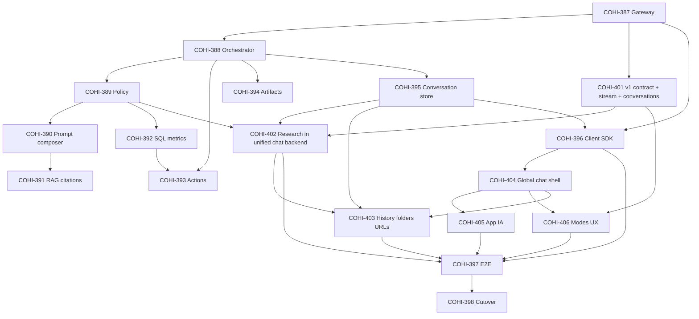

# Unified Cohi Chat — Jira backlog (COHI-386)

**Architecture:** [cohi-chat-unified-architecture.md](./cohi-chat-unified-architecture.md) (reconcile §15 Research with epic)  
**Product / UX centralization:** [COHI_CHAT_CENTRALIZATION_MEETING_SPEC.md](./COHI_CHAT_CENTRALIZATION_MEETING_SPEC.md)  
**JSON Schemas:** [schemas/cohi-chat-unified/](./schemas/cohi-chat-unified/)

This document tracks **live Jira**: Epic **[COHI-386](https://teraverde.atlassian.net/browse/COHI-386)** and its children **COHI-387–COHI-398** plus centralization stories **COHI-401–COHI-406** (Parent = COHI-386).

**Issue numbering:** **COHI-399** and **COHI-400** are **not** part of this epic (other project work). Centralization contract + Research-in-chat work starts at **COHI-401**.

**Source of truth for story bodies:** Jira descriptions (Scope / Implemented in codebase / Acceptance criteria / dependencies) — especially after 2026-05-14 merge with the meeting spec.

**Wave 1 implementation (COHI-387 + COHI-401):** Landed in repo with tenant migration **128** (`unified_chat_conversations` columns + `unified_chat_idempotency_keys`), full `/api/chat/v1` §5.1 routes, OpenAPI `server/openapi/chat-v1.yaml`, and Vitest coverage in `server/src/services/chat/unifiedChatSchemas.test.ts`. Close **COHI-387** / **COHI-401** in Jira when ACs match and link the merging PR.

---

## Epic COHI-386 — Unified Cohi Chat Platform + Chat Centralization

**Issue type:** Epic  
**Summary:** See Jira — unified platform + meeting-spec centralization (Research in-chat, shell, IA, history, modes).

### Epic description

Maintain in **Jira** (updated 2026-05-14): unified API/orchestrator/policy/client plus **COHI_CHAT_CENTRALIZATION_MEETING_SPEC.md** (Research embedded in chat, unified history, global shell, IA, etc.).

### Epic acceptance criteria

See **COHI-386** in Jira (includes meeting spec §1–§11 and cutover gates).

---

## Dependency overview

---

## Stories (under Epic COHI-386)

| Key | Title | Depends on (see Jira for full) |
|-----|-------|-------------------------------|
| **COHI-387** | Chat gateway: schemas, validation, OpenAPI draft | — |
| **COHI-388** | Conversation orchestrator + POST `/api/chat/v1/messages` | COHI-387, COHI-401; COHI-402 for Research AC |
| **COHI-389** | Unified policy engine | COHI-388 |
| **COHI-390** | Prompt composer modules + persona router | COHI-389, COHI-401 |
| **COHI-391** | RAG retrieval + citations blocks (parity) | COHI-390 |
| **COHI-392** | SQL / metrics execution behind unified policy | COHI-389 |
| **COHI-393** | Workbench action planner + executor integration | COHI-388, COHI-392 |
| **COHI-394** | Artifact service + visualization blocks | COHI-388 |
| **COHI-395** | Unified conversation store + migration / backfill | COHI-388 |
| **COHI-396** | Frontend Chat SDK + unified shell | COHI-387, COHI-395 |
| **COHI-397** | E2E parity suite + replay harness | COHI-396, COHI-404, COHI-402, COHI-403, COHI-405, COHI-406 (as shipped) |
| **COHI-398** | Feature flags, cutover runbook, rollback drills | COHI-397 |
| **COHI-401** | [Centralization] v1 contract — `chat_type`, conversations API, stream | COHI-387 |
| **COHI-402** | [Centralization] Research Lab in unified chat — backend & session model | COHI-401, COHI-395, COHI-389 |
| **COHI-403** | [Centralization] Unified history, folders, Full History, legacy Research URLs | COHI-395, COHI-402 |
| **COHI-404** | [Centralization] Global chat shell — layout, expand modes, remove right rail | COHI-396 |
| **COHI-405** | [Centralization] App IA — sidebar, top nav, Communications Center | COHI-404 |
| **COHI-406** | [Centralization] Chat type selector + Insight builder + Workbench mode UX | COHI-404, COHI-401, COHI-390, COHI-393 |

---

## Per-story detail (COHI-387–COHI-406)

Canonical **Scope**, **Implemented in codebase**, **Acceptance criteria**, and **_Depends on_** lines for **COHI-387** through **COHI-406** are in **Jira** under epic **[COHI-386](https://teraverde.atlassian.net/browse/COHI-386)** (updated 2026-05-14 to merge `COHI_CHAT_CENTRALIZATION_MEETING_SPEC.md`).

Schema file references for gateway work: [chat-request.schema.json](./schemas/cohi-chat-unified/chat-request.schema.json), [chat-response.schema.json](./schemas/cohi-chat-unified/chat-response.schema.json), [chat-event-stream.schema.json](./schemas/cohi-chat-unified/chat-event-stream.schema.json).

---

## Optional follow-ups (separate epics or later stories)

| Item | Notes |
|------|--------|
| Research escalation / `deep_dive` from general chat | Optional after **COHI-402** if product wants “go deeper” from Chat mode; architecture §15 |
| Inline citation anchors in markdown | Architecture §14 |
| Context compaction job | Architecture §14 + `compactionWatermark` |
| Tenant admin tuning for Research suggestions | If caps differ from meeting §10 parity |

---

## Jira field cheat sheet

| Field | Epic COHI-386 | Each story |
|-------|----------------|------------|
| **Epic Link / Parent** | — | COHI-386 |
| **Components** | Chat / Platform | As used today |
| **Labels** | `unified-chat`, `architecture` | `unified-chat` |
| **Fix version** | TBD | Same train as epic |

---

## Document history

| Date | Change |
|------|--------|
| 2026-05-05 | Initial backlog with COHI-386 epic and COHI-387–398 story placeholders + ACs |
| 2026-05-05 | Issues created in Jira (Epic COHI-386 + Stories COHI-387–398); epic AC2 fix (cutover = COHI-398) |
| 2026-05-14 | Jira: epic + 387–398 + new **COHI-401–406** merged with meeting spec; backlog table/diagram updated; per-story text in Jira |
