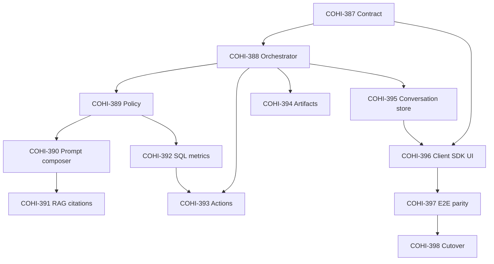

# Unified Cohi Chat — Jira backlog (COHI-386)

**Architecture source of truth:** [cohi-chat-unified-architecture.md](./cohi-chat-unified-architecture.md)  
**JSON Schemas:** [schemas/cohi-chat-unified/](./schemas/cohi-chat-unified/)

This document matches **live Jira**: Epic **COHI-386** on [teraverde.atlassian.net](https://teraverde.atlassian.net); child Stories **COHI-387**–**COHI-398** were created with Parent = COHI-386 (2026-05-05).

Issue keys **COHI-387 … COHI-398** are the live Story keys in Jira (not placeholders).

Use **COHI-386** as Epic parent for any additional spin-off tasks.

---

## Epic COHI-386 — Unified Cohi Chat Platform

**Issue type:** Epic (updated in Jira 2026-05-05)  
**Summary:** Unified Cohi Chat Platform (single API, orchestrator, policy, UI across site + workbench)

### Epic description (paste into Jira)

Deliver one assistant surface across the main app and workbench: **one HTTP contract** (`/api/chat/v1/*`), **one orchestrator**, **one policy layer**, and **one client integration**, while preserving workbench actions, chat→canvas/PPT artifacts, session history, RAG/citations, and role-based access.

**Out of scope for this epic’s definition:** unrelated Research Lab agent redesign — Research Lab appears only as an optional escalation path per architecture §15 and Appendix A.4.

**Related docs:** `docs/planning/cohi-chat-unified-architecture.md`, `docs/planning/schemas/cohi-chat-unified/*`.

### Epic acceptance criteria

1. All **child stories** listed below are either Done or explicitly deferred with PM sign-off.
2. Legacy routes (`/api/cohi-chat/*`, `/api/cohi-chat/workbench`, `/api/workbench/ai/query` as applicable) are **removed or shim-only** behind feature flag per cutover runbook (**COHI-398**).
3. **Big-bang readiness gates** from architecture §10 / §11 are satisfied before production enablement.
4. Product decisions in **Appendix A** of the architecture doc are implemented or tracked as explicit exceptions with approval.

---

## Dependency overview

---

## Stories (create under Epic COHI-386)

| Placeholder key | Title | Depends on |
|-----------------|-------|------------|
| **COHI-387** | Chat gateway: schemas, validation, OpenAPI draft | — |
| **COHI-388** | Conversation orchestrator + POST `/api/chat/v1/messages` | COHI-387 |
| **COHI-389** | Unified policy engine (single entitlement + data gate matrix) | COHI-388 |
| **COHI-390** | Prompt composer modules + persona router | COHI-389 |
| **COHI-391** | RAG retrieval + citations blocks (parity) | COHI-390 |
| **COHI-392** | SQL / metrics execution behind unified policy | COHI-389 |
| **COHI-393** | Workbench action planner + executor integration | COHI-388, COHI-392 |
| **COHI-394** | Artifact service + visualization blocks (chart/canvas/PPT handoff) | COHI-388 |
| **COHI-395** | Unified conversation store + migration / backfill | COHI-388 |
| **COHI-396** | Frontend Chat SDK + unified shell (site + workbench + hub) | COHI-387, COHI-395 |
| **COHI-397** | E2E parity suite + replay harness | COHI-396 |
| **COHI-398** | Feature flags, cutover runbook, rollback drills | COHI-397 |

---

### COHI-387 — Chat gateway: schemas, validation, OpenAPI draft

**Story:** Implement JSON Schema validation for request/response/stream payloads; publish OpenAPI 3.1 draft for `/api/chat/v1/*`; wire validation middleware on gateway.

**Acceptance criteria**

1. Request bodies validate against [chat-request.schema.json](./schemas/cohi-chat-unified/chat-request.schema.json); invalid bodies return **400** with machine-readable error detail (field path).
2. Response shape validates against [chat-response.schema.json](./schemas/cohi-chat-unified/chat-response.schema.json) in CI / integration tests (or runtime in non-prod).
3. Streaming events conform to [chat-event-stream.schema.json](./schemas/cohi-chat-unified/chat-event-stream.schema.json).
4. OpenAPI document checked into repo under `docs/planning/` or `server/openapi/` (team convention) and references same schemas.
5. `clientMessageId` idempotency field accepted; duplicate retries within TTL do not double-charge or duplicate persisted user turns.

---

### COHI-388 — Conversation orchestrator + POST messages

**Story:** Implement orchestrator pipeline: resolve context → policy snapshot → compose prompt → LLM route → assemble typed response blocks; expose `POST /api/chat/v1/messages` and optional `:stream`.

**Acceptance criteria**

1. Single entry path handles `location`, `scope`, and optional `context` per architecture §5.
2. Response returns `conversationId`, `turn` with **blocks** array (`text`, `citations`, `visualization`, `actions`, `artifacts`, `navigation_hints`, `safety` as applicable).
3. `metadata.contextManifest` reflects which context tiers were included / truncated (architecture §6).
4. Non-streaming and streaming paths emit **semantically equivalent** final blocks (streaming may chunk `text`).
5. `options.planningMode` honored (`auto` | `always` | `never`) — at minimum **stub** `never` as current single-shot until planner story expanded.

---

### COHI-389 — Unified policy engine

**Story:** One policy matrix for all chat modes; align historical differences (e.g. `cohi_chat` section vs workbench routes); enforce before RAG/SQL/actions.

**Acceptance criteria**

1. Single module resolves: auth, tenant, feature sections, row/field restrictions, tool allowlists.
2. Denied requests return **403** or **404** (no silent downgrade) with stable `error.code`.
3. Platform `tenant_id` query allowed **only** for roles permitted today; audited (architecture Appendix A.3).
4. Navigation hints filtered through **allowlist** (Appendix A.2): external URLs and disallowed paths never reach client.
5. Unit tests cover matrix combinations for at least: standard user, tenant admin, platform staff.

---

### COHI-390 — Prompt composer + persona router

**Story:** Modular prompt assembly (repo templates + DB overrides); single persona registry for routing.

**Acceptance criteria**

1. No monolithic copy-paste prompt blocks for workbench vs global — **modules** composed by surface + scope.
2. `metadata.promptHash` (or bundle version) stable for identical inputs for audit replay.
3. Tenant DB prompt overrides applied deterministically with precedence documented (repo default < tenant override).

---

### COHI-391 — RAG + citations parity

**Story:** Tenant-scoped retrieval; citations block populated; aligns with chat answers where knowledge is used.

**Acceptance criteria**

1. When RAG chunks contribute to an answer, response includes a `citations` block or explicit inline linkage per §14 strategy (minimum: citations block).
2. Retrieval respects policy (no retrieval when entitlement denies).
3. Parity test: known tenant fixture returns expected citation titles/ids for golden prompt.

---

### COHI-392 — SQL / metrics execution behind policy

**Story:** Route SQL and metrics execution through unified sanitization + policy; consistent with legacy chat behavior where intentional.

**Acceptance criteria**

1. Generated or tool-produced SQL passes through shared sanitization + policy filters before execution.
2. Row/column restrictions apply when product specifies them for chat paths (document gaps if legacy lacked enforcement).
3. Errors from execution surface as assistant-safe messages + structured error metadata (no raw stack traces to client).

---

### COHI-393 — Action planner + workbench executor

**Story:** Validate `WidgetAction[]`; integrate auto-execute when client opts in; parity with current workbench chat.

**Acceptance criteria**

1. Invalid actions rejected before executor; partial batches handled per defined strategy (fail-closed or strip-invalid — document choice in PR).
2. Workbench canvas integration exercises **at least one** create/modify path e2e on staging.
3. `query_data` or equivalent path covered by automated test if present in legacy.

---

### COHI-394 — Artifact service + visualization blocks

**Story:** Stable artifact IDs for charts/tables; hooks for PPT/canvas export parity.

**Acceptance criteria**

1. `visualization` blocks include `artifactId` where persistence required for reload/export.
2. Export / open-in-workbench flows using artifacts succeed for golden scenario (align with existing `chatToCanvas` flows).
3. Artifact TTL / cleanup policy documented (even if “no TTL v1”).

---

### COHI-395 — Unified conversation store + migration

**Story:** Single persistence model for scopes (global, canvas, draft, insight, workbench_hub per Appendix A.1); migrate legacy rows.

**Acceptance criteria**

1. Conversations readable/writable by `scope` + `userId` + `tenantId`.
2. **Workbench hub** persistence uses `workbench_hub` + stable `scope.id` keys (`hub:favorites`, etc.).
3. Migration script / runbook: maps legacy global sessions and `cohi_conversations` with `legacy_ref`.
4. Rebind scope (draft → canvas) supported if legacy did — preserve messages.

---

### COHI-396 — Frontend Chat SDK + unified shell

**Story:** Replace forked hooks/panels with SDK calling `/api/chat/v1/*`; one shell on site + workbench + hub pages.

**Acceptance criteria**

1. Global chat, workbench panel, and hub Ask Cohi use **same** client module (facade ok for incremental rollout).
2. Tenant resolution centralized (remove duplicate `resolveEffectiveTenantId` patterns where touched).
3. Markdown/rendering parity acceptable per UX review (plain text gaps closed).

---

### COHI-397 — E2E parity + replay harness

**Story:** Playwright coverage + tagged `@critical @COHI-386` (or per-story keys); optional prompt replay from staging logs.

**Acceptance criteria**

1. Critical paths: global ask + chart; workbench action; hub persisted thread resume.
2. QA pipeline picks up keys from commits/tests per `docs/QA_DEVELOPER_PROCEDURES.md`.
3. Minimum pass rate for replay harness defined with PM (e.g. ≥90% on golden set) documented in runbook.

---

### COHI-398 — Feature flags, cutover, rollback

**Story:** `unified_chat_enabled` (or equivalent); staged rollout; rollback drill documented.

**Acceptance criteria**

1. Flag disables unified stack and restores legacy behavior without deploy (or single-config rollback).
2. Cutover checklist in architecture §11 executed on staging; rollback drill recorded (date + owner).
3. Observability dashboards/alerts for error rate, P95, token usage, policy denials.

---

## Optional follow-ups (separate epics or later stories)

| Item | Notes |
|------|--------|
| Research Lab `deep_dive` block + UI button | Architecture §15; depends on Research entitlement + Appendix A.4 caps |
| Inline citation anchors in markdown | Architecture §14 |
| Context compaction job | Architecture §14 + `compactionWatermark` |
| Tenant admin sensitivity for Research suggestions | Appendix A.4 future |

---

## Jira field cheat sheet

| Field | Epic COHI-386 | Each story |
|-------|----------------|------------|
| **Epic Link / Parent** | — | COHI-386 |
| **Components** | Chat / Platform | As used today |
| **Labels** | `unified-chat`, `architecture` | `unified-chat` |
| **Fix version** | TBD | Same train as epic |

---

## Document history

| Date | Change |
|------|--------|
| 2026-05-05 | Initial backlog with COHI-386 epic and COHI-387–398 story placeholders + ACs |
| 2026-05-05 | Issues created in Jira (Epic COHI-386 + Stories COHI-387–398); epic AC2 fix (cutover = COHI-398) |
