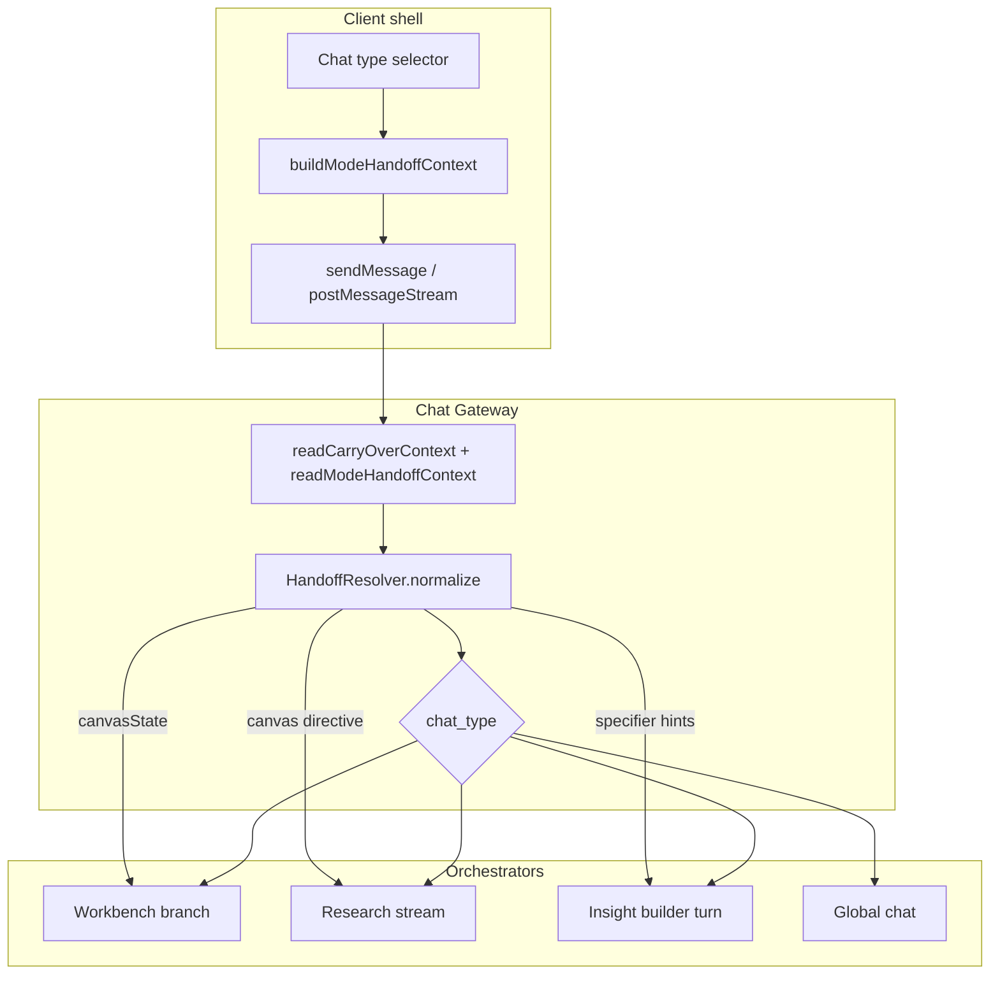

# Cross-mode chat handoff plan

**Status:** Draft for engineering + product review (updated post–COHI-386 merge)  
**Related:** [cohi-chat-unified-architecture.md](./cohi-chat-unified-architecture.md), [COHI_CHAT_CENTRALIZATION_MEETING_SPEC.md](./COHI_CHAT_CENTRALIZATION_MEETING_SPEC.md)  
**Code anchors:** `carryOverContext.ts`, `carryOverContext.resolve.ts`, `chatConversationFork.ts`, `useCohiChat.ts`, `unifiedResearchStream.ts`, `insightBuilderTurn.ts`, `cohiWorkbench.ts` (`buildCanvasContext`)

---

## 0. Baseline after dev merge (COHI-386 + COHI-398 fixes)

**Already shipped on `dev` (text / fork layer):**

| Piece | What it does |
|-------|----------------|
| `src/lib/carryOverContext.ts` | Rich fork summaries (dialogue, workbench actions, IB draft, research report/findings caps). |
| `carryOverContext.resolve.ts` | Async summary when forking **from Research** (fetches session report, 5s timeout). |
| `applyChatCarryOver()` | Injects carry-over into **new** Research Lab sessions (steering + `priorChatCarryOver`). |
| `unifiedResearchStream` + `chatV1` | Passes `carryOver` into stream research same as non-stream. |
| Fork UX | `resolveCarryOverSummary` in panel; parent/child links on `getConversation`. |

**Shipped on workbench branch (runtime / binding, merged with dev):**

| Piece | What it does |
|-------|----------------|
| `bindResearchSessionAfterStream` | Binds `researchSessionId` from stream metadata + `legacy_ref`; restores fork links. |
| `clearConversationBinding` | WB → Research with empty thread: drop workbench `sessionId` so research does not reuse wrong conversation. |
| Chat panel / scope fixes | History under header; no workbench mode snap-back on canvas; research shell expand. |

**Still missing (this plan’s focus):**

- **Structural** handoff: `canvasState` / open board → Research (and WB → Insight Builder).
- Correct **location/scope** on research sends from canvas (`workbench_canvas`, `canvas` scope).
- `ModeHandoffContext` envelope + server `HandoffResolver` (below).

---

## 1. Problem

Users switch chat type in one shell (Workbench → Research, Workbench → Insight Builder, etc.) and expect the assistant to understand **where they were**—especially the **open canvas**. After COHI-386, **text** carry-over is much better; **structural** context is still the gap:

| Source mode | What the target mode actually receives |
|-------------|----------------------------------------|
| **Workbench** | Full `canvasState` + `widgetCatalog` (workbench route only). |
| **Research** (unified) | Question + **carry-over text** into Research steering (`applyChatCarryOver`). **No** canvas snapshot, **no** `widgetContext` on `createSession` unless standalone Research Lab POST. |
| **Insight Builder** | `insightBuilderDraft` when revising; carry-over text via fork; **no** canvas payload. |
| **Chat** | Tenant/session + RAG; optional carry-over text only. |

Research from `/my-dashboard/:canvasId` still posts `scope: global_session` / `surface: data_chat_page` with empty structural context—so *“insights from **this** dashboard”* is under-specified.

We extend COHI-386 with one **structural handoff** model—not a second carry-over system.

---

## 2. Goals and non-goals

### Goals

1. **Predictable context** when switching modes or sending the first message in a new mode after a switch.
2. **Canvas-aware Research** when the user is on a workbench canvas (layout, widgets, periods, research-sourced widgets).
3. **Reuse existing fork UX** (new conversation + undo toast + parent link) and extend with **structured** payloads where text summary is insufficient.
4. **Policy-safe truncation** with `contextManifest` tiers (no silent drops).
5. **Parity** with patterns we already have: insight → research (`initialContext` + steering directives in `createSession`).

### Non-goals (v1)

- Merging conversation stores across modes (still one unified conversation per mode switch fork).
- Auto-running Workbench actions when leaving Research without user confirmation.
- Shared streaming UI across modes (each mode keeps its workspace).

---

## 3. Design principles

1. **Mode switch = new conversation** when there is an active thread with messages (`shouldForkOnChatTypeChange`)—keep this.
2. **Two layers of handoff:**
   - **Transcript layer:** `carryOverContext.summary` (user/assistant snippets) — already implemented.
   - **Structural layer:** mode-specific snapshots (canvas, insight draft, research session id, registry catalog).
3. **Location follows truth:** If the user is on `workbench_canvas`, research requests should declare `location.surface: workbench_canvas`, `scope: canvas | draft`, and include canvas snapshot—even though orchestration still runs the research pipeline.
4. **Server owns normalization:** Client sends raw snapshots; server builds prompts / steering / session fields via a single **HandoffResolver**.
5. **Idempotent first turn:** Handoff payload attached to **first message after switch** only (or stored on conversation row as `handoff_snapshot` jsonb for replay).

---

## 4. Canonical handoff envelope

Extend unified request `context` (schema already allows `additionalProperties`):

```ts
/** Client → server on first turn after mode switch (or explicit "Continue in X"). */
interface ModeHandoffContext {
  /** Provenance */
  fromChatType: UnifiedChatType;
  fromConversationId: string;
  fromTitle?: string;

  /** Text layer (existing) */
  summary?: string; // same as carryOverContext.summary; merge in resolver

  /** Structural layer — include only what the source mode had */
  canvasState?: CanvasStateSnapshot;
  widgetCatalog?: string; // registry serializer
  insightBuilderDraft?: InsightBuilderDraft;
  researchSessionId?: string; // legacy_ref / research lab session
  sourceInsight?: SourceInsightContext; // tracked insight → workbench path

  /** What the user was looking at */
  location?: {
    surface: UnifiedChatLocation["surface"];
    route?: string;
    canvasId?: string;
    canvasTitle?: string;
  };
}
```

**Persistence:** On fork, optionally store `handoff_snapshot` on the child `unified_chat_conversations` row (origin = `fork_on_type_change`) so reload/resume does not lose canvas context.

**Server entry:** `readModeHandoffContext(body)` alongside `readCarryOverContext(body)`; resolver merges into branch-specific inputs.

---

## 5. Handoff matrix (from → to)

| From \ To | **Research** | **Insight Builder** | **Workbench** | **Chat** |
|-----------|--------------|---------------------|-----------------|----------|
| **Workbench** | Canvas markdown + registry catalog + research widgets on canvas + carry-over. Set `initialContext`-style **steering directive** on new research session. | Carry-over + canvas widget list/metrics as **specifier hints** in first user message or draft seed. | N/A (same mode) | Carry-over + short canvas summary in RAG turn. |
| **Research** | Resume session (`legacyResearchSessionId`) or new session with report/findings summary in steering. | Carry-over + synthesis/report excerpt → IB gathering prompt. | Navigate to canvas; optional “Save findings to workbench” (existing artifact path). | Carry-over + report summary. |
| **Insight Builder** | Approved/preview draft → research topic + specifiers as steering. | Resume `insightBuilderDraft`. | Rare; carry-over text only unless user asks to build dashboard. | Carry-over + draft title/prompt. |
| **Chat** | Carry-over only (+ registry catalog default). | Carry-over only. | `navigateForWorkbenchChatSubmit` / widget handoff (existing). | N/A |

### 5.1 Workbench → Research (priority)

**User intent:** “Investigate deeper than this board” / “what else can you find from this dashboard?”

**Client (on switch + first send):**

- `buildModeHandoffContext("workbench", "research")` using `buildWorkbenchRequestContext()` (same as workbench send).
- Set `location: { surface: "workbench_canvas", route: pathname }`.
- Set `scope: { type: "canvas" | "draft", id }` aligned with workbench chat scope (not `global_session`).
- Keep `carryOverContext` for transcript.

**Server (`runUnifiedResearchStream`):**

1. If new session: call `createSession(..., widgetContext, canvasHandoff?)` where:
   - `widgetContext` = global registry (`serializeResearchWidgetCatalog` equivalent, server-side or client-provided).
   - **New:** `steeringDirectives.push(buildCanvasHandoffDirective(canvasState))` — reuse logic from `buildCanvasContext` + `buildResearchContext` in `cohiWorkbench.ts` (extract shared module).
2. Topic line: prefer user message; if message is deictic (“this dashboard”), prepend canvas title from handoff.
3. `contextManifest` includes `workbench_snapshot: true`, `research_registry: true`.

**Follow-ups:** Same research `legacy_ref`; handoff snapshot not re-sent (loaded from conversation or session).

### 5.2 Workbench → Insight Builder

**User intent:** “Turn this dashboard discussion into a tracked insight / custom prompt.”

**Client:**

- Fork + carry-over (existing).
- Pass `canvasState` + optional `sourceInsight` in `ModeHandoffContext`.
- First message: optional system-side prefix (server) listing widgets/metrics on canvas relevant to IB specifiers.

**Server (`runInsightBuilderTurn`):**

- New helper `buildInsightBuilderHandoffPrefix(handoff)` → injected into LLM user/history (not a user-visible bubble).
- Map canvas widgets to **column/specifier suggestions** via existing `suggestLoanColumns` / specifier flows where possible.
- Do **not** pass full canvas JSON into specifiers raw—summarize.

### 5.3 Research → Workbench

**Already partially exists:** Save to workbench from findings; `navigateForWorkbenchConversationResume`.

**Extend:**

- On mode switch Research → Workbench with active `legacyRef`, offer **scoped** workbench thread on current canvas (scope sync) + carry-over including **report abstract** (not full findings JSON).
- Optional chip: “Apply top findings to canvas” → uses existing widget actions pipeline (out of scope for automatic apply in v1).

### 5.4 Research → Insight Builder

- Carry-over + `report.summary` / top findings titles.
- IB phase `gathering` with suggested `prompt_text` seeded from research topic.

### 5.5 Chat ↔ others

- Text carry-over only unless `location` is workbench canvas (then include snapshot).
- Chat → Research on home page: registry catalog only (current Research Lab behavior).

---

## 6. Architecture



### 6.1 HandoffResolver (new server module)

`server/src/services/chat/handoffResolver.ts`:

| Function | Purpose |
|----------|---------|
| `normalizeHandoff(body)` | Merge `carryOverContext` + `modeHandoffContext`; enforce size budgets. |
| `canvasToMarkdown(snapshot)` | Shared with workbench (extract from `cohiWorkbench.ts`). |
| `toResearchSessionInputs(handoff)` | `{ widgetContext, steeringDirectives, topicHint }` |
| `toInsightBuilderPrefix(handoff)` | string block for IB turn |
| `toWorkbenchContext(handoff)` | Already have `canvasState`; merge carry-over into history only |

**Budgets (initial):**

| Tier | Max size | On overflow |
|------|----------|-------------|
| carry-over summary | 1.2k chars | truncate (existing) |
| canvas markdown | 8k chars | summarize groups/widgets count + top N widgets |
| research registry | existing catalog | server-side trim meta |
| IB prefix | 2k chars | bullet list of widget titles + metrics only |

Emit `contextManifest` entries: `handoff_from`, `canvas_included`, `truncated: true/false`.

### 6.2 Client module

`src/lib/chat/modeHandoff.ts`:

- `buildModeHandoffContext(args: { from, to, messages, workbenchBridge, session })`
- `shouldAttachHandoff(isNewConversation, pendingHandoffRef)`
- Called from `handleChatTypeChange` (store pending handoff) and `sendMessage` (attach to `context`).

**Fix location/scope for research on canvas:**

- `sendUnifiedGlobalStream` should accept `location` + `scope` params (today hardcoded to `data_chat_page` / `global_session`).

---

## 7. UX and conversation rules

| Event | Behavior |
|-------|----------|
| Mode switch with messages | Fork (existing toast + undo). Stash `ModeHandoffContext` in ref until first send. |
| Mode switch, empty thread | Clear workbench binding (done for WB→Research). Stash handoff if on canvas. |
| First send in target mode | Attach handoff + carry-over; clear stash. |
| User undoes fork | Restore prior mode **and** drop stashed handoff. |
| Research from canvas | Auto full-page shell (existing). Show chip: “Using canvas: {title}” (optional v1.1). |

**Deictic prompts** (“this dashboard”, “these widgets”): resolver rewrites planner topic with canvas title + widget count when handoff present.

---

## 8. Implementation phases

### Phase 0 — Align and extract (1–2 days) — **next up**

- [x] Rich text carry-over + research steering (COHI-386).
- [x] Research session binding after poll-mode stream (COHI-398 branch).
- [ ] Extract `buildCanvasContext` / `buildResearchContext` to `server/src/services/chat/canvasContextBuilder.ts` (shared by workbench + handoff).
- [ ] Add unit tests for `HandoffResolver` truncation (new module).
- [ ] Fix `sendUnifiedGlobalStream` to pass through `location` + `scope` from caller.

### Phase 1 — Canvas → Research (highest value) — **MVP for handoff**

- [ ] `ModeHandoffContext` types (client + server).
- [ ] Client: build handoff on WB→Research switch; attach on first research send from canvas route.
- [ ] Server: `unifiedResearchStream` + `handleResearchStream` consume handoff; pass `widgetContext` + canvas steering directive into `createSession`.
- [ ] E2E: dashboard canvas → switch Research → ask “insights from this dashboard” → timeline runs with plan referencing canvas widgets.
- [ ] Manual: verify poll mode + `researchSessionId` binding (recent fix).

### Phase 2 — Workbench → Insight Builder

- [ ] `toInsightBuilderPrefix(handoff)` in IB turn.
- [ ] Client handoff on WB→IB switch.
- [ ] Tests: specifier suggestions reference canvas widget columns where applicable.

### Phase 3 — Research → Workbench / Insight Builder

- [ ] Load research session summary for handoff (findings titles + synthesis excerpt).
- [ ] Research → IB: seed gathering message.
- [ ] Research → WB: carry-over + optional navigation to connected canvas.

### Phase 4 — Polish

- [ ] Persist `handoff_snapshot` on forked conversation row.
- [ ] UI chip for active handoff source.
- [ ] `includeLiveCanvasData` wire-up (if product wants live query results on canvas, not just snapshot).

---

## 9. Testing strategy

| Layer | Cases |
|-------|--------|
| Unit | `HandoffResolver` budgets; canvas markdown; deictic topic rewrite |
| Unit | `buildModeHandoffContext` with/without bridge |
| Integration | `POST messages:stream` research with `modeHandoffContext.canvasState` creates session with steering + widget_context |
| E2E | W2-09 style: mode switch on canvas; research timeline progresses |
| Regression | Fork undo restores mode without leaking handoff to next send |

---

## 10. Open product decisions

1. **Research scope on canvas:** Should unified conversation `scope_type` be `canvas` for research threads tied to a board (history grouped per canvas), or stay `global_session` with handoff metadata only?
   - *Recommendation:* `canvas` scope when handoff includes `canvasId`—matches workbench history UX.

2. **Re-send handoff on every research follow-up?**  
   - *Recommendation:* No—first turn + session steering only; follow-ups use research session state.

3. **Insight Builder from canvas without WB messages:** Switch with empty thread—still attach canvas snapshot?  
   - *Recommendation:* Yes, if on canvas route.

4. **Auto-switch to Research when user asks investigation-style question in Workbench?**  
   - *Recommendation:* No auto-switch in v1; optional suggestion chip later.

---

## 11. Summary

- **Today:** COHI-386 owns **text** fork carry-over + Research steering; workbench owns **canvas** on WB sends only.
- **Target:** Add **structural** `ModeHandoffContext` + `HandoffResolver` on top of existing `carryOverContext` (do not fork a parallel summary pipeline).
- **First ship:** Workbench/canvas → Research (steering + registry + canvas markdown + scope/location).
- **Next:** Workbench → Insight Builder; then Research outbound handoffs.

### 12. Suggested tickets (implementation prep)

| Ticket | Scope | Depends on |
|--------|--------|------------|
| **H1** | `canvasContextBuilder.ts` extract + tests | — |
| **H2** | `sendUnifiedGlobalStream` location/scope params; client passes canvas route | H1 optional |
| **H3** | `HandoffResolver` + `modeHandoffContext` on request schema | H1 |
| **H4** | Phase 1: wire resolver into `runUnifiedResearchStream` (`createSession` steering + catalog) | H2, H3 |
| **H5** | Client: `buildModeHandoffContext` + stash on mode switch; attach on first send | H4 |
| **H6** | Phase 2: Insight Builder prefix from canvas handoff | H3 |
| **H7** | E2E: canvas → Research → timeline references board widgets | H5 |

**Merge note:** Conclude the dev merge commit on `fix/COHI-398-workbench-live-solid` before starting H1 (conflicts resolved in `unifiedResearchStream.ts`, `useCohiChat.ts`, `CohiChatPanel.tsx`).

This keeps one shell, one API envelope, and mode-specific execution paths—as intended in the unified architecture—while making cross-mode switches feel intentional instead of amnesiac.
