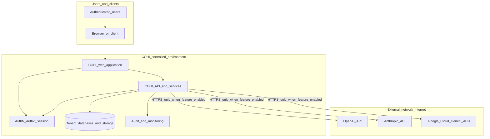
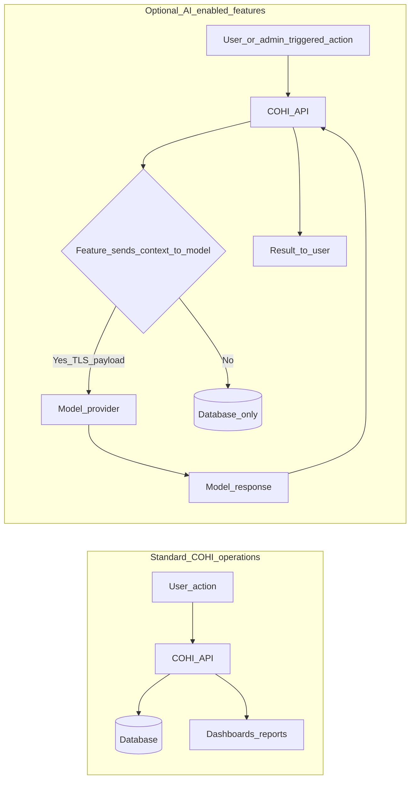
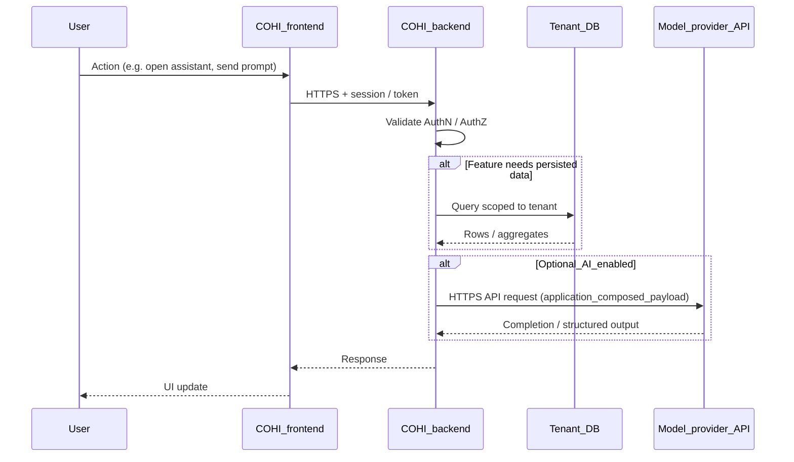
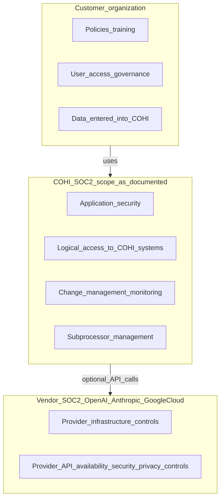
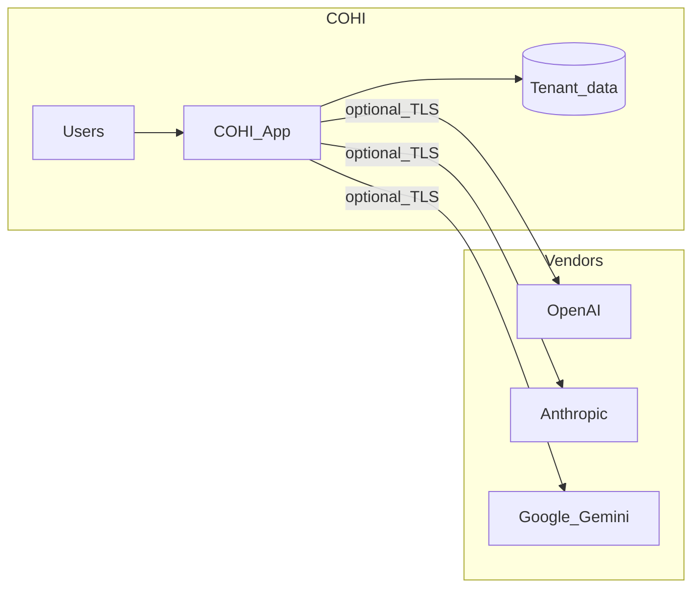

# COHI: Agentic AI, Data Security & Compliance Reference

**Document type:** Internal compliance & security narrative (supports `/agent-compliance` product page and customer due diligence)  
**Audience:** Security, GRC, legal, enterprise buyers, engineering  
**Status:** Living document — verify all certification claims against current vendor trust portals before external distribution.

> **Presentation:** For a **white page** when printing or exporting to PDF, use your viewer’s “white background” / “light theme” option. All embedded figures below use an explicit **white canvas** so they stay readable on screen and in exports.

---

## 0. Sketch overview — trust envelope (one glance)

Hand-drawn style schematic: **tenant data and the database stay inside the COHI boundary**; model vendors are reached only by **optional HTTPS** from your application layer. **No** vendor connection back into the database.

<figure>

<!-- White canvas + sketch-style strokes (ink on paper) -->
<svg xmlns="http://www.w3.org/2000/svg" viewBox="0 0 820 440" width="100%" style="max-width:820px;display:block;margin:1rem auto;background:#ffffff;border:1px solid #e2e8f0;border-radius:12px" role="img" aria-labelledby="sketchTitle sketchDesc">
  <title id="sketchTitle">COHI security sketch — data stays in platform; AI APIs optional</title>
  <desc id="sketchDesc">Wavy COHI boundary contains user, app, API, and database. Outside, three model provider boxes receive dashed one-way arrows from API only. No arrows return to the database.</desc>
  <defs>
    <marker id="sketchArrow" markerWidth="10" markerHeight="10" refX="9" refY="3" orient="auto">
      <path d="M0,0 L0,6 L9,3 z" fill="#334155"/>
    </marker>
  </defs>
  <rect width="820" height="440" fill="#ffffff"/>
  <!-- subtle paper grain -->
  <rect width="820" height="440" fill="#f8fafc" opacity="0.5"/>

  <!-- Wavy "COHI trust zone" -->
  <path d="M 55 52 Q 120 38 200 48 Q 280 58 360 50 Q 520 42 620 55 Q 700 62 748 95 Q 768 140 762 200 Q 758 280 740 330 Q 700 385 620 392 Q 480 402 340 395 Q 200 388 95 360 Q 48 300 52 220 Q 48 120 55 52 Z"
        fill="none" stroke="#0f766e" stroke-width="2.8" stroke-linejoin="round" stroke-linecap="round"/>
  <text x="380" y="78" text-anchor="middle" font-family="Georgia, 'Times New Roman', serif" font-size="15" font-weight="bold" fill="#0f766e">COHI — your lending data stays here</text>

  <!-- User -->
  <ellipse cx="130" cy="155" rx="38" ry="22" fill="#fff" stroke="#334155" stroke-width="2.2" stroke-linecap="round"/>
  <text x="130" y="160" text-anchor="middle" font-family="Georgia, serif" font-size="12" fill="#334155">User</text>

  <!-- Browser -->
  <rect x="210" y="125" width="100" height="70" rx="8" fill="#fff" stroke="#334155" stroke-width="2.2"/>
  <rect x="218" y="133" width="84" height="12" rx="2" fill="#e2e8f0" stroke="#334155" stroke-width="1"/>
  <text x="260" y="178" text-anchor="middle" font-family="Georgia, serif" font-size="11" fill="#334155">Web app</text>

  <!-- Arrow user to app -->
  <path d="M 172 155 L 200 155" stroke="#334155" stroke-width="2" fill="none" marker-end="url(#sketchArrow)"/>

  <!-- API block -->
  <rect x="350" y="125" width="110" height="70" rx="6" fill="#fff7ed" stroke="#c2410c" stroke-width="2.4" stroke-linecap="round"/>
  <text x="405" y="155" text-anchor="middle" font-family="Georgia, serif" font-size="13" font-weight="bold" fill="#9a3412">COHI API</text>
  <text x="405" y="175" text-anchor="middle" font-family="Georgia, serif" font-size="10" fill="#7c2d12">Auth + tenant scope</text>

  <path d="M 314 158 L 342 158" stroke="#334155" stroke-width="2" marker-end="url(#sketchArrow)"/>

  <!-- Database cylinder sketch -->
  <ellipse cx="545" cy="138" rx="42" ry="14" fill="#f1f5f9" stroke="#334155" stroke-width="2"/>
  <path d="M 503 138 L 503 198 Q 545 218 587 198 L 587 138" fill="#f8fafc" stroke="#334155" stroke-width="2"/>
  <ellipse cx="545" cy="198" rx="42" ry="14" fill="#e2e8f0" stroke="#334155" stroke-width="2"/>
  <text x="545" y="232" text-anchor="middle" font-family="Georgia, serif" font-size="11" fill="#334155">Tenant DB</text>

  <path d="M 462 158 L 498 158" stroke="#334155" stroke-width="2" marker-end="url(#sketchArrow)"/>

  <!-- Optional AI zone (outside wavy line conceptually — drawn to the right) -->
  <text x="640" y="115" text-anchor="middle" font-family="Georgia, serif" font-size="12" font-style="italic" fill="#64748b">Outside COHI core persistence</text>

  <!-- Provider boxes -->
  <rect x="610" y="128" width="88" height="36" rx="5" fill="#fff" stroke="#475569" stroke-width="1.8" stroke-dasharray="4 3"/>
  <text x="654" y="150" text-anchor="middle" font-family="Georgia, serif" font-size="10" fill="#334155">OpenAI</text>
  <rect x="610" y="172" width="88" height="36" rx="5" fill="#fff" stroke="#475569" stroke-width="1.8" stroke-dasharray="4 3"/>
  <text x="654" y="194" text-anchor="middle" font-family="Georgia, serif" font-size="10" fill="#334155">Anthropic</text>
  <rect x="610" y="216" width="88" height="36" rx="5" fill="#fff" stroke="#475569" stroke-width="1.8" stroke-dasharray="4 3"/>
  <text x="654" y="238" text-anchor="middle" font-family="Georgia, serif" font-size="10" fill="#334155">Google / Gemini</text>

  <!-- Dashed arrows API -> providers (optional TLS) -->
  <path d="M 460 175 Q 530 200 600 148" fill="none" stroke="#0369a1" stroke-width="2" stroke-dasharray="6 5" marker-end="url(#sketchArrow)" opacity="0.9"/>
  <path d="M 465 185 Q 535 205 605 190" fill="none" stroke="#0369a1" stroke-width="2" stroke-dasharray="6 5" marker-end="url(#sketchArrow)" opacity="0.9"/>
  <path d="M 465 200 Q 540 230 605 232" fill="none" stroke="#0369a1" stroke-width="2" stroke-dasharray="6 5" marker-end="url(#sketchArrow)" opacity="0.9"/>
  <text x="520" y="128" text-anchor="middle" font-family="Georgia, serif" font-size="9" fill="#0369a1">HTTPS (if enabled)</text>

  <!-- Explicit "no return" -->
  <path d="M 650 270 Q 580 290 500 270" fill="none" stroke="#b91c1c" stroke-width="2" stroke-dasharray="3 4"/>
  <path d="M 515 262 L 525 278 M 525 262 L 515 278" stroke="#b91c1c" stroke-width="2"/>
  <text x="575" y="305" text-anchor="middle" font-family="Georgia, serif" font-size="11" fill="#b91c1c">No path from vendors → database</text>

  <!-- Lock doodle near DB -->
  <rect x="518" y="248" width="18" height="14" rx="2" fill="none" stroke="#334155" stroke-width="1.5"/>
  <path d="M 522 248 Q 522 238 527 235 Q 532 232 537 235" fill="none" stroke="#334155" stroke-width="1.5"/>

  <!-- Legend -->
  <rect x="55" y="340" width="710" height="85" rx="8" fill="#ffffff" stroke="#cbd5e1" stroke-width="1.5"/>
  <text x="70" y="365" font-family="Georgia, serif" font-size="12" font-weight="bold" fill="#334155">How to read this sketch</text>
  <text x="70" y="388" font-family="Georgia, serif" font-size="11" fill="#475569">• Solid flow inside the wavy border = normal COHI operations (auth, app, API, database).</text>
  <text x="70" y="408" font-family="Georgia, serif" font-size="11" fill="#475569">• Blue dashed arrows = optional outbound API calls; payload is only what COHI sends.</text>
</svg>

<figcaption><em>Figure 0 — Sketch trust envelope on a white canvas; dashed strokes = optional vendor calls only.</em></figcaption>
</figure>

### ASCII sketch (plain-text, copy-friendly)

Use this in email or terminals where SVG does not render:

```text
                         ┌─────────────────────────────────────────────────────────────┐
    ~  ~  ~  ~  ~  ~  ~  │   COHI CONTROLLED ZONE (your lending data stays here)      │  ~  ~  ~
  ~                      │                                                              │                      ~
      ┌──────┐    ┌──────┴─────┐    ┌──────────┐    ┌────────────┐                       │
      │ User │───▶│  Web app   │───▶│ COHI API │───▶│ Tenant DB  │◀── credentials      │
      └──────┘    └────────────┘    └────┬─────┘    │  (locked)  │     never sent       │
                                         │           └────────────┘     to vendors        │
                                         │ dotted = optional, TLS only if feature on     │
                                         ▼                                                │
                                   ┌──────────┐     ┌────────────┐     ┌────────────┐    │
                                   │ OpenAI   │     │ Anthropic  │     │ Google /   │    │
                                   │   API    │     │    API     │     │  Gemini    │    │
                                   └──────────┘     └────────────┘     └────────────┘    │
                                         ╳  NO return channel to database  ╳                │
  ~  ~  ~  ~  ~  ~  ~  ~  ~  ~  ~  ~  ~  └──────────────────────────────────────────────────┘  ~  ~  ~
```

---

## Important notice

This document is **descriptive** and **not legal advice**. It summarizes how COHI is **designed** to handle lending and related data in relation to optional use of third-party AI APIs (OpenAI, Anthropic, Google). **Final customer-facing statements** must be reviewed by **legal and compliance** and aligned with your **actual** SOC 2 report scope, dates, and boundaries.

---

## 1. Executive summary

| Topic | Statement |
|--------|-----------|
| **Database isolation** | Third-party model providers **do not receive database connection strings, credentials, or direct query access** to COHI’s tenant data stores. All persistence remains under COHI’s application and infrastructure boundary. |
| **When models see data** | Model providers may process **only the content COHI’s application explicitly sends** over HTTPS (e.g., user-typed prompts, retrieved snippets, or application-composed context for enabled features). This is **not** the same as “the vendor reads your entire database.” |
| **Control** | Access to AI features is **gated** by authentication, authorization, and product configuration (including admin-managed keys/settings where applicable). |
| **SOC 2 alignment** | COHI’s security posture should be described using **your** SOC 2 report (type, scope, period). Major AI vendors publish **their own** SOC 2 (and related) attestations for **their** services; those attest **vendor controls**, not COHI’s internal code or your loan database. Together, they support a **layered** assurance story when combined with contracts (DPAs, BAAs if applicable) and architecture. |

---

## 2. Scope & definitions

| Term | Meaning in this document |
|------|---------------------------|
| **Tenant data** | Loan pipeline data, PII, financial attributes, and other customer content stored or processed within COHI for a given tenant. |
| **Model provider** | OpenAI, Anthropic (Claude), Google (Gemini / Google Cloud APIs) when invoked from COHI. |
| **Optional AI feature** | Any product capability that calls an external model API (e.g., in-app assistant, chat/voice flows, embeddings/RAG where configured). |
| **Trust boundary** | The logical line between COHI-controlled systems and external networks (including model provider APIs). |

---

## 3. High-level security architecture (trust boundaries)

The diagram below shows **where data lives** versus **where optional AI calls may go**. No return path from vendors into the database is part of the design.



**Note:** There is **no** designed data path from OpenAI, Anthropic, or Google back into `Tenant_databases_and_storage`. Vendors do not receive database credentials or direct query access.

**Reading the diagram**

- **Solid arrows** into the model providers represent **application-initiated, outbound API requests** carrying only what the application puts in the request body (per feature design).
- **Dashed “not applicable”** emphasizes that providers **do not** connect back into `Tenant_databases_and_storage` as part of this architecture.

---

## 4. Data flow: normal operations vs optional AI

This diagram contrasts **typical CRUD/analytics** (data stays inside COHI) with **optional AI** paths.



**Compliance takeaway**

- **Standard operations** do not require model provider involvement.
- **Optional AI** introduces **data processing by a subprocessor** only when the application sends a request; scope minimization, retention, and DPA terms are governed by **your agreement with each vendor** and **configuration**.

---

## 5. Sequence: authenticated request with optional model call

Useful for **threat modeling** and **customer Q&A** (“what happens when someone uses the assistant?”).



**Key point for auditors:** The **model** is not a party that authenticates to your DB; **COHI backend** performs DB access under **your** access control model.

---

## 6. Shared responsibility & SOC 2 framing

SOC 2 reports describe **controls at a service organization** for a **defined scope** and **period**. Customers should map **who is responsible for what**.



**Table: illustrative responsibility split** (finalize with your SOC 2 and contracts)

| Area | COHI | Model provider |
|------|------|----------------|
| Physical / hypervisor security of COHI app & DB | Yes | N/A |
| API endpoint security (TLS, auth to **their** API) | Integrate correctly | Yes |
| What text/JSON is placed in a model request | Application logic | No |
| Training / logging policies for **API** data | Governed by vendor terms + your settings | Vendor policy |
| Tenant isolation inside COHI | Yes | N/A |

---

## 7. Public SOC 2 & trust references (verify before publishing)

Use these **primary sources** for customer decks and the in-app compliance page. Wording on your site should **mirror** what each vendor currently claims (do not overstate scope).

| Organization | Typical public claim (verify live) | Primary reference |
|--------------|-----------------------------------|-------------------|
| **OpenAI** | SOC 2 Type 2 and additional programs described in security/trust materials | [OpenAI Trust Portal](https://trust.openai.com/), [OpenAI Security](https://openai.com/security/) |
| **Anthropic** | SOC 2 Type I and II and other certifications documented for Claude / API | [Anthropic Trust](https://trust.anthropic.com/), [Claude API security & compliance](https://docs.anthropic.com/en/docs/about-claude/security-compliance) |
| **Google Cloud / Gemini** | Google Cloud SOC 2 and related reports; Gemini products covered per Google’s compliance documentation | [Google Cloud SOC 2](https://cloud.google.com/security/compliance/soc-2), [Gemini enterprise compliance](https://cloud.google.com/gemini/enterprise/docs/compliance-security-controls) |
| **COHI** | **Insert:** SOC 2 Type I / II, report period, in-scope services, how customers obtain the report | **Insert:** your trust page, NDA process, or security contact |

---

## 8. Security principles (control objectives)

Detailed enough for **control mapping** exercises; map columns to your SOC 2 control numbers internally.

| ID | Principle | Implementation intent |
|----|-----------|------------------------|
| P1 | **Authentication & authorization** | Only authenticated users invoke features; roles limit admin vs tenant capabilities. |
| P2 | **Tenant isolation** | Data access enforced in application and database layers (see existing COHI docs on RLS / multi-tenant architecture where applicable). |
| P3 | **Encryption in transit** | HTTPS to COHI and HTTPS to vendor APIs. |
| P4 | **Minimization for AI** | Send only the minimum necessary context for the enabled feature; avoid bulk exports to models. |
| P5 | **No vendor DB credentials** | Model APIs never receive database URLs/passwords or direct SQL channels from COHI as part of normal integration. |
| P6 | **Logging & monitoring** | Security-relevant events logged within COHI’s environment per your SOC 2 control set. |
| P7 | **Subprocessor governance** | Maintain a list of AI subprocessors, review vendor terms, DPAs, and transfer mechanisms as required. |
| P8 | **Incident response** | Process for vendor- or COHI-side incidents affecting customer data per your IR program. |

---

## 9. What this document does **not** claim

Avoid these statements in customer contracts unless explicitly true and approved by legal:

- “AI providers never process any customer data” — **False** if optional features send prompts or context.
- “SOC 2 at OpenAI means COHI is certified for the same scope” — **Misleading**; reports differ by organization and scope.
- “Zero risk” or “guaranteed confidentiality of all data” — **Avoid**; use risk-based, control-based language.

**Preferred phrasing examples**

- “Model providers do not have direct access to our loan database; only COHI’s application can query tenant data, and optional AI features transmit only application-selected content over TLS.”
- “COHI maintains SOC 2 Type **[I/II]** for **[in-scope services]** as of **[period]**; OpenAI, Anthropic, and Google publish independent SOC 2 reports for their respective API platforms—see their trust portals.”

---

## 10. Relationship to in-app `/agent-compliance` page (planned)

The product page should:

- Reuse the **architecture** and **sequence** story (simplified visuals).
- Show the **four-card SOC 2 row**: COHI + OpenAI + Anthropic + Google, each linking to official trust documentation.
- Include a **short legal disclaimer** and a path to **your** security contact or trust package.

---

## 11. Document control

| Field | Value |
|-------|--------|
| **Maintainer** | Security / GRC (assign owner) |
| **Review cadence** | Quarterly or when AI integrations or vendors change |
| **Next review date** | _YYYY-MM-DD_ |

---

## Appendix A — Alternate compact diagram (Mermaid)

Single-slide style overview for executives:



Conceptual only: **no** arrow from D, E, or F to C — vendors do not connect to tenant data stores.

---

## Appendix B — Glossary

| Term | Definition |
|------|------------|
| **SOC 2 Type I** | Point-in-time assessment of control design. |
| **SOC 2 Type II** | Assessment of control design **and** operating effectiveness over a period. |
| **Subprocessor** | Third party that processes personal data on behalf of COHI (e.g., model API provider when used for customer content). |
| **DPA** | Data Processing Agreement governing processor obligations under GDPR-style regimes (if applicable). |

---

_End of document._
